文章标题：高中同班同学社区网站概要设计文档

## 文档历史发放及记录

| 序号 | 变更（+/-）说明 | 作者 | 版本号 | 日期 | 审核 | 批准 |
|------|----------------|------|--------|------|------|------|
| 1 | 新建 | Hermes Agent | v0.1 | 2026-06-13 | 待确认 | 待确认 |

---

## 1 引言

### 1.1 背景

本文档描述“高中同班同学社区网站”的概要设计。系统面向高中同班同学构建一个私密、可信、可管理的线上社区，用于账号审核、同学资料维护、生活动态分享、评论互动、活动组织、公告发布、相册沉淀、生日祝福、举报处理和后台治理。

本设计以 `classmate-community-whitepaper.md` 为产品与治理总纲，以 `AGENTS.md` 中的技术栈、隐私、安全、部署和开发约束为工程约束。当前仓库已存在 Django 初始工程，依赖目前仅包含 `django>=6.0.6`，后续需要补齐 DRF、JWT、OpenAPI、MySQL、Redis、图片处理和前端工程能力。

本文档适用于产品负责人、后端工程师、前端工程师、测试人员、运维人员和后续参与评审的管理人员。文档重点说明第一版上线范围内的系统边界、模块划分、关键流程、接口分组、数据结构、非功能要求和风险点。

### 1.2 术语和缩略语

| 缩略语/术语 | 全称 | 说明 |
|-------------|------|------|
| HLD | High-Level Design | 概要设计文档 |
| DRF | Django REST Framework | Django REST API 开发框架 |
| JWT | JSON Web Token | 前后端分离认证使用的令牌机制 |
| OpenAPI | OpenAPI Specification | API 契约和文档规范，优先通过 `drf-spectacular` 生成 |
| PII | Personally Identifiable Information | 可识别个人身份的信息，如手机号、邮箱、微信号、真实姓名等 |
| RBAC | Role-Based Access Control | 基于角色的访问控制 |
| 审核状态 | Account Review Status | 用户注册后的身份确认状态，包括待审核、通过、拒绝、需补充资料、限制、封禁等 |
| 匿名展示 | Anonymous Display | 仅前台对普通同学展示匿名，后台仍保留真实作者并可追溯 |
| 活动实名 | Real-name Activity Participation | 活动发起、报名、投票、接龙、费用确认等行为必须使用真实姓名 |
| 管理会员 | Moderator | 可协助处理举报、内容下架、活动和相册治理的管理角色 |
| 超级管理员 | Super Admin | 具备用户审核、角色分配、站点配置、操作日志查看等完整管理能力的角色 |

### 1.3 参考资料

- `classmate-community-whitepaper.md`：高中同班同学社区网站白皮书。
- `AGENTS.md`：本项目 AI 编码 Agent 全局工作规则。
- 当前仓库 Django 初始工程：`manage.py`、`tavern/settings.py`、`tavern/urls.py`、`pyproject.toml`。
- Django、Django REST Framework、djangorestframework-simplejwt、drf-spectacular、django-filter、django-cors-headers、Pillow、MySQL、Redis、Celery 相关官方文档。

---

## 2 需求分析

### 2.1 需求概述

#### 2.1.1 需求背景

高中毕业多年后，同学之间的信息和共同记忆分散在微信群、个人相册和零散聊天记录中。项目希望提供一个长期、安静、可靠的班级内部空间，把同学资料、生活动态、老照片、活动组织、公告、生日祝福和社区治理能力沉淀下来。

系统不是公开论坛，也不是泛社交产品。第一版目标是“可用、可管、安全”，核心边界是：身份可信、访问受限、内容可管、分享自愿、隐私优先，并明确不提供站内私信、小群、群聊、陌生人社交、直播、短视频流、推荐算法和复杂交易担保。

#### 2.1.2 需求列表

| 需求编号 | 需求说明 | 来源 | 备注 |
|---------|----------|------|------|
| R-001 | 支持账号注册、登录、退出、密码修改、密码找回和账号状态管理 | 白皮书：账号注册与身份审核 | 第一版必须完成 |
| R-002 | 注册必须填写真实姓名，并提交必要身份确认信息 | 白皮书：身份可信原则 | 审核材料仅管理员可见 |
| R-003 | 支持邀请码 + 管理员审核机制 | 白皮书：账号注册与身份审核 | 邀请码机制可配置 |
| R-004 | 未登录用户不得访问站内内容 | 白皮书：私密访问原则 | 仅允许访问登录、注册、说明、隐私政策 |
| R-005 | 待审核、拒绝、封禁用户不得访问内部资源 | AGENTS：后端设计规则 | 后端强制校验 |
| R-006 | 支持普通同学、管理会员、超级管理员、被限制用户等角色和权限 | 白皮书：登录访问控制 | 管理接口独立授权 |
| R-007 | 支持同学通讯录和个人资料维护 | 白皮书：同学通讯录 | 联系方式默认不公开 |
| R-008 | 支持资料可见范围设置 | 白皮书：信息可见范围 | 至少支持仅自己、仅管理员、已审核同学、活动参与者 |
| R-009 | 支持首页动态、图片上传、标签、置顶、评论和回复 | 白皮书：首页动态 | 动态和评论可举报、可管理 |
| R-010 | 动态、评论、照片说明、生日祝福支持匿名展示 | 白皮书：真实身份与匿名展示原则 | 后台必须保留真实作者 |
| R-011 | 支持活动模块：聚会报名、投票、接龙 | 白皮书：活动发起与参与 | 活动参与必须实名 |
| R-012 | 活动发起人不能直接删除已发布活动，删除由管理员处理 | 白皮书：内容可管原则 | 删除需保留操作记录 |
| R-013 | 支持公告发布、置顶、有效期和重要公告已读确认 | 白皮书：公告与置顶 | 管理员或授权管理会员发布 |
| R-014 | 支持相册、照片上传、照片说明、照片评论、活动照片关联 | 白皮书：相册与回忆照片 | 上传需文件安全校验 |
| R-015 | 支持生日祝福板块，仅展示生日月份和本月生日同学 | 白皮书：生日祝福板块 | 禁止出生年份和具体日期 |
| R-016 | 动态、评论、照片、活动说明、生日祝福均可举报 | 白皮书：举报与内容处理 | 管理处理需记录日志 |
| R-017 | 支持管理后台：用户审核、角色、限制/封禁、内容管理、举报处理、公告、日志 | 白皮书：管理后台 | 管理接口与普通接口隔离 |
| R-018 | 记录关键操作日志 | 白皮书：操作日志 | 普通用户不可查看后台日志 |
| R-019 | 支持数据库、上传文件和关键配置的备份恢复设计 | AGENTS：核心原则 | 第一版部署方案需考虑 |
| R-020 | 禁止站内私信、小群、群聊、点对点聊天和完全不可追溯匿名 | 白皮书：第一版明确不做 | 作为硬边界约束 |

当前无 Jira / Issue / 需求单 ID，后续进入正式开发流程时需要补充。

#### 2.1.3 需求范围及限制

第一版范围：

- 账号注册、登录、身份审核、账号状态管理。
- 全站登录访问控制、角色权限和管理接口隔离。
- 同学资料、通讯录、隐私可见范围。
- 首页动态、评论、回复、图片上传、标签、置顶和举报。
- 活动模块：聚会报名、投票、接龙。
- 公告、置顶、已读确认。
- 相册、照片、照片说明、照片评论和活动关联。
- 生日祝福板块，仅展示生日月份和本月生日同学。
- 举报处理、内容治理、用户限制和封禁。
- 管理后台和操作日志。
- 基础部署、备份、恢复、安全配置和 OpenAPI 文档。

明确限制：

- 不实现站内私信、小群、群聊、临时讨论组、点对点聊天。
- 不实现公开浏览、搜索引擎公开索引、陌生人社交。
- 不实现完全不可追溯匿名。
- 不实现直播、短视频流、推荐算法驱动信息流。
- 不实现复杂交易、支付担保、金融化费用托管。
- 第一版可以预留 Celery、Redis 和对象存储迁移点，但异步任务和对象存储可按实际阶段启用。
- 本地早期原型可使用 SQLite，核心业务开发和上线前必须使用 MySQL 验证。

#### 2.1.4 需求整体目标

功能目标：

- 为已审核同学提供一个私密、可信、长期可维护的班级社区。
- 让用户能自愿维护资料、分享近况、评论互动、参与活动、上传照片和发送生日祝福。
- 让管理员具备用户审核、内容治理、举报处理、角色管理、限制封禁和操作追溯能力。
- 通过 REST API 和前后端分离架构，为未来移动端、PWA 或小程序保留能力。

非功能性目标：

- 默认最小必要数据收集和最小必要字段返回。
- 所有内部资源必须经过后端认证、审核状态和角色权限校验。
- 保护联系方式、审核材料、举报记录、后台日志、登录 IP 和设备信息等敏感数据。
- 图片和附件上传具备类型、大小、安全校验和访问控制。
- 关键操作可审计，重要数据可备份、可恢复。
- 架构保持简单清晰，适合第一版小团队持续迭代。

### 2.2 需求分析

#### 2.2.1 竞品分析

本项目不是典型商业竞品驱动，主要参考常见沟通和社区工具的优缺点：

| 参考对象 | 优点 | 不适合本项目的原因 | 本项目吸收点 |
|---------|------|------------------|--------------|
| 微信群 / QQ 群 | 即时沟通方便、用户熟悉 | 历史信息易丢失，活动、照片、通讯录不结构化，私密沟通和治理能力弱 | 活动通知可外部提醒，但沉淀和治理放在站内 |
| 公开论坛 / 贴吧 | 帖子沉淀较好 | 面向公众，身份可信和隐私保护不足 | 借鉴帖子、评论、标签、置顶模型 |
| 企业协作系统 | 权限、审计、流程能力强 | 使用门槛高，不适合同学轻量社区 | 借鉴角色权限、操作日志、公告已读 |
| 相册类产品 | 图片管理体验好 | 与身份审核、活动、评论、治理脱节 | 借鉴相册分类、活动照片归档 |
| 活动报名工具 | 报名、投票、接龙效率高 | 缺少长期社区身份与治理上下文 | 借鉴结构化报名、投票、接龙 |

#### 2.2.2 功能性需求分析

| 功能性需求编号 | 需求说明 | 优先级 | 备注 |
|---------------|---------|--------|------|
| FR-001 | 用户注册、登录、退出、密码管理、JWT 认证 | P0 | 账号体系基础 |
| FR-002 | 身份审核、审核状态流转、审核备注、补充资料 | P0 | 审核材料仅管理员可见 |
| FR-003 | 角色和权限体系：普通同学、管理会员、超级管理员、限制/封禁 | P0 | 后端强制校验 |
| FR-004 | 全站私密访问控制 | P0 | 未登录和未审核不可访问内部内容 |
| FR-005 | 个人资料和通讯录 | P0 | 联系方式默认不公开 |
| FR-006 | 隐私可见范围 | P0 | 字段级返回控制 |
| FR-007 | 动态、图片、标签、置顶、评论、回复 | P0 | 支持匿名展示 |
| FR-008 | 活动：聚会报名、投票、接龙 | P0 | 所有参与行为实名 |
| FR-009 | 公告、置顶、有效期、已读确认 | P1 | 管理后台发布 |
| FR-010 | 相册、照片、照片说明、照片评论、活动关联 | P1 | 需文件安全校验 |
| FR-011 | 生日月份和生日祝福 | P1 | 禁止具体生日字段 |
| FR-012 | 举报入口和举报处理流程 | P0 | 覆盖动态、评论、照片、活动说明、生日祝福 |
| FR-013 | 管理后台 | P0 | 独立 API 分组和权限 |
| FR-014 | 操作日志 | P0 | 关键治理行为可追溯 |
| FR-015 | 系统通知中心预留 | P2 | 第一版可先实现审核和公告类基础通知；不得实现私信 |
| FR-016 | OpenAPI 文档 | P1 | 便于前端和未来移动端协作 |

#### 2.2.3 非功能性需求分析

| 非功能性需求编号 | 需求说明 | 优先级 | 备注 |
|-----------------|---------|--------|------|
| NFR-001 | 性能满足班级社区常规访问要求 | P0 | 小规模用户为主，压测指标待确认 |
| NFR-002 | 资源/成本满足低成本长期运行要求 | P0 | Docker Compose + 单机或小规模云主机优先 |
| NFR-003 | 安全满足私密社区和隐私保护要求 | P0 | 认证、授权、上传、脱敏、备份、HTTPS |
| NFR-004 | 可观测性和可靠性满足要求 | P0 | 关键错误日志、管理操作日志、备份恢复 |
| NFR-005 | 可维护性满足模块化长期迭代要求 | P0 | Django apps 按领域拆分，前端路由按业务模块拆分 |
| NFR-006 | 可测试性满足核心权限和隐私规则回归 | P0 | 重点覆盖权限矩阵、匿名展示、生日月份、活动实名 |
| NFR-007 | 可配置性满足不同环境部署 | P1 | `.env.dev`、`.env.prod`、CORS、ALLOWED_HOSTS、数据库连接 |
| NFR-008 | 兼容性满足未来移动端和对象存储扩展 | P1 | REST API 版本化、媒体访问抽象 |

#### 2.2.4 设计约束分析

**性能：**

- 第一版按小规模班级社区设计，主要瓶颈在图片上传、首页动态列表、相册列表、通讯录搜索和管理后台筛选。
- 列表接口必须分页，搜索和筛选参数白名单化，避免一次性返回大量通讯录和照片数据。
- 图片需压缩并限制尺寸，避免原图直接压垮存储和带宽。
- 具体接口延迟、并发用户数、图片容量和存储预算待确认，可在编码和压测阶段补齐指标。

**硬件 / 云资源平台约束：**

- 开发期推荐本机运行 Django 和前端，MySQL / Redis 使用 Docker。
- 上线期推荐 Nginx + Django/Gunicorn + MySQL + Redis 的 Docker Compose 结构。
- 不使用 Kubernetes，除非后续明确要求。

**软件平台 / 运行时约束：**

- 后端：Python、Django、DRF、MySQL、Redis、JWT、OpenAPI。
- 前端：Vue 3 + TypeScript + Vite，配合 Pinia、Vue Router、Element Plus 或 Naive UI。
- 依赖管理：Python 优先使用 `uv`；前端包管理工具待确认。
- 当前工程为 Django 初始项目，后续应迁移为推荐目录结构或在现有结构上兼容演进。

**成本 / 资源：**

- 第一版优先选择低维护成本架构，不引入复杂分布式组件。
- Redis 和 Celery 可预留，只有在通知、图片处理、备份任务、邮件发送等异步场景成熟后再启用。
- 本地 `media/` 可作为第一版上传存储，但设计上需保留迁移对象存储的路径。

**安全合规：**

- 站点不公开浏览，内部 API 必须通过认证、审核状态和角色权限校验。
- 管理接口必须独立命名和授权，例如 `/api/v1/admin/...`。
- 不得向普通用户返回审核备注、举报记录、后台日志、封禁原因详情、登录 IP、设备信息等敏感字段。
- 不得在日志中记录明文密码、JWT token、完整手机号、完整微信号、完整邮箱和敏感审核材料。
- 生产环境必须使用 HTTPS、`DEBUG=False`、明确 `ALLOWED_HOSTS`、CORS 白名单和安全 Cookie / CSRF / JWT 策略。

**全球化：**

- 第一版默认中文用户界面和中文错误信息。
- 数据库字符集必须使用 `utf8mb4`，保证中文、emoji、特殊符号正常保存。
- 多语言暂不作为第一版目标。

**三方软件/开源软件使用规范：**

- 优先使用 Django、DRF、simplejwt、drf-spectacular、django-filter、django-cors-headers、Pillow、mysqlclient 等成熟开源组件。
- 引入新依赖前需确认许可证、维护状态、Python / Django 版本兼容性和安全风险。

#### 2.2.5 依赖分析

- 外部模块依赖：MySQL、Redis、Nginx、SMTP / 短信服务（密码找回和通知，待确认）、对象存储（未来可选）、系统备份介质。
- 内部模块依赖：账号模块是所有内部业务模块的前置依赖；权限与隐私过滤是动态、评论、活动、相册、生日、公告、举报和管理后台的公共依赖；操作日志是管理处理的公共依赖；文件上传能力被动态和相册复用。

#### 2.2.6 影响分析

- 对现有工程：当前仓库是 Django 初始工程，需要增加领域 apps、REST API、配置分层、环境变量管理、前端工程和部署目录。
- 对数据模型：需要尽早确定自定义用户模型，避免后期迁移成本过高。
- 对前端：必须根据账号审核状态、角色和权限进行路由守卫和页面入口控制，但最终权限以后端校验为准。
- 对测试：权限、隐私、匿名展示、活动实名和生日月份是第一版最容易出错的规则，需要形成回归测试基线。
- 对运维：上传文件和数据库备份是上线前必须落实的运维能力。

---

## 3 总体架构设计

### 3.1 零层设计（本系统在上级系统中的位置）

本系统是一个独立的班级内部社区网站，不属于更大企业平台的子系统。它与用户浏览器、管理员浏览器、数据库、缓存、文件存储、通知通道和部署基础设施形成边界关系。

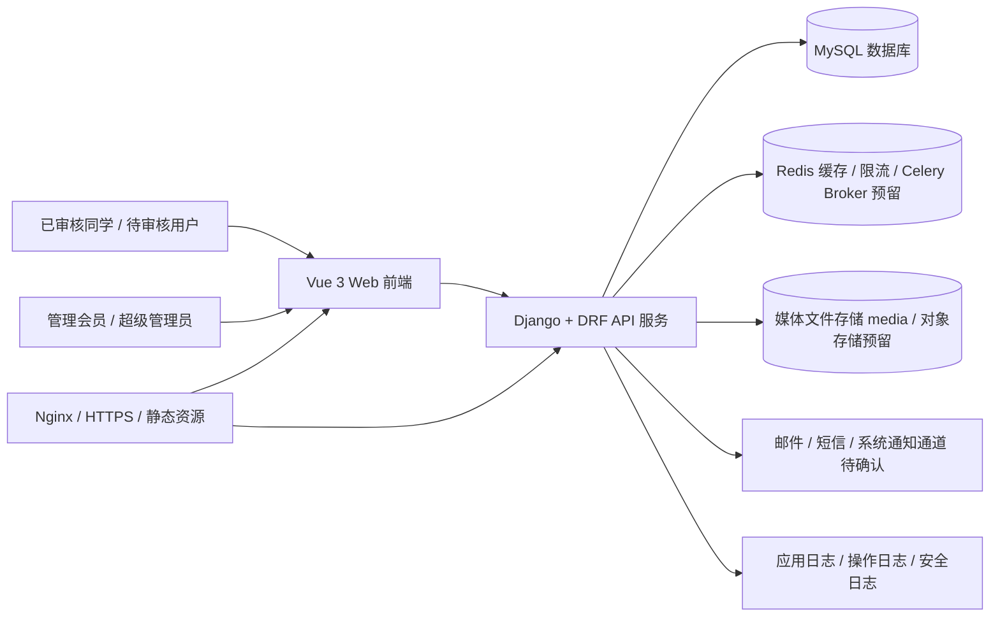

系统对外只暴露 Web 页面、REST API、媒体受控访问入口和必要的管理后台入口。数据库、Redis、上传文件目录和日志系统不对公网暴露。

### 3.2 一层设计

#### 3.2.1 系统总体结构框图

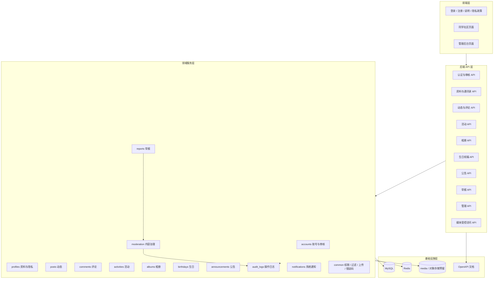

总体架构采用前后端分离：前端负责页面展示、交互和路由守卫；后端负责认证、权限、业务规则、隐私过滤、数据持久化、上传安全和审计。前端不得绕过后端权限判断。

#### 3.2.2 场景时序图/整体关键流程

账号注册与审核流程：

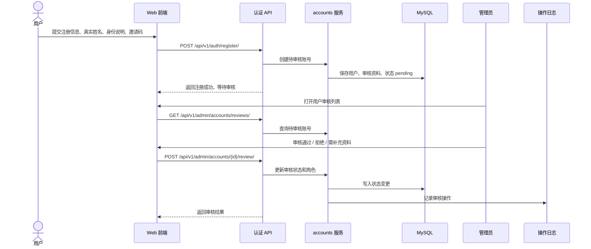

内部内容访问控制流程：

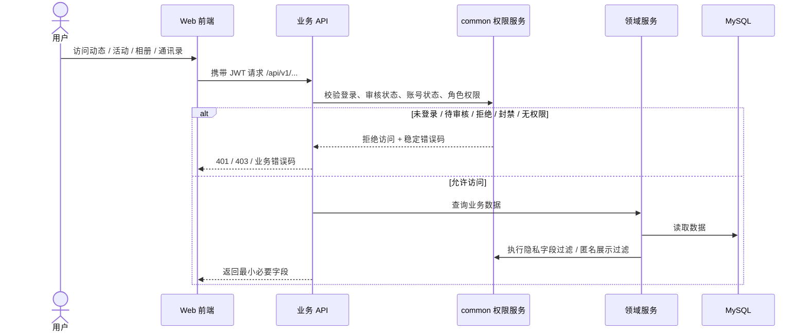

举报与治理流程：

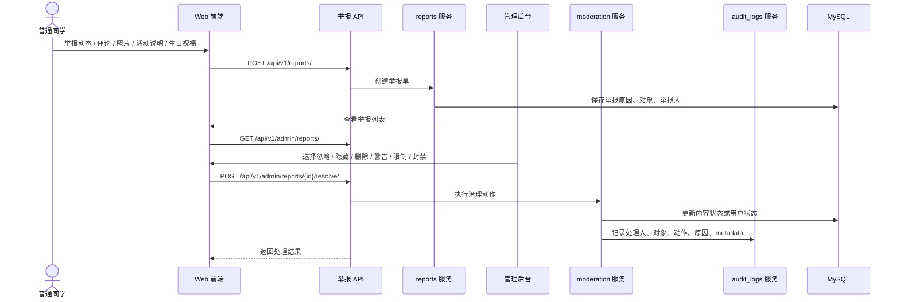

#### 3.2.3 模块分解

| 功能需求 | accounts | profiles | posts | comments | activities | albums | birthdays | announcements | reports | moderation | audit_logs | common | notifications |
|---------|----------|----------|-------|----------|------------|--------|-----------|---------------|---------|------------|------------|--------|---------------|
| 用户注册、登录、审核 | √ | | | | | | | | | √ | √ | √ | √ |
| 全站访问控制 | √ | | | | | | | | | | | √ | |
| 角色和账号状态 | √ | | | | | | | | | √ | √ | √ | |
| 同学资料和通讯录 | √ | √ | | | | | √ | | | | | √ | |
| 隐私可见范围 | √ | √ | √ | √ | √ | √ | √ | | | | | √ | |
| 动态发布和图片 | √ | | √ | √ | | √ | | | √ | √ | √ | √ | |
| 评论和回复 | √ | | √ | √ | | √ | √ | | √ | √ | √ | √ | √ |
| 活动报名、投票、接龙 | √ | √ | | | √ | | | | √ | √ | √ | √ | √ |
| 公告和已读 | √ | | | | | | | √ | | √ | √ | √ | √ |
| 相册和照片 | √ | | | √ | √ | √ | | | √ | √ | √ | √ | |
| 生日祝福 | √ | √ | | √ | | | √ | | √ | √ | √ | √ | √ |
| 举报处理 | √ | | √ | √ | √ | √ | √ | | √ | √ | √ | √ | √ |
| 管理后台 | √ | √ | √ | √ | √ | √ | √ | √ | √ | √ | √ | √ | |
| 操作日志 | √ | | √ | √ | √ | √ | √ | √ | √ | √ | √ | √ | |

### 3.3 开发和运行环境

开发环境：

- 后端：Python 3.14 当前环境已存在，Django 当前依赖为 `django>=6.0.6`；后续通过 `uv` 管理虚拟环境和依赖。
- 数据库：早期原型可用 SQLite；核心业务开发和上线前必须在 MySQL 上迁移和测试。
- 缓存：Redis 用于缓存、限流和 Celery broker 预留。
- 前端：Vue 3 + TypeScript + Vite，配合 Pinia、Vue Router 和 Element Plus 或 Naive UI，具体 UI 组件库待确认。
- API 文档：DRF + drf-spectacular 生成 OpenAPI。

运行环境：

- 开发期：Django 本机虚拟环境运行，前端本机 Node.js 运行，MySQL / Redis 使用 Docker。
- 生产期：Nginx + Django/Gunicorn + MySQL + Redis + 媒体文件存储 + 备份任务。
- 部署方式：Docker Compose，区分 `docker-compose.dev.yml` 和 `docker-compose.prod.yml`。

### 3.4 模块开发方式说明

- 后端按领域 app 拆分，推荐目录为 `apps/accounts`、`apps/profiles`、`apps/posts`、`apps/comments`、`apps/activities`、`apps/albums`、`apps/birthdays`、`apps/announcements`、`apps/reports`、`apps/moderation`、`apps/audit_logs`、`apps/notifications`、`apps/common`。
- `common` 承载权限基类、错误码、分页、筛选白名单、匿名展示、隐私字段过滤、上传校验、审计辅助工具等跨模块能力。
- 管理 API 与普通用户 API 分离，统一放在 `/api/v1/admin/...` 路径下，并使用独立权限类。
- 前端按页面域拆分，使用路由守卫处理未登录、待审核、普通用户和管理员入口，但后端仍作为最终权限来源。
- OpenAPI 作为前后端契约来源，接口返回遵循最小必要原则。

### 3.5 技术方案风险点

| 风险点 | 影响 | 应对措施 |
|--------|------|----------|
| 自定义用户模型确定过晚 | 后续迁移成本高，账号扩展困难 | 项目早期即定义自定义用户模型和状态字段 |
| 匿名展示误泄露真实作者 | 破坏用户信任和隐私 | 序列化层按角色过滤作者字段；管理员接口和普通接口分离；增加回归测试 |
| 活动参与未强制实名 | 违反白皮书活动实名原则 | 活动记录保存 `real_name_snapshot`，活动相关接口不提供匿名选项 |
| 生日字段设计过度 | 泄露具体生日或出生年份 | 数据模型只允许 `birthday_month`，禁止 `birthday`、`birth_day`、`birth_year` 等字段 |
| 上传文件安全不足 | XSS、恶意文件、资源滥用 | 限制类型、大小、数量，服务端校验图片，媒体文件受控访问 |
| 管理接口越权 | 泄露审核材料、举报和日志 | 独立 admin API、严格权限类、测试覆盖 |
| 本地 SQLite 与 MySQL 行为差异 | 上线前迁移失败或约束行为不同 | 核心业务开发和上线前在 MySQL 运行迁移和测试 |
| 备份恢复未落地 | 数据和照片长期不可恢复 | 部署阶段明确数据库和媒体文件备份策略，并演练恢复 |
| 功能范围膨胀 | 第一版延期，治理风险增加 | 严格遵守第一版不做项，私信/小群/推荐流等需求需先修改总纲再评估 |

---

## 4 二层设计（模块内部设计）

### 4.1 账号与权限模块设计

#### 4.1.1 分模块1结构图

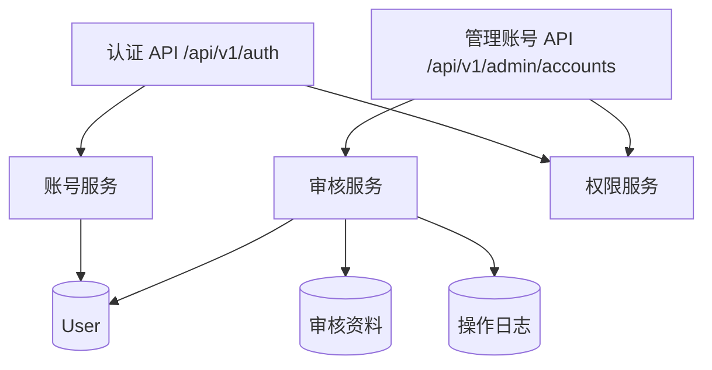

#### 4.1.2 模块1流程图

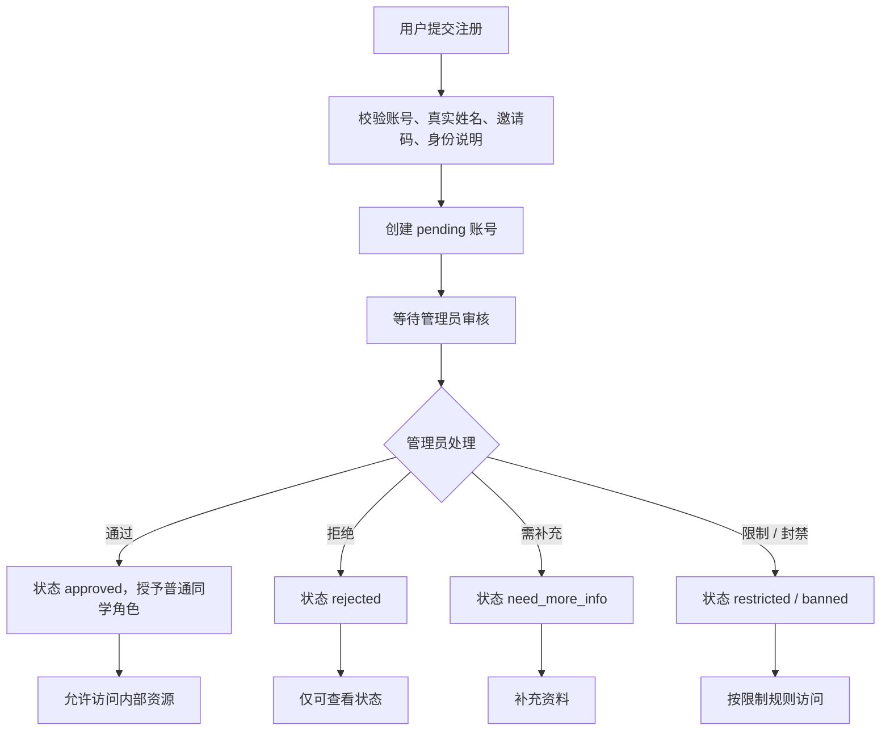

#### 4.1.3 模块1时序图

参见 3.2.2 的账号注册与审核流程。模块内部关键点是：登录成功只代表认证通过，访问内部 API 还必须继续校验审核状态、账号状态和业务权限。

#### 4.1.4 模块1其他说明

账号与权限模块以 Django 自定义用户模型为核心。用户状态建议采用显式枚举：`pending`、`approved`、`rejected`、`need_more_info`、`restricted`、`banned`。角色建议采用显式枚举或可扩展角色表：`classmate`、`moderator`、`super_admin`。

权限判断分三层：认证层确认请求者身份；账号状态层确认是否通过审核且未封禁；业务权限层确认是否能访问具体对象和字段。普通用户接口不得返回审核备注、举报记录、后台日志等管理信息。

### 4.2 资料与通讯录模块设计

#### 4.2.1 分模块2结构图

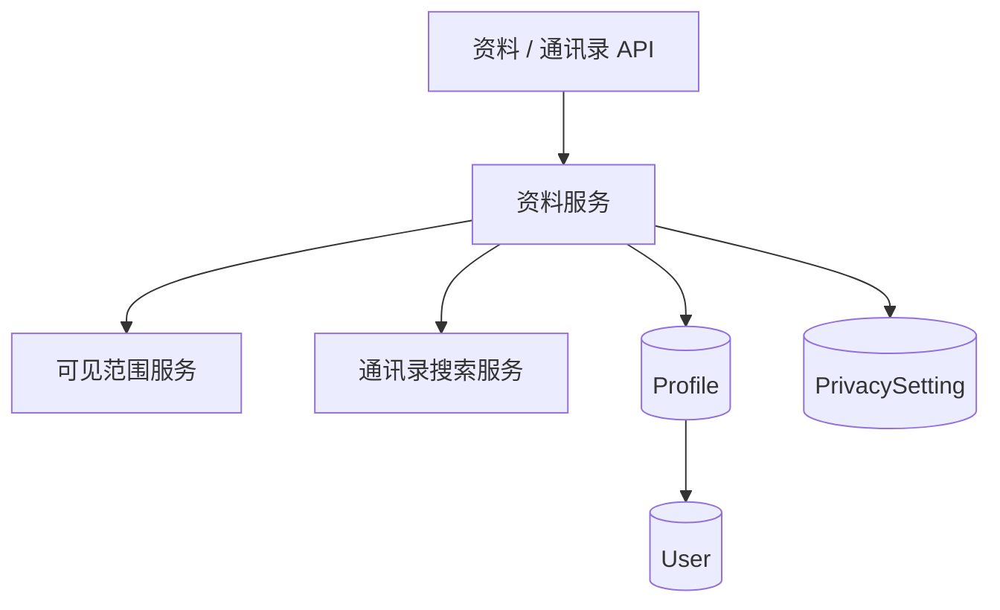

#### 4.2.2 模块2流程图

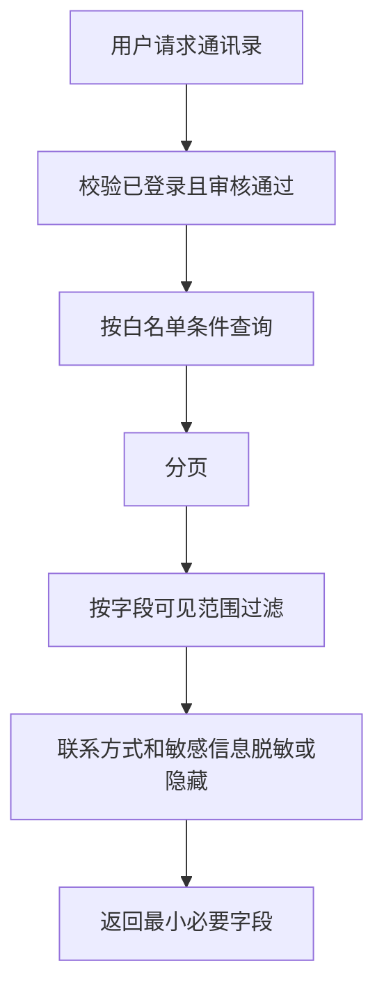

#### 4.2.3 模块2时序图

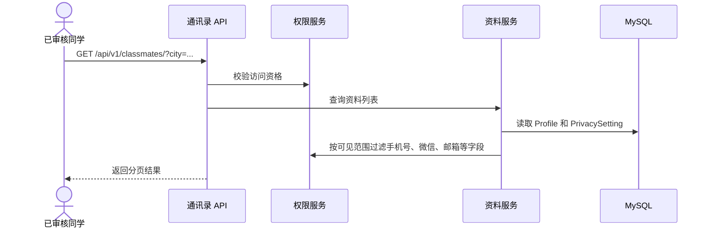

#### 4.2.4 模块2其他说明

资料模块只保存用户主动填写的信息。联系方式默认不公开，必须由用户主动设置可见范围后才展示。生日相关只保存 `birthday_month` 和是否展示生日月份，不保存出生年份、具体日期或完整生日。

### 4.3 内容互动模块设计

#### 4.3.1 分模块3结构图

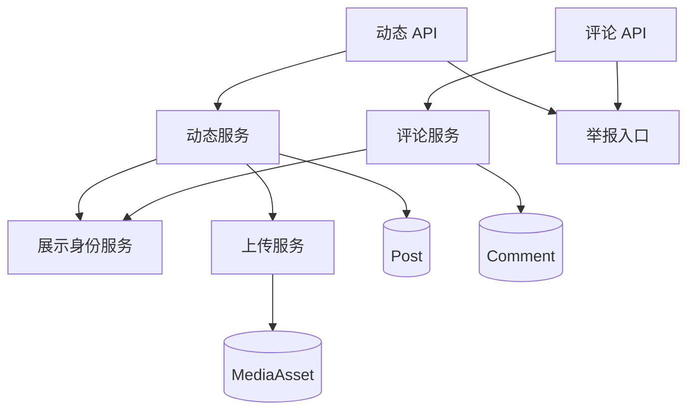

#### 4.3.2 模块3流程图

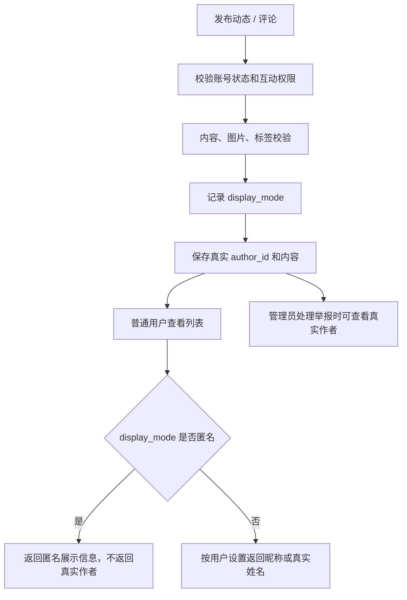

#### 4.3.3 模块3时序图

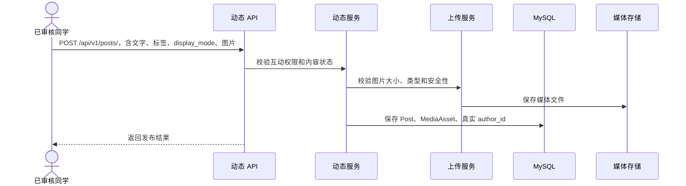

#### 4.3.4 模块3其他说明

内容互动模块覆盖动态、评论和回复。用户可以删除自己的普通动态和评论，但已被举报或处于处理中的内容可由管理员接管。内容状态建议使用 `draft`、`published`、`hidden`、`deleted`、`pending_review`，并配合软删除字段记录删除人和原因。

### 4.4 活动模块设计

#### 4.4.1 分模块4结构图

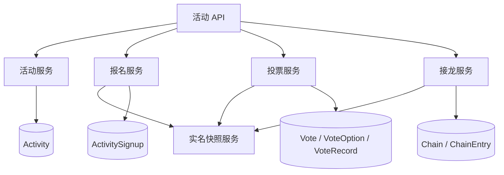

#### 4.4.2 模块4流程图

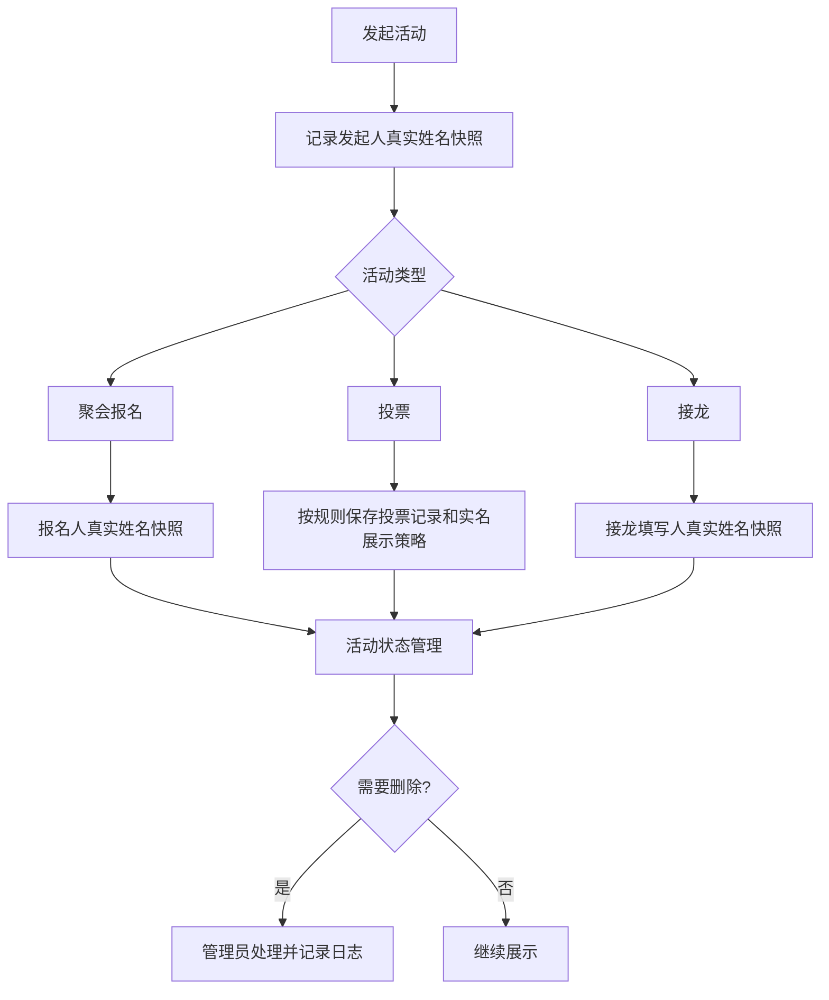

#### 4.4.3 模块4时序图

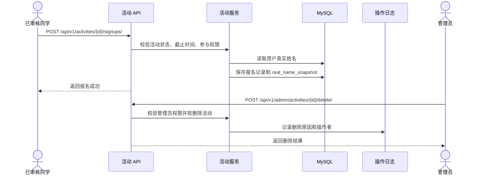

#### 4.4.4 模块4其他说明

活动模块不同于普通动态，所有参与行为必须实名。聚会报名、投票和接龙可以共享 `Activity` 主体，但不同活动类型应有清晰的数据结构，避免一个大 JSON 字段承载所有规则。活动发起人可以补充说明或更新状态，但不能直接删除已发布活动。

### 4.5 公告、相册与生日模块设计

#### 4.5.1 分模块5结构图

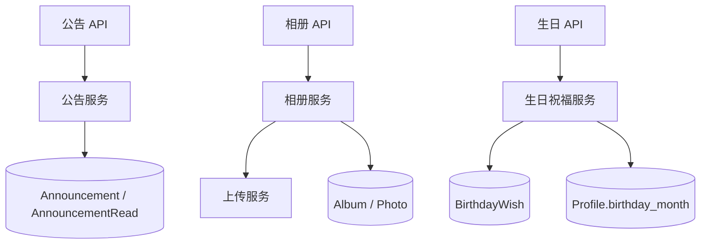

#### 4.5.2 模块5流程图

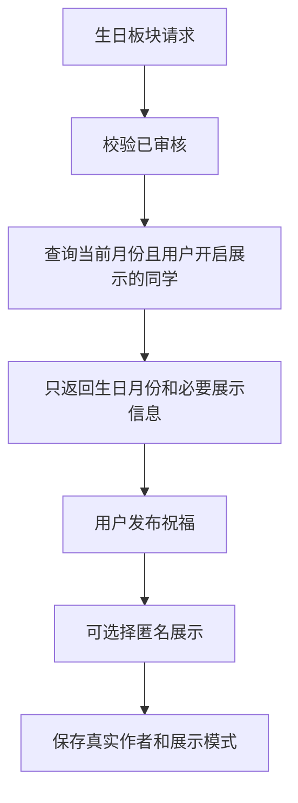

#### 4.5.3 模块5时序图

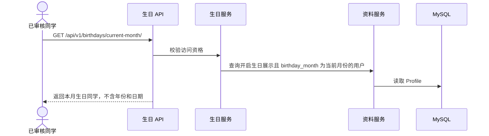

#### 4.5.4 模块5其他说明

公告由管理员或授权管理会员发布，支持置顶、有效期和重要公告已读确认。相册用于保存班级照片和活动照片，照片上传要进行安全校验。生日模块必须严格限制数据模型和接口，不得出现出生年份、具体日期、身份证号推导生日等设计。

### 4.6 举报、治理与审计模块设计

#### 4.6.1 分模块6结构图

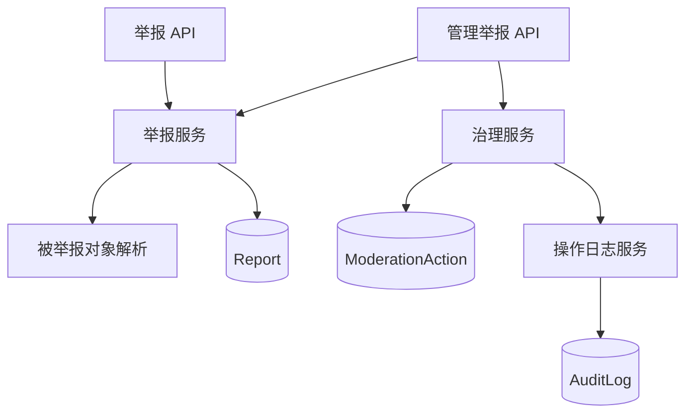

#### 4.6.2 模块6流程图

```mermaid
flowchart TD
    SubmitReport[提交举报] --> ValidateTarget[校验举报对象类型和可访问性]
    ValidateTarget --> CreateReport[创建举报单]
    CreateReport --> AdminQueue[进入管理后台处理队列]
    AdminQueue --> Decision{处理动作}
    Decision --> Ignore[忽略举报]
    Decision --> Hide[隐藏内容]
    Decision --> Delete[删除内容]
    Decision --> Warning[警告用户]
    Decision --> Restrict[限制发言]
    Decision --> Ban[封禁账号]
    Ignore --> Audit[记录处理日志]
    Hide --> Audit
    Delete --> Audit
    Warning --> Audit
    Restrict --> Audit
    Ban --> Audit
```

#### 4.6.3 模块6时序图

参见 3.2.2 的举报与治理流程。治理动作必须记录操作者、操作对象、动作类型、时间、原因和必要 metadata。

#### 4.6.4 模块6其他说明

举报模块需要支持多类型对象引用，至少覆盖动态、评论、照片或相册说明、活动说明、生日祝福。普通用户只能提交和查看与自己相关的必要状态，不能看到举报处理内部信息。管理员可按权限查看举报详情、真实作者和处理历史。

---

## 5 接口设计

### 5.1 提供接口

#### 5.1.1 外部接口

系统对前端和未来移动端提供版本化 REST API，统一前缀为 `/api/v1/`。接口路径为概要设计，具体字段和 OpenAPI schema 在详细设计与实现阶段补齐。

| 接口分组 | 路径前缀 | 主要能力 | 权限要求 |
|---------|----------|----------|----------|
| 认证 | `/api/v1/auth/` | 注册、登录、刷新令牌、退出、密码修改、密码找回 | 未登录 / 已登录 |
| 当前用户 | `/api/v1/me/` | 当前账号状态、个人资料、隐私设置、补充审核资料 | 已登录；内部资料需审核通过 |
| 同学通讯录 | `/api/v1/classmates/` | 同学列表、搜索、筛选、资料详情 | 已审核且未封禁 |
| 资料 | `/api/v1/profiles/` | 个人资料维护、可见范围设置 | 已审核；本人或授权管理员 |
| 动态 | `/api/v1/posts/` | 动态列表、发布、详情、编辑、删除、置顶状态读取 | 已审核；互动权限按账号状态判断 |
| 评论 | `/api/v1/comments/` | 评论、回复、删除 | 已审核；互动权限按账号状态判断 |
| 活动 | `/api/v1/activities/` | 活动列表、详情、创建、报名、投票、接龙、状态更新 | 已审核；活动参与实名 |
| 相册 | `/api/v1/albums/` | 相册、照片上传、照片说明、照片评论、活动关联 | 已审核 |
| 生日 | `/api/v1/birthdays/` | 本月生日同学、生日祝福、关闭生日展示 | 已审核 |
| 公告 | `/api/v1/announcements/` | 公告列表、详情、已读确认 | 已审核；部分公告可登录后查看 |
| 举报 | `/api/v1/reports/` | 创建举报、查看本人举报的必要状态 | 已审核 |
| 媒体 | `/api/v1/media/` | 受控媒体访问、缩略图访问 | 按资源权限校验 |
| 管理 | `/api/v1/admin/` | 用户审核、角色、内容管理、活动删除、举报处理、操作日志 | 管理会员 / 超级管理员 |
| OpenAPI | `/api/schema/`、`/api/docs/` | API schema 和文档 | 环境和权限待确认，生产建议限制访问 |

统一错误码建议：

| 错误码 | 含义 |
|--------|------|
| `ACCOUNT_PENDING_REVIEW` | 账号待审核，不能访问内部内容 |
| `ACCOUNT_NEED_MORE_INFO` | 账号需补充资料 |
| `ACCOUNT_REJECTED` | 审核未通过 |
| `ACCOUNT_RESTRICTED` | 账号被限制，部分互动不可用 |
| `ACCOUNT_BANNED` | 账号被封禁 |
| `PERMISSION_DENIED` | 无权访问该资源或字段 |
| `CONTENT_REMOVED` | 内容已被删除或隐藏 |
| `VALIDATION_ERROR` | 参数或业务规则校验失败 |
| `RATE_LIMITED` | 请求过于频繁 |
| `MEDIA_ACCESS_DENIED` | 无权访问媒体资源 |

#### 5.1.2 内部接口

内部接口主要是领域服务之间的调用契约，不直接暴露给前端：

| 内部接口 / 能力 | 提供模块 | 使用模块 | 说明 |
|----------------|----------|----------|------|
| 用户状态与角色校验 | `accounts` / `common` | 所有业务模块 | 校验登录、审核状态、封禁、限制和角色 |
| 字段可见范围过滤 | `profiles` / `common` | 通讯录、动态、评论、生日、活动 | 按当前用户和字段隐私设置返回最小字段 |
| 匿名展示解析 | `common` | 动态、评论、照片说明、生日祝福 | 普通用户返回匿名，管理员处理时可追溯真实作者 |
| 实名快照 | `activities` | 活动报名、投票、接龙 | 保存 `real_name_snapshot`，避免历史记录受资料变更影响 |
| 上传安全校验 | `common` | 动态、相册 | 校验文件类型、大小、图片安全和路径 |
| 举报对象解析 | `reports` | 举报、治理 | 根据对象类型和 ID 定位被举报资源 |
| 治理动作执行 | `moderation` | 举报、管理后台 | 隐藏、删除、警告、限制、封禁 |
| 操作日志写入 | `audit_logs` | 管理后台、审核、举报、活动、公告 | 记录关键管理动作 |
| 系统通知创建 | `notifications` | 审核、公告、评论、活动、生日 | 仅系统通知，不提供私信能力 |

### 5.2 依赖接口

| 依赖 | 用途 | 设计说明 |
|------|------|----------|
| MySQL | 业务数据持久化 | 正式目标数据库，字符集 `utf8mb4` |
| Redis | 缓存、限流、Celery broker 预留 | 第一版可先接入缓存和限流，异步任务按需启用 |
| 本地文件系统 / 对象存储 | 图片和附件存储 | 第一版可用本地 `media/`，接口和路径设计需保留对象存储迁移能力 |
| SMTP / 短信服务 | 密码找回、审核结果通知 | 服务商和发送策略待确认；敏感信息不得写入日志 |
| Nginx | HTTPS、静态资源、反向代理、媒体受控入口 | 生产必须配置 HTTPS 和安全响应头 |
| OpenAPI 工具链 | API 文档 | 使用 `drf-spectacular` 生成契约，供前端和未来移动端使用 |
| 备份介质 | 数据库和媒体文件备份 | 本地磁盘、对象存储或外部备份服务待确认 |

---

## 6 非功能设计

### 6.1 性能

- 列表接口必须分页，默认分页大小和最大分页大小待确认。
- 通讯录搜索仅允许白名单字段，例如姓名、城市、行业；联系方式不参与普通用户模糊搜索。
- 首页动态、相册、活动列表按发布时间或状态建立必要索引。
- 图片上传限制单文件大小、数量和像素尺寸，生成缩略图用于列表展示。
- 管理后台列表应支持分页和筛选，避免一次性加载全部举报、日志或用户。
- 具体性能指标建议在第一版功能稳定后补充：典型接口 P95 延迟、并发在线人数、图片上传大小、数据库容量和备份窗口。

### 6.2 成本 / 资源

- 第一版优先单体 Django + 前端静态资源 + MySQL + Redis + Nginx，避免过度拆分微服务。
- 图片是主要存储成本来源，应默认压缩、限制原图、定期清理无引用临时文件。
- Redis 可先用于限流和缓存热点数据，不强依赖复杂队列。
- 对象存储、CDN、短信服务可能带来额外成本，第一版应按实际预算启用。

### 6.3 内存

- Django 应用常驻内存受 Gunicorn worker 数量、依赖和图片处理影响。
- 图片处理需避免一次性读取超大文件导致内存峰值过高。
- Redis 缓存应设置 TTL 和容量策略，避免长期缓存通讯录、相册列表等隐私数据。
- 管理后台导出、备份、批量处理等功能若后续加入，应使用流式或异步方式。

### 6.4 可靠性（DFR）

- 关键写操作使用数据库事务，例如审核状态变更 + 操作日志、举报处理 + 内容状态更新、活动报名记录写入。
- 对重复提交场景设计幂等约束，例如同一用户对同一活动的报名、同一投票的投票记录、重要公告已读记录。
- 对活动状态、报名截止时间、投票截止时间进行后端校验，不能依赖前端隐藏按钮。
- 上传文件保存和业务记录写入需要处理部分失败，避免产生大量孤儿文件。
- 删除优先采用软删除，并保留删除人、删除时间和删除原因。
- 数据库和媒体文件必须有备份策略，并定期验证恢复可用性。

### 6.5 安全性（DFSe）

- 所有内部 API 均需要认证，并校验审核状态和账号状态。
- 管理接口独立命名、独立权限类、独立 OpenAPI 分组，防止普通用户误用。
- 所有通过 ID 访问的对象都必须进行对象级权限校验，避免 IDOR。
- API 返回字段遵循最小必要原则，普通用户不得接收审核备注、举报记录、后台日志、封禁详情、登录 IP、设备信息等敏感字段。
- 匿名展示必须在序列化层统一处理，普通用户不得通过接口响应拿到真实作者字段。
- 文件上传不信任客户端 MIME 类型，需要服务端验证图片格式、大小、扩展名和内容安全。
- 用户输入内容需要做 XSS 防护，前端渲染富文本时使用白名单策略；第一版建议避免开放复杂富文本能力。
- 生产环境不得提交 `.env.prod`、数据库密码、JWT 密钥、Django Secret Key、云服务密钥。
- 日志中不得记录明文密码、JWT token、手机号完整值、微信号完整值、邮箱完整值和敏感审核材料。

### 6.6 可维护性

- 后端按领域 app 拆分，避免所有模型和接口堆在单一模块。
- 权限、匿名展示、隐私字段过滤、错误码、分页、上传校验等横切能力放在 `common`。
- 管理 API 和普通 API 分离，降低字段误暴露风险。
- 数据状态使用显式枚举，避免多个布尔字段组合导致状态不清晰。
- 重要架构决策写入 `docs/`，API 变更同步 OpenAPI。
- 对未来拓展方向，如时间轴、老师专区、费用公示、活动照片归档、内容搜索、纪念册，保留模块边界，但第一版不提前实现复杂能力。

### 6.7 可测试性（DFT）

重点测试范围：

- 账号审核状态访问矩阵：未登录、待审核、审核通过、拒绝、需补充、限制、封禁。
- 角色权限矩阵：普通同学、管理会员、超级管理员。
- 匿名展示：普通用户看不到真实作者，管理员处理举报时可追溯。
- 隐私字段：联系方式默认不公开，按可见范围返回。
- 活动实名：报名、投票、接龙均保存真实姓名快照，且无匿名参与入口。
- 生日字段：只允许月份，不接受年份、日期或完整生日。
- 举报治理：处理动作更新内容或用户状态，并写入操作日志。
- 上传安全：非法类型、超大文件、伪装图片、无权限访问媒体均被拒绝。

建议测试类型：单元测试、API 集成测试、权限矩阵测试、序列化字段快照测试、上传安全测试、管理后台关键流程测试。

### 6.8 可观测性（DFS）

- 应用日志记录接口异常、权限拒绝、上传失败、外部通知失败等事件，但必须脱敏。
- 操作日志记录审核、删除、隐藏、限制、封禁、角色变更、公告发布、举报处理、活动删除等管理动作。
- 安全日志可记录登录失败、异常访问、限流触发、后台访问失败等事件；普通用户不可查看。
- 生产环境建议监控：应用存活、接口错误率、数据库连接、磁盘容量、媒体目录容量、备份任务结果、Redis 可用性。
- 告警渠道待确认，可先通过日志和运维脚本检查，后续接入消息通知。

### 6.9 可配置性（DFCu）

- 通过环境变量区分开发、测试、生产配置：`DEBUG`、`SECRET_KEY`、`ALLOWED_HOSTS`、数据库、Redis、CORS、媒体路径、邮件/短信服务等。
- 邀请码机制、注册开关、上传大小限制、公告置顶数量、分页大小、限流策略等应配置化。
- 管理角色和权限应通过数据库管理，不通过硬编码用户 ID。
- 第一版不要求复杂 feature flag，但可以保留配置层，为后续灰度功能做准备。

### 6.10 兼容性（DFC）

- API 使用 `/api/v1/` 版本化，未来破坏性变更可通过 `/api/v2/` 演进。
- OpenAPI schema 保持稳定，前端、未来移动端和测试可基于 schema 协作。
- 数据库字符集使用 `utf8mb4`，兼容中文和 emoji。
- 媒体存储通过服务层封装，避免业务代码直接依赖本地路径，便于迁移对象存储。
- 本地 SQLite 仅作为早期原型，不能作为 MySQL 兼容性的最终验证依据。

### 6.11 解耦

- 前端与后端通过 REST API 解耦，前端不直接访问数据库或媒体文件真实路径。
- 业务领域模块通过服务接口协作，避免跨 app 直接操作对方内部状态。
- 举报治理通过对象类型和对象 ID 抽象目标，避免每类内容重复实现完整举报流程。
- 通知模块只处理系统通知，不承载私信、小群或聊天语义。
- 上传服务与具体业务对象解耦，动态和相册复用同一安全校验和媒体资产模型。

### 6.12 全球化

第一版面向中文班级用户，不设计多语言界面。需要保证中文姓名、昵称、地点、公告、评论、emoji 正常存储和展示。时间展示优先使用用户所在地常见表达，服务端统一存 UTC 或带时区时间，前端按配置展示。

---

## 7 并发处理

- 本软件第一版采用 Django Web 服务多进程 / 多 worker 部署方式，具体 Gunicorn worker 数量按服务器资源调整。
- Django 请求处理本身为同步模型为主；如后续启用异步任务，Celery 用于邮件通知、图片处理、备份提醒等非实时任务。
- 数据库连接池、Redis 连接和 HTTP 客户端超时需要按生产配置设置，避免连接泄漏。
- 需要处理的并发和资源竞争场景：
  - 同一用户重复提交报名、投票、接龙，需使用唯一约束或事务防重。
  - 活动截止时间附近提交，必须以服务端时间和事务校验为准。
  - 管理员同时处理同一举报或同一内容，需通过状态校验避免重复处理。
  - 用户资料更新与活动实名快照无冲突，历史活动记录使用 `real_name_snapshot`。
  - 公告已读记录需要幂等写入。
  - 上传文件和业务记录写入需要处理回滚或孤儿文件清理。
- 对限流、登录失败次数、图片上传频率、举报频率等场景，应使用 Redis 或数据库记录实现基础防滥用。

---

## 8 数据结构设计

主要数据结构设计如下，具体字段、索引、约束在详细设计和模型实现阶段补齐。

| 数据结构 | 归属模块 | 关键字段 / 关系 | 说明 |
|----------|----------|----------------|------|
| `User` | accounts | 登录标识、真实姓名、角色、审核状态、账号状态、密码、最后登录时间 | 建议使用自定义用户模型 |
| `ReviewProfile` | accounts | 用户、班级信息、邀请码、身份说明、审核备注、审核人、审核时间 | 普通用户不可查看审核备注 |
| `Profile` | profiles | 用户、头像、昵称、城市、行业、简介、`birthday_month`、生日展示开关 | 不保存出生年份和具体日期 |
| `PrivacySetting` | profiles | 用户、字段名、可见范围 | 联系方式默认不公开 |
| `Post` | posts | 作者、内容、标签、展示模式、状态、置顶、软删除字段 | 保存真实作者，普通接口按展示模式过滤 |
| `Comment` | comments | 作者、目标对象、父评论、内容、展示模式、状态、软删除字段 | 支持回复和照片评论 |
| `MediaAsset` | common / albums | 上传人、文件路径、类型、大小、宽高、校验状态、关联对象 | 媒体访问需权限控制 |
| `Activity` | activities | 标题、类型、时间、地点、说明、发起人、真实姓名快照、状态、截止时间 | 活动删除由管理员处理 |
| `ActivitySignup` | activities | 活动、用户、`real_name_snapshot`、人数、备注、状态 | 聚会报名 |
| `Vote` | activities | 活动、主题、说明、单选/多选、截止时间、结果展示规则 | 投票定义 |
| `VoteOption` | activities | 投票、选项内容、排序 | 投票选项 |
| `VoteRecord` | activities | 投票、选项、用户、`real_name_snapshot`、提交时间 | 投票记录，是否展示参与人按规则控制 |
| `Chain` | activities | 活动、字段定义、状态 | 接龙定义 |
| `ChainEntry` | activities | 接龙、用户、`real_name_snapshot`、字段值、提交时间 | 接龙填写记录 |
| `Announcement` | announcements | 发布人、标题、内容、置顶、有效期、状态 | 管理员或授权管理会员发布 |
| `AnnouncementRead` | announcements | 公告、用户、已读时间 | 重要公告确认已读 |
| `Album` | albums | 创建人、标题、分类、说明、状态、活动关联 | 相册分类管理 |
| `Photo` | albums | 相册、媒体、说明、上传人、状态 | 照片说明可举报 |
| `BirthdayWish` | birthdays | 祝福对象、作者、内容、展示模式、状态 | 保存真实作者，前台可匿名展示 |
| `Report` | reports | 举报人、对象类型、对象 ID、原因、说明、状态、处理人 | 普通用户不可查看后台处理细节 |
| `ModerationAction` | moderation | 操作者、对象、动作、原因、结果 | 内容处理和账号处理记录 |
| `AuditLog` | audit_logs | 操作者、对象、动作、时间、原因、metadata | 后台关键操作追溯 |
| `Notification` | notifications | 接收人、类型、标题、内容、状态 | 系统通知，不支持私信 |

数据存储结构设计：

- 关系型数据存储在 MySQL，使用外键表达领域关系。
- Redis 用于限流、短期缓存、Celery broker 预留，不作为权威数据源。
- 上传文件存储在本地 `media/` 或未来对象存储，数据库仅保存元数据和访问控制信息。
- 操作日志既可以作为业务表，也可以同步输出到应用日志；普通用户不可访问。

关联影响关系：

- `User` 是大多数业务对象的作者或参与者来源，删除账号时需要区分个人身份信息和公共互动记录。
- 活动、投票、接龙中的历史参与记录依赖 `real_name_snapshot`，不应因用户后续修改真实姓名而变化。
- 举报对象采用对象类型 + 对象 ID 或更规范的内容类型机制，需保证对象级权限校验。
- 软删除内容保留必要审计字段，列表默认过滤 `deleted` / `hidden` 状态。

---

## 9 物理数据结构（终端、服务端、云端按需填写）

### 9.1 持久化存储 / 对象存储 / 磁盘分配

- MySQL：存储账号、资料、内容、活动、公告、举报、治理、操作日志等结构化数据。
- 媒体文件：第一版可使用服务端本地 `media/`，按日期、业务类型和随机文件名组织；不得使用用户可控文件名直接拼接路径。
- 静态文件：前端构建产物和 Django 静态资源通过 Nginx 或静态文件目录提供。
- 备份：数据库备份和媒体文件备份必须同时设计，否则照片和业务记录会不一致。
- 对象存储预留：媒体访问通过后端签权或受控入口，不生成永久公开敏感图片直链。

### 9.2 内存 / 缓存 / 连接池分配

- Django/Gunicorn：根据 CPU 和内存设置 worker，避免图片处理导致内存峰值过高。
- Redis：用于限流、短期缓存、验证码或密码找回 token、Celery broker 预留。
- 数据库连接：配置最大连接数和连接复用，避免管理后台批量查询耗尽连接。
- 缓存策略：不长期缓存敏感资料；缓存内容需设置 TTL；涉及权限或隐私的数据应谨慎缓存。

### 9.3 计算 / 网络 / 队列 / 云资源分配

- Nginx：负责 HTTPS、反向代理、静态资源、安全响应头、上传大小限制。
- Django/Gunicorn：承载 API、权限和业务逻辑。
- MySQL：正式目标数据库，生产禁止使用开发调试数据库。
- Redis：缓存、限流、Celery broker 预留。
- Celery：第一版可预留，后续用于图片压缩、通知发送、备份检查等异步任务。
- 网络：管理后台可考虑额外访问控制，如强密码、二次验证或内网 / IP 白名单，具体策略待确认。

---

## 10 系统出错处理

| 场景 | 处理方式 | 用户提示 / 错误码 | 日志要求 |
|------|----------|------------------|----------|
| 未登录访问内部 API | 返回 401 | 登录后才能访问 | 记录必要请求信息，不记录 token |
| 待审核用户访问内部资源 | 返回 403 或业务错误 | `ACCOUNT_PENDING_REVIEW` | 可记录访问尝试 |
| 审核拒绝 / 封禁用户访问 | 返回 403 | `ACCOUNT_REJECTED` / `ACCOUNT_BANNED` | 安全日志脱敏记录 |
| 被限制用户执行发帖、评论等互动 | 返回 403 | `ACCOUNT_RESTRICTED` | 记录限制规则命中 |
| 普通用户访问管理接口 | 返回 403 | `PERMISSION_DENIED` | 安全日志记录 |
| 对象不存在或无权访问 | 返回 404 或 403 | `PERMISSION_DENIED` / `CONTENT_REMOVED` | 避免暴露对象是否存在 |
| 参数校验失败 | 返回 400 | `VALIDATION_ERROR` | 记录字段级错误，不记录敏感材料全文 |
| 上传文件非法 | 返回 400 | `VALIDATION_ERROR` / `MEDIA_ACCESS_DENIED` | 记录类型、大小、原因 |
| 重复报名 / 重复投票 | 返回 409 或 400 | `VALIDATION_ERROR` | 记录幂等冲突 |
| 活动已截止仍提交 | 返回 400 | `VALIDATION_ERROR` | 记录活动状态和用户 ID |
| 举报对象不可举报 | 返回 400 / 403 | `VALIDATION_ERROR` / `PERMISSION_DENIED` | 记录目标类型 |
| 管理员重复处理同一举报 | 返回当前状态或冲突提示 | `VALIDATION_ERROR` | 记录并发处理冲突 |
| 数据库异常 | 返回 500 通用错误 | 系统暂时不可用 | 应用错误日志，不暴露 SQL |
| 外部通知失败 | 业务主流程可成功，通知标记失败 | 待确认 | 记录通知失败原因，后续重试 |
| 备份失败 | 不影响用户请求，但触发运维告警 | 不直接面向普通用户 | 记录并告警 |

错误处理原则：

- 对普通用户隐藏敏感内部细节，错误码稳定、可读。
- 对权限相关错误避免泄露资源是否存在，防止枚举和 IDOR。
- 管理后台可展示更详细的处理原因，但仍不得暴露密码、token、完整联系方式等敏感信息。
- 关键失败需要可追踪：请求 ID、用户 ID、对象类型、动作、脱敏 metadata。

---

## 11 技术创新（可选）

第一版不追求技术创新，优先保证系统简单、稳定、可治理。可作为设计亮点保留的能力包括：

- 匿名展示和后台真实作者追溯分离：兼顾表达压力和内容治理。
- 活动实名快照：保证历史活动记录稳定，不受用户资料变更影响。
- 字段级隐私过滤：通讯录和个人资料按可见范围返回最小必要字段。
- 多类型举报治理抽象：动态、评论、照片、活动说明、生日祝福共用举报和处理流程。
- 生日月份最小化设计：仅存储和展示月份，避免生日具体日期带来的隐私风险。

---

## 12 数据库设计（可选）

数据库详细 ER 图和迁移脚本将在详细设计和实现阶段输出。概要阶段建议遵循以下原则：

- 使用 MySQL 作为正式目标数据库，字符集使用 `utf8mb4`。
- 早期即确定自定义用户模型，避免后期替换 Django 默认用户模型的迁移风险。
- 所有重要模型包含 `created_at`、`updated_at`。
- 支持软删除的对象包含 `deleted_at`、`deleted_by`、`delete_reason`。
- 外键删除策略必须明确：用户相关历史内容通常不应简单级联删除；公共事务记录需要保留或匿名化；临时从属记录可按实际业务使用 `CASCADE`。
- 用户状态、内容状态、活动状态、举报状态、处理动作使用显式枚举。
- 敏感字段不应无差别暴露给序列化器；必要时在数据库层、服务层和 API 层共同约束。
- 迁移上线前必须在 MySQL 上执行 `makemigrations --check --dry-run`、迁移和测试，不得只依赖 SQLite 验证。

建议核心表：

| 表名 | 模块 | 说明 |
|------|------|------|
| `accounts_user` | accounts | 用户、登录标识、真实姓名、角色、状态 |
| `accounts_review_profile` | accounts | 审核资料和审核记录 |
| `profiles_profile` | profiles | 同学资料和生日月份 |
| `profiles_privacy_setting` | profiles | 字段级可见范围 |
| `posts_post` | posts | 动态内容 |
| `comments_comment` | comments | 评论和回复 |
| `common_media_asset` | common | 上传媒体元数据 |
| `activities_activity` | activities | 活动主体 |
| `activities_signup` | activities | 聚会报名 |
| `activities_vote` | activities | 投票主体 |
| `activities_vote_option` | activities | 投票选项 |
| `activities_vote_record` | activities | 投票记录 |
| `activities_chain` | activities | 接龙定义 |
| `activities_chain_entry` | activities | 接龙记录 |
| `announcements_announcement` | announcements | 公告 |
| `announcements_read` | announcements | 公告已读 |
| `albums_album` | albums | 相册 |
| `albums_photo` | albums | 照片 |
| `birthdays_wish` | birthdays | 生日祝福 |
| `reports_report` | reports | 举报单 |
| `moderation_action` | moderation | 治理动作 |
| `audit_logs_audit_log` | audit_logs | 操作日志 |
| `notifications_notification` | notifications | 系统通知 |

---

## 方案概要设计评审 checklist

| 序号 | 检查项 | SE自查结果 | 评审结论 | 该检查项问题 | 备注 |
|------|--------|-----------|---------|-------------|------|
| 1 | 参评 SE 针对文档的预评审疑问，是否有提前书面答复 | 待确认 | | | 当前为初稿，尚未进入正式评审 |
| 2 | 评审走 Jira / Issue / 评审任务单，建立相关评审任务单 | 待确认 | | | 当前无任务单号 |
| 3 | 需求分析是否到位，包括竞品分析、各种非功能性需求和需求约束是否考虑在内，需求影响和需求依赖是否有考虑到位 | 是 | | | 已基于白皮书和 AGENTS 约束梳理 |
| 4 | 总体架构和模块划分是否合理（高内聚低耦合），0 层、1 层、2 层的章节业务设计描述是否清晰 | 是 | | | 采用前后端分离 + Django 领域 app 拆分 |
| 5 | 风险点：设计是否描述了可能出现的风险以及应对措施 | 是 | | | 见 3.5 |
| 6 | 接口：提供接口（对内和对外提供接口）和依赖接口是否清晰列举，接口是否复用现成能力并尽量符合业界标准 | 是 | | | REST + `/api/v1/` + OpenAPI |
| 7 | 可靠性：异常场景考虑是否全面 | 初步覆盖 | | | 细节需在详细设计补齐事务和约束 |
| 8 | 可维护性：代码移植性、可修改性、可扩充性等便利性是否有考虑 | 是 | | | 按领域模块拆分，公共能力下沉 common |
| 9 | 可测试性（可观察、可追踪、可控制）是否有考虑，自开发或外部提供库是否提供测试方法、工具 | 是 | | | 权限矩阵、隐私过滤、匿名展示为重点 |
| 10 | 可测试性：自动化测试接口或自动化验证方案是否考虑 | 是 | | | 后续需补充具体测试用例和 CI |
| 11 | 对性能、成本、资源的影响：CPU、内存、磁盘、网络、数据库、缓存、云资源等 | 初步覆盖 | | | 具体指标待压测和部署规格确认 |
| 12 | 兼容性：（1）对现有功能是否带来不兼容 | 是 | | | 当前工程为初始项目，主要影响为目录和依赖扩展 |
| 13 | 兼容性：（2）是否预留协议升级接口 | 是 | | | API 使用 `/api/v1/` 版本化 |
| 14 | 兼容性：（3）外部接口和协议，和公司的其它产品或系统是否兼容 | 不涉及 | | | 当前为独立班级社区 |
| 15 | 兼容性：（4）涉及多平台、多区域、多租户需求时，是否通用，是否存在差异，方案中是否考虑完善 | 不涉及 / 预留 | | | 第一版仅 Web，REST API 预留未来移动端 |
| 16 | 可升级性：功能是否可单独升级或灰度发布 | 初步覆盖 | | | 第一版以整体部署为主，配置化预留灰度能力 |
| 17 | 安全性：1）是否遵循安全通用性设计要求 2）是否遵循隐私合规设计标准 | 是 | | | 身份审核、访问受限、最小字段、上传安全、审计 |
| 18 | 合规性：是否用了开源代码框架，是否遵循开源协议 | 待确认 | | | 后续引入依赖时需确认许可证 |
| 19 | 是否对特定产品、客户、区域、租户或环境有影响，如资源占用、配额、权限、网络策略等 | 初步覆盖 | | | 生产部署规格、备份介质、通知服务待确认 |
| 20 | 出错处理：系统出错处理是否考虑到位？ | 是 | | | 见第 10 章 |

**评审结论：** 待评审。
