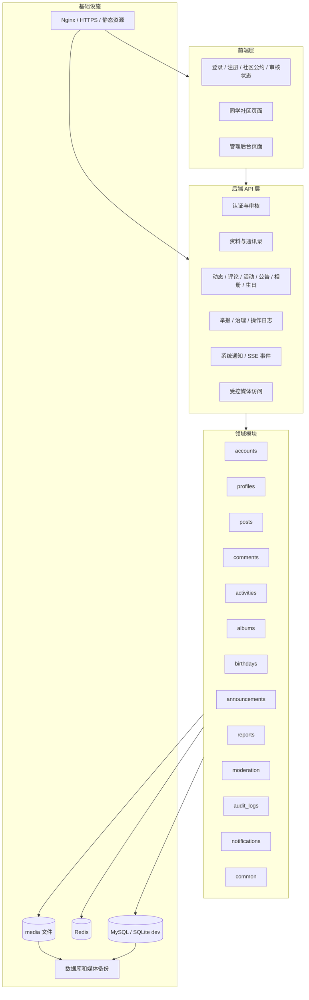
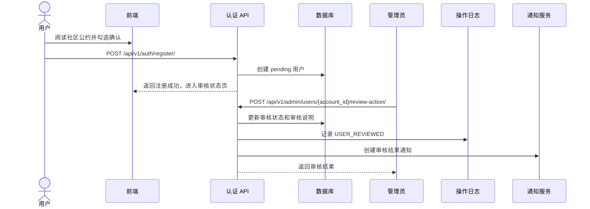
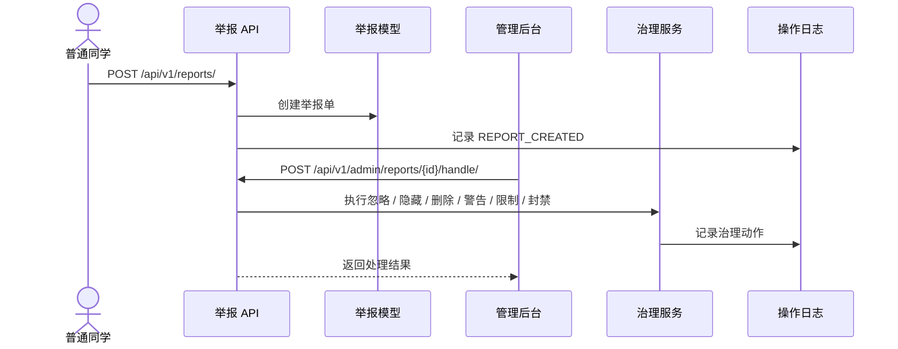

文章标题：高中同班同学社区网站概要设计文档

# 一、文档状态

本文档根据当前仓库代码和最新需求更新，替代早期“Django 初始工程”阶段的概要设计描述。当前项目已经完成第一版核心模块、实时事件推送、部署备份配置、P0 安全加固、移动端适配、社区公约注册门控以及头像上传与兜底展示优化。

| 项目 | 当前状态 |
| --- | --- |
| 后端 | Django 6.0 + DRF，按 `apps/` 领域模块拆分 |
| 前端 | Vue 3 + TypeScript + Vite + Element Plus + Pinia + Vue Router |
| 认证 | SimpleJWT，access token + refresh token，前端支持刷新后保持登录 |
| 数据库 | 正式目标 MySQL 8.4，开发期可使用 SQLite；当前开发驱动为 PyMySQL |
| 实时刷新 | SSE + cursor 补拉，事件详情仍通过 REST API 读取 |
| 媒体访问 | 上传文件保存元数据，敏感媒体通过短期签名 URL 访问 |
| 部署 | Docker Compose + Nginx + Django + MySQL + Redis，含备份 / 恢复脚本 |

# 二、系统目标与边界

## 目标

Tavern 是一个面向高中同班同学的私密社区，核心目标是：

- 只允许真实同学通过审核后进入内部内容区。
- 支持同学资料、通讯录、动态、评论、活动、公告、相册、生日祝福等第一版核心能力。
- 为所有可互动内容提供举报、管理处理和操作日志追溯。
- 对联系方式、审核材料、举报信息、管理日志、媒体文件等敏感信息采取保守隐私策略。
- 通过 REST API 保留未来移动端、PWA 或小程序扩展能力。

## 不做范围

第一版明确不实现以下能力：

- 站内私信、小群、群聊、临时讨论组、点对点聊天。
- 面向公众的开放浏览、陌生人社交、同城扩列、好友匹配。
- 完全不可追溯的匿名发布。
- 直播、短视频流、推荐算法驱动的信息流。
- 复杂交易、支付担保或金融化费用托管。

系统通知和 SSE 实时事件只用于“系统提醒”和“页面刷新信号”，不得扩展成聊天或在线状态能力。

# 三、产品原则落地

## 身份可信与访问受限

用户注册时必须提供真实姓名、高中学校、班级和补充身份信息。系统使用邮箱作为登录凭证，使用 `account_id` UUID 作为对外稳定账号标识，避免在前端路由和接口中直接暴露数据库主键。

账号审核状态包括：

- `pending`：待审核。
- `approved`：审核通过。
- `rejected`：审核拒绝。
- `need_more_info`：需补充资料。

账号状态包括：

- `normal`：正常。
- `restricted`：已限制。
- `banned`：已封禁。

未登录、未审核、审核拒绝、被限制或被封禁用户不能访问内部资源。前端有路由守卫，但最终权限判断始终放在后端。

## 角色与管理权限

系统角色包括：

| 角色 | 说明 |
| --- | --- |
| `classmate` | 普通同学，访问已审核用户范围内的普通功能 |
| `moderator` | 管理会员，可协助处理内容、活动、举报等日常治理 |
| `super_admin` | 超级管理员，具备用户审核、角色分配、账号状态调整等完整治理能力 |

管理 API 统一放在 `/api/v1/admin/...` 路径下，并使用独立权限类。普通接口不得为了前端方便返回审核备注、举报记录、操作日志、封禁细节等管理字段。

## 隐私与身份展示

当前代码实现中，动态、评论、照片说明和生日祝福的 `display_mode` 支持：

- `real_name`：展示真实姓名。
- `nickname`：展示昵称；没有昵称时回退到真实姓名。

也就是说，当前第一版不提供完全匿名展示。所有内容仍保存真实作者，治理场景可以追溯。文档后续提到“展示身份”时，均指真实姓名 / 昵称二选一，而不是匿名。

联系方式采用字段级可见范围：

- `everyone`：所有已审核同学可见。
- `selected`：指定同学可见。
- `only_me`：仅自己可见。

手机号、微信号、邮箱默认不公开。生日只保存 `birthday_month` 和 `show_birthday`，不保存出生年份、具体日期或完整生日。

## 活动实名

活动相关行为必须实名，包括活动发起、报名、投票、接龙和费用确认。活动、报名、投票和接龙记录保存真实姓名快照，例如：

- `initiator_name_snapshot`
- `real_name_snapshot`

这样可以避免用户后续修改资料导致历史活动记录失真。

# 四、总体架构

## 架构分层



前端负责展示、交互、移动端适配和路由守卫；后端负责认证、权限、业务规则、隐私过滤、上传校验、数据持久化和审计。所有敏感权限以后端校验为准。

## 目录结构

```text
apps/
├── accounts       # 用户、登录、JWT、审核、角色、账号状态
├── profiles       # 资料、通讯录、联系方式可见范围、头像、生日月份
├── posts          # 动态内容、分类、置顶
├── comments       # 动态评论和扁平回复
├── activities     # 活动、报名、投票、接龙、实名快照
├── albums         # 相册、照片、照片评论
├── birthdays      # 本月生日、生日祝福
├── announcements  # 公告、置顶、已读确认
├── reports        # 举报单与举报入口
├── moderation     # 举报处理和治理动作
├── audit_logs     # 管理操作日志
├── notifications  # 系统通知、实时事件、SSE
└── common         # 权限、分页、媒体、错误码、通用视图
```

# 五、核心数据模型

| 模块 | 主要模型 | 关键设计 |
| --- | --- | --- |
| accounts | `User` | 邮箱登录，`account_id` UUID，真实姓名，角色，审核状态，账号状态 |
| profiles | `Profile` | 头像 URL、城市、行业、简介、生日月份、联系方式可见范围 |
| common | `Media`、`SoftDeletableModel` | 上传文件元数据、通用软删除字段、内容状态基础 |
| posts | `Post` | 动态内容、图片列表、分类、展示身份、置顶状态 |
| comments | `Comment` | 动态评论，`parent` 指向一级评论，`reply_to` 指向实际回复对象 |
| activities | `Activity`、`Signup`、`VoteOption`、`VoteRecord`、`ChainRecord` | 活动类型、状态、实名快照、报名、投票、接龙 |
| announcements | `Announcement`、`AnnouncementReadReceipt` | 公告、置顶、有效期、重要公告已读确认 |
| albums | `Album`、`Photo`、`PhotoComment` | 相册、照片、受控媒体、照片评论与扁平回复 |
| birthdays | `BirthdayWish` | 祝福对象、作者、祝福内容、展示身份、内容状态 |
| reports | `Report` | GenericForeignKey 指向被举报对象，记录原因、状态和处理信息 |
| moderation | `ModerationAction` | 举报处理后的治理动作记录 |
| audit_logs | `AuditLog` | GenericForeignKey 指向操作对象，记录操作者、动作、原因、metadata |
| notifications | `Notification`、`RealtimeEvent` | 一方向系统通知、SSE 事件、断线补拉 cursor |

# 六、关键业务流程

## 注册、登录与审核



登录成功后，前端会根据 `review_status` 和 `account_status` 决定跳转首页还是审核状态页。access token 失效时，前端使用 refresh token 自动续期；只有 refresh 也失败时才清空登录态。

## 动态评论与扁平回复

动态评论采用“一级评论 + 一级回复列表”的展示结构，但任意评论或回复都可以继续被回复：

- 回复一级评论 A：新回复 `parent=A`，`reply_to=None`。
- 回复 A 下的回复 B：新回复仍然 `parent=A`，`reply_to=B`。
- 前端只展示两层结构，回复里显示“回复某某”，不继续嵌套第三层。

该规则同样用于照片评论。

## 活动实名参与

活动分为三类：

- `gathering`：聚会报名。
- `voting`：投票。
- `chain`：接龙。

报名、投票、接龙接口都会保存当前用户真实姓名快照。活动发起人不能直接删除活动，删除由管理接口处理并写入操作日志。

## 举报与治理



举报目标覆盖动态、动态评论、活动、公告、相册、照片、照片评论、生日祝福等内容对象。普通用户只能提交举报，不能查看举报后台、处理说明或操作日志。

# 七、实时刷新设计

当前项目采用 SSE + cursor 补拉，不使用 WebSocket。核心原则是：SSE 只推送“发生了变化”的最小事件，页面详情仍通过现有 REST API 和权限过滤获取。

| 能力 | 接口 / 模型 | 说明 |
| --- | --- | --- |
| 实时事件流 | `GET /api/v1/events/stream/` | 登录后访问，推送当前用户可见事件 |
| 断线补拉 | `GET /api/v1/events/since/?cursor=...` | 手机端切回前台、断线重连后补偿刷新 |
| 事件模型 | `RealtimeEvent` | 记录事件类型、目标对象和最小 payload |
| 系统通知 | `Notification` | 一方向提醒，不是私信或聊天 |

当前事件类型包括：

- `post.created`
- `post.updated`
- `comment.created`
- `album.photo.created`
- `photo.comment.created`
- `announcement.created`
- `activity.updated`
- `notification.created`
- `notification.read`

本地调试 SSE 时，后端建议用 ASGI / Uvicorn：

```bash
uv run uvicorn tavern.asgi:application --host 0.0.0.0 --port 8000 --reload
```

前端使用：

```bash
npm run dev:sse
```

# 八、媒体与上传设计

## 上传校验

图片上传必须前后端双重校验：

- 前端文件选择器限制 `image/jpeg`、`image/png`、`image/gif`、`image/webp`。
- 后端使用通用校验函数检查文件大小、MIME 类型和 Pillow 图片有效性。
- 动态图片、相册照片、头像上传都使用 `FormData`，前端 axios 不全局硬编码 `Content-Type: application/json`。

## 受控媒体访问

生产环境不直接公开 `/media/`。本地文件路径保存到业务模型或 `Media` 元数据后，序列化返回时通过 `sign_stored_media_url()` 转换为短期签名 URL：

```text
/api/v1/media/<id>/file/?token=...
```

开发环境为了本地调试，在 `DEBUG=True` 时仍挂载 Django static media 路由。生产由 Nginx 反代后端签名入口，不暴露永久公开敏感图片直链。

## 头像兜底

前端使用通用 `UserAvatar` 组件：有头像时显示头像，无头像或图片加载失败时显示通用用户图标，不使用真实姓名 / 昵称首字作为兜底，避免在折叠导航、通知或截图场景中额外暴露身份线索。

# 九、前端设计

## 页面与路由

当前前端主要路由包括：

- `/login`：登录。
- `/register`：注册，必须勾选社区公约。
- `/community-convention`：注册前公开可访问的社区公约。
- `/review-status`：审核状态。
- `/`：首页动态。
- `/profile/edit`：个人资料编辑。
- `/classmates`、`/classmates/:accountId`：通讯录和同学详情。
- `/posts/create`、`/posts/:id`：发动态和动态详情。
- `/activities`、`/activities/create`、`/activities/:id`：活动。
- `/announcements`、`/announcements/create`、`/announcements/:id`：公告。
- `/albums`、`/albums/create`、`/albums/:id`、`/photos/:id`：相册和照片。
- `/birthdays`：生日祝福。
- `/notifications`：系统通知。
- `/admin/...`：管理后台。

路由守卫按登录状态、审核状态、账号状态和管理角色控制入口。管理会员 / 超级管理员入口使用 `requiresModerator` 标记。

## 移动端适配

前台布局在手机端采用“标题 + 头像 + 菜单按钮 / 抽屉”模式，避免横向菜单撑开页面。全局样式集中处理页面卡片、表格、筛选栏、弹窗、图片网格和表单按钮的移动端表现。举报弹框有独立位置和宽度优化，不影响全局弹窗。

# 十、部署与安全设计

## 开发环境

开发期推荐：

```bash
docker compose -f deploy/docker-compose.dev.yml up -d
uv sync
uv run python manage.py migrate
uv run python manage.py runserver 0.0.0.0:8000
cd frontend && npm run dev
```

如果调试 SSE，后端改用 Uvicorn，前端使用 `npm run dev:sse`。

## 生产环境

生产配置包括：

- `deploy/docker-compose.prod.yml`：Nginx、Django、MySQL、Redis。
- `deploy/Dockerfile`：Django 生产镜像。
- `deploy/nginx/nginx.conf` 和 `deploy/nginx/conf.d/tavern.conf`：反向代理、安全响应头、SSE 配置、媒体访问控制。
- `deploy/.env.prod.example`：生产环境变量模板。
- `deploy/scripts/backup-db.sh` / `restore-db.sh`：数据库备份恢复。
- `deploy/scripts/backup-media.sh` / `restore-media.sh`：媒体文件备份恢复。

生产安全重点：

- `DEBUG=False`。
- `ENABLE_API_DOCS=False`，生产默认关闭 `/api/docs/` 和 `/api/schema/`。
- `ALLOWED_HOSTS`、CORS、CSRF trusted origins 明确配置。
- 登录、注册、上传、评论、举报、SSE 接口启用限流。
- `/media/` 不作为永久公开目录暴露。
- 日志不得记录明文密码、JWT、完整手机号、微信号、邮箱或敏感审核材料。

# 十一、验证策略

## 后端验证

```bash
uv run python manage.py check
uv run python manage.py makemigrations --check --dry-run
uv run python manage.py test
uv run python manage.py spectacular --file /tmp/tavern-schema.yml --validate
```

重点覆盖：

- 账号审核状态和账号状态访问矩阵。
- 角色权限和管理接口隔离。
- 联系方式可见范围过滤。
- 生日月份最小展示。
- 活动实名快照。
- 动态评论 / 照片评论扁平回复。
- 举报处理和操作日志。
- 系统通知与 SSE 补拉。
- 受控媒体访问与上传校验。

## 前端验证

```bash
cd frontend
npm run typecheck
npm run build
```

重点手动检查：

- 注册页社区公约勾选门控。
- 登录后已审核用户跳转首页，未审核用户跳转审核状态页。
- refresh token 有效期内刷新浏览器保持登录。
- 手机端顶部导航、抽屉菜单、表格和弹窗不横向撑开页面。
- 首页动态、动态详情、相册详情、照片详情、通知未读数的实时刷新。
- 普通用户看不到管理入口，手输管理路由会被前端拦截，后端仍拒绝。

# 十二、主要风险与约束

| 风险 | 场景 | 当前控制措施 |
| --- | --- | --- |
| 越权访问 | 未审核或普通用户访问内部 / 管理接口 | DRF 权限类、路由守卫、测试覆盖 |
| 敏感字段泄露 | 普通接口返回审核备注、举报处理、日志等字段 | 普通接口和管理接口分离，序列化最小字段 |
| 联系方式泄露 | 通讯录默认展示手机号 / 微信 / 邮箱 | 字段级可见范围，默认 `only_me` |
| 活动匿名参与 | 活动报名或投票使用昵称 | 活动记录保存真实姓名快照，不提供匿名参与入口 |
| 生日过度暴露 | 保存或展示生日年份 / 具体日期 | 只存 `birthday_month`，只展示月份和本月同学 |
| 上传文件风险 | 恶意图片、超大文件、公开直链 | 类型 / 大小 / Pillow 校验，短期签名访问 |
| SSE 被误用 | 实时事件扩展成聊天或在线状态 | 事件 payload 最小化，只做页面刷新信号 |
| 备份不完整 | 只备份数据库，不备份媒体 | 数据库和媒体分别提供备份 / 恢复脚本 |

# 十三、文档索引

- `README.md`：项目入口说明、快速开始、功能总览。
- `docs/classmate-community-whitepaper.md`：产品与治理总纲。
- `docs/project-development-module-plan.md`：模块规划与当前进展。
- `docs/m01-*.md` 至 `docs/m15-*.md`：各模块技术方案。
- `docs/realtime-events-sse-technical-design.md`：SSE 实时事件方案。
