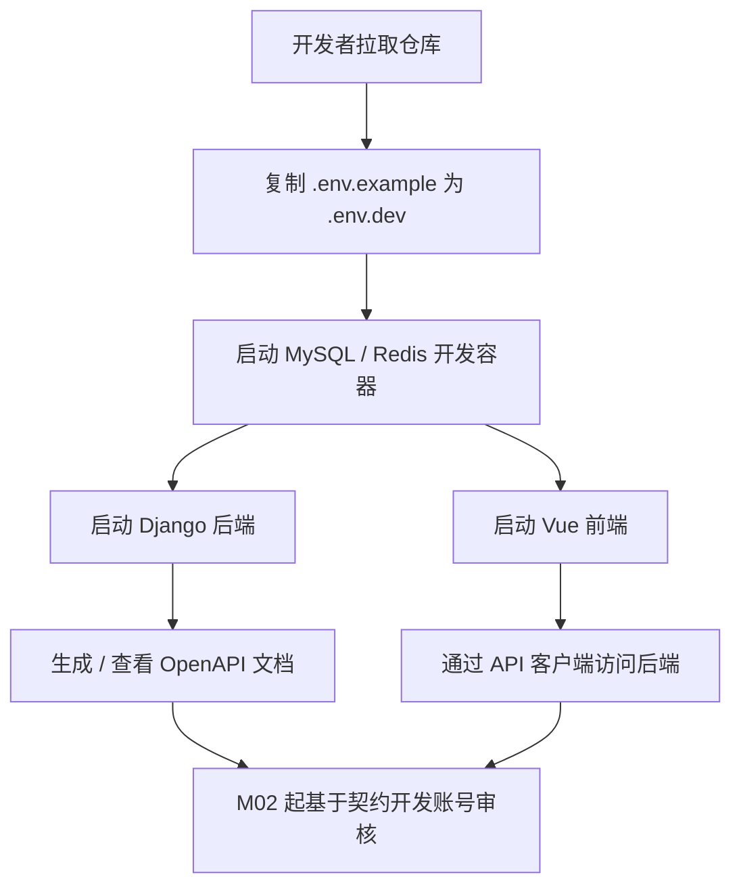
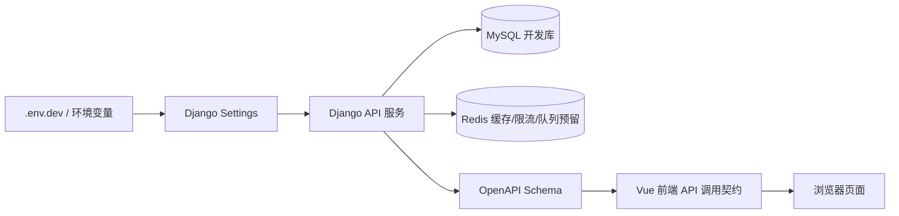
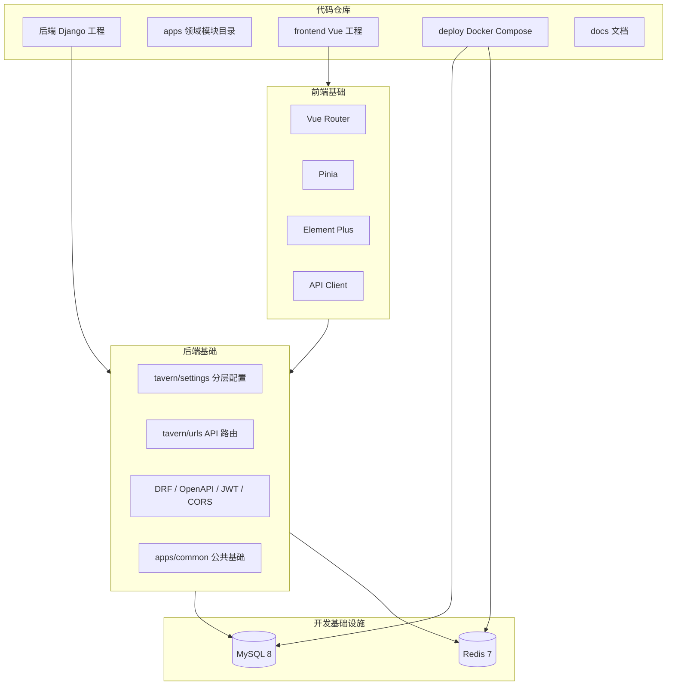

文章标题：M01 工程基础设施技术方案

# 一、背景

## 项目背景

高中同班同学社区网站第一版需要先搭建可持续开发的基础骨架。根据 `classmate-community-whitepaper.md`、`docs/classmate-community-hld.md` 和 `docs/project-development-module-plan.md`，M01 的目标不是实现具体业务功能，而是为后续 M02-M15 提供稳定、清晰、可扩展的工程基础。

M01 属于首发项目的第一阶段，优先级为 P0。后续账号审核、权限隐私、通讯录、动态、活动、相册、生日祝福、举报治理和部署上线都依赖该基础骨架。

## 当前状态

本文档最初用于 M01 实施前评审；当前仓库已经完成 M01，并在后续模块中持续扩展。当前工程基础如下：

- 根目录存在 `manage.py`、`pyproject.toml`、`tavern/urls.py` 和 `tavern/settings/` 分层配置。
- `pyproject.toml` 已包含 Django、DRF、SimpleJWT、drf-spectacular、django-filter、django-cors-headers、Pillow、PyMySQL、Redis、Uvicorn 等依赖。
- 后端已按 `apps/` 领域模块拆分，覆盖 accounts、profiles、posts、comments、activities、albums、birthdays、announcements、reports、moderation、audit_logs、notifications、common。
- 前端已完成 Vue 3 + TypeScript + Vite + Element Plus + Pinia + Vue Router 工程，并包含业务页面、管理后台、移动端适配和 SSE 客户端。
- Docker 开发环境、生产部署配置、Nginx 配置、备份 / 恢复脚本和生产环境变量模板已落地。

因此，本文件保留为 M01 的历史技术方案和验收依据；最新总体架构以 `README.md`、`docs/classmate-community-hld.md` 和 `docs/project-development-module-plan.md` 的当前状态说明为准。

# 二、需求描述

## 需求来源

| 类型 | 文档 / 路径 | 说明 |
| --- | --- | --- |
| 产品与治理总纲 | `classmate-community-whitepaper.md` / `docs/classmate-community-whitepaper.md` | 定义项目定位、隐私、安全、第一版范围和禁止事项 |
| 概要设计 | `docs/classmate-community-hld.md` | 定义总体架构、模块拆分、接口分组、非功能要求 |
| 模块规划 | `docs/project-development-module-plan.md` | 将 M01 定义为工程基础设施模块 |
| 工程规则 | `AGENTS.md` | 定义技术栈、推荐目录、测试验证和部署要求 |

## M01 交付目标

M01 需要交付以下能力：

1. 后端工程结构整理：建立可扩展的 Django 项目结构和 `apps/` 领域模块目录。
2. 后端依赖补齐：引入 DRF、JWT、OpenAPI、CORS、过滤、图片处理、MySQL/Redis 相关依赖。
3. 配置分层：使用环境变量区分开发、测试和生产，避免敏感配置写死在代码中。
4. OpenAPI 基础接入：提供 API schema 和文档入口，作为前后端联调契约基础。
5. 前端工程初始化：建立 Vue 3 + TypeScript + Vite 工程，配置路由、状态管理、UI 组件库和基础 API 客户端目录。
6. Docker 开发环境：提供 MySQL、Redis 的开发期 Docker Compose 配置。
7. 验证链路：保证后端 `manage.py check`、迁移 dry-run、前端构建和 Docker Compose 配置验证可执行。

## 非目标范围

M01 不实现以下内容：

- 不实现用户注册、登录、审核业务逻辑。
- 不创建自定义用户模型；该内容属于 M02，但 M01 要预留 `accounts` app。
- 不实现权限矩阵、隐私字段过滤、身份展示和活动实名；这些属于 M03-M07。
- 不接入生产短信、邮件、对象存储或真实线上域名。
- 不实现业务页面，只提供前端基础布局、路由和占位页面。

# 三、技术方案

## 方案描述

M01 采用“后端单体模块化 + 前后端分离 + 开发环境容器化”的方案。

后端仍保持一个 Django 服务，但按领域 app 拆分目录，避免后续所有业务代码堆在单一模块中。配置采用 `tavern/settings/base.py`、`development.py`、`production.py`、`test.py` 分层方式，默认本地开发使用 `development`。环境变量读取集中在配置层，敏感配置不写入仓库。

前端使用 Vue 3 + TypeScript + Vite 初始化独立 `frontend/` 工程。前端只负责页面、路由、状态和 API 调用封装，所有敏感权限仍以后端校验为准。M01 只保留公共布局、路由、API 客户端、类型目录和占位页面，为后续模块增量开发预留边界。

开发环境使用 `deploy/docker-compose.dev.yml` 提供 MySQL 和 Redis。Django 和前端在开发期仍推荐本机运行，符合项目规则中“开发期本机运行 Django 和前端，MySQL/Redis 使用 Docker”的约束。

## 业务流程图



该流程保证新开发者可以从环境变量、容器依赖、后端服务、前端服务和 API 文档开始工作。

## 数据流程图



M01 不产生业务数据，只建立配置、服务和依赖之间的数据流。MySQL 在本阶段主要用于验证数据库连接和后续 migration 目标；Redis 作为缓存、限流和 Celery broker 的预留组件。

## 技术架构拓扑图



整体拓扑强调解耦：业务领域解耦、配置与代码解耦、前端与后端通过 API 契约解耦、运行依赖通过 Docker Compose 与本机服务解耦。

## 关联模块具体方案描述

### 前端 / 客户端

前端工程目录规划：

```text
frontend/
  index.html
  package.json
  tsconfig*.json
  vite.config.ts
  src/
    main.ts
    App.vue
    router/
      index.ts
    stores/
      app.ts
    api/
      client.ts
    layouts/
      DefaultLayout.vue
    pages/
      HomePage.vue
      NotFoundPage.vue
    styles/
      main.css
```

设计要点：

- 使用 Vue 3 + TypeScript + Vite。
- 使用 Vue Router 预留页面路由能力。
- 使用 Pinia 预留全局状态管理能力。
- 使用 Element Plus 作为基础 UI 组件库，后续可以统一主题 token。
- `src/api/client.ts` 只提供基础封装，不写业务接口。
- `HomePage.vue` 提示 M01 已完成，后续 M02 再接入登录注册。
- 前端通过 `VITE_API_BASE_URL` 配置后端 API 地址，避免硬编码环境。

### 后端服务 / API

后端目录规划：

```text
Tavern/
  manage.py
  pyproject.toml
  tavern/
    settings/
      __init__.py
      base.py
      development.py
      production.py
      test.py
    urls.py
    asgi.py
    wsgi.py
  apps/
    common/
    accounts/
    profiles/
    posts/
    comments/
    activities/
    albums/
    birthdays/
    announcements/
    reports/
    moderation/
    audit_logs/
    notifications/
```

后端配置策略：

- `base.py` 放通用配置：INSTALLED_APPS、MIDDLEWARE、DRF、OpenAPI、静态文件、媒体文件、国际化、REST_FRAMEWORK 等。
- `development.py` 放本地开发配置：`DEBUG=True`、SQLite 默认兜底、可通过环境变量切换 MySQL。
- `production.py` 放生产配置要求：`DEBUG=False`、必须提供 `SECRET_KEY`、`ALLOWED_HOSTS`、数据库环境变量。
- `test.py` 放测试配置，默认 SQLite 内存或本地测试库。
- `manage.py`、`asgi.py`、`wsgi.py` 默认指向 `tavern.settings.development`，生产通过环境变量覆盖。

API 基础：

- 引入 DRF，配置 JSON 渲染、分页和默认权限占位。
- 引入 `drf-spectacular`，提供 `/api/schema/` 和 `/api/docs/`。
- 保留 `/api/v1/` 业务 API 前缀，M01 暂不挂载具体业务接口。
- 保留 Django admin，用于后续 M02 管理能力过渡。

### 数据层 / 存储

M01 不创建业务模型，但需要为后续数据层建立基础：

- MySQL 开发容器使用 `utf8mb4` 字符集和 `utf8mb4_unicode_ci` 排序规则。
- `.env.example` 提供 MySQL 连接环境变量。
- 本地开发默认可使用 SQLite 兜底，便于没有启动 Docker 时运行 `manage.py check`。
- 上线前和核心业务开发阶段必须使用 MySQL 验证迁移，不能只依赖 SQLite。
- 媒体目录保留 `MEDIA_ROOT`、`MEDIA_URL` 配置，实际上传能力在 M05 实现。

### 基础设施 / 第三方依赖

依赖规划：

- Python 依赖：Django、DRF、django-cors-headers、djangorestframework-simplejwt、drf-spectacular、django-filter、Pillow、redis、django-environ。MySQL 驱动优先使用 `mysqlclient`；当前开发机缺少 `mysqlclient` 编译所需的系统 `pkg-config` / MySQL client 开发包，因此 M01 临时接入 `PyMySQL` 作为开发期 MySQL 驱动兼容层，后续具备系统依赖后可切回 `mysqlclient`。
- 前端依赖：Vue、Vue Router、Pinia、Element Plus、Axios、TypeScript、Vite、Vue TSC。
- 开发容器：MySQL 8、Redis 7。

Docker 规划：

```text
 deploy/
   docker-compose.dev.yml
   docker-compose.prod.yml    # M15 再完整实现，M01 可先不创建或仅预留
   mysql/
     init/
   nginx/
```

M01 只要求开发期 `docker-compose.dev.yml` 可通过 `docker compose config` 验证。生产 Docker Compose 会在 M15 细化。

## 异常和边界场景

| 异常情况 | 结果 | 描述 | 验证方式/次数 |
| --- | --- | --- | --- |
| 未配置 `.env.dev` | 后端仍可使用开发默认值启动，但生产配置不允许缺少关键变量 | 开发环境降低门槛，生产环境强约束 | `python manage.py check` 验证一次 |
| MySQL 未启动 | 开发配置默认 SQLite 兜底，避免基础检查被阻断 | 后续进入模型迁移阶段必须启动 MySQL 验证 | `python manage.py check` 验证一次 |
| 生产缺少 `SECRET_KEY` | 启动失败 | 避免生产使用开发密钥 | 后续 M15 验证 |
| OpenAPI 依赖缺失或路由错误 | `/api/schema/` 无法生成 | 前后端契约不可用 | `python manage.py spectacular --file /tmp/schema.yml --validate` 验证一次 |
| 前端依赖安装失败 | 前端无法构建 | 需要检查 Node/npm 版本或网络 | `npm run build` 验证一次 |
| Docker Compose 文件错误 | MySQL/Redis 开发环境不可用 | 后续数据库开发受阻 | `docker compose -f deploy/docker-compose.dev.yml config` 验证一次 |
| 目录结构导入错误 | Django app 加载失败 | 后续模块无法注册 app | `python manage.py check` 验证一次 |
| CORS 配置过宽 | 生产存在安全风险 | 开发可放宽，生产必须白名单 | 检查 `production.py` 配置 |

## 方案劣势、风险和解决措施

| 风险 / 劣势 | 影响 | 解决措施 | 验证方式 |
| --- | --- | --- | --- |
| M01 引入依赖较多 | 可能出现版本兼容问题 | 使用 `uv` 锁定依赖，安装后立即运行 Django 检查和 OpenAPI 生成 | `uv run python manage.py check`、`uv run python manage.py spectacular --validate` |
| `mysqlclient` 在本机缺少系统依赖时安装失败 | 阻塞 MySQL 连接能力 | 已记录失败原因，M01 临时使用 `PyMySQL` 作为开发期兼容层，并保留 SQLite 开发兜底；后续可安装系统依赖后切回 `mysqlclient` | `uv add mysqlclient` 失败输出、`uv run python manage.py check` |
| 配置分层过早复杂化 | 新开发者理解成本增加 | 保持 `base/development/production/test` 四层，避免过度抽象 | 代码审查和文档说明 |
| 前端工程独立后增加双工程维护成本 | 开发需要同时关注后端和前端 | 通过 `frontend/` 独立 package 和 API base 配置明确边界 | `npm run build` |
| 只搭骨架不做业务 | 用户短期看不到业务功能 | 通过占位页面、OpenAPI、目录结构和验证命令证明 M01 可用 | 本阶段验收清单 |
| 开发默认 SQLite 可能掩盖 MySQL 差异 | 后续迁移风险 | 文档和配置明确核心业务阶段必须使用 MySQL 验证 | M02 起补充 MySQL migration 验证 |

# 四、实施步骤

## 后端实施步骤

1. 使用 `uv` 补齐后端依赖。
2. 建立 `tavern/settings/` 配置目录，拆分 `base.py`、`development.py`、`production.py`、`test.py`。
3. 修改 `manage.py`、`asgi.py`、`wsgi.py` 默认配置入口。
4. 创建 `apps/` 领域模块目录和每个 app 的 `apps.py`。
5. 创建 `apps/common` 基础工具占位，包括错误码、分页、健康检查 API。
6. 配置 DRF、CORS、OpenAPI、JWT 基础设置。
7. 在 `tavern/urls.py` 挂载 admin、health、schema、docs、`api/v1/` 占位路由。

## 前端实施步骤

1. 初始化 `frontend/` package。
2. 增加 Vue、TypeScript、Vite、Router、Pinia、Element Plus、Axios 等依赖。
3. 创建 `src/main.ts`、`App.vue`、`router`、`stores`、`api`、`layouts`、`pages`、`styles` 基础目录。
4. 配置 `VITE_API_BASE_URL`。
5. 增加基础首页和 404 页面。
6. 运行类型检查和构建。

## 开发环境实施步骤

1. 创建 `.env.example`，描述 Django、数据库、Redis、CORS、前端 API 地址等配置。
2. 创建 `deploy/docker-compose.dev.yml`，提供 MySQL 和 Redis。
3. 补充必要的目录占位，例如 `deploy/nginx/.gitkeep`、`deploy/mysql/init/.gitkeep`。
4. 更新 `.gitignore`，忽略前端构建产物、node_modules、本地环境文件等。

# 五、验收标准

M01 完成后，应满足以下验收条件：

- `uv run python manage.py check` 通过。
- `uv run python manage.py makemigrations --check --dry-run` 通过或明确无模型变更。
- OpenAPI schema 可生成。
- `npm run build` 在 `frontend/` 下通过。
- `docker compose -f deploy/docker-compose.dev.yml config` 通过。
- 仓库中存在清晰的后端领域 app 目录、前端基础目录、开发环境配置和技术方案文档。
- 没有修改白皮书总纲内容。
- 没有提交 `.env.dev`、生产密钥、数据库密码或其他敏感配置。
