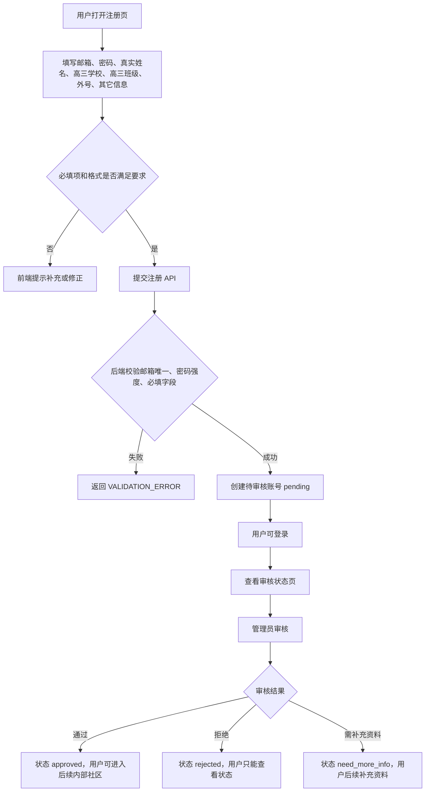
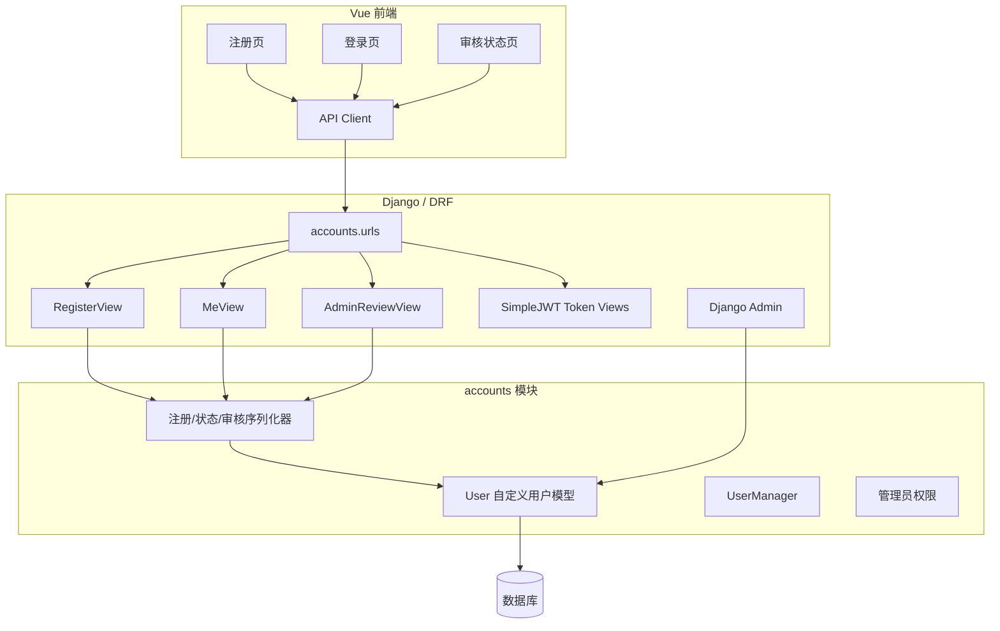

文章标题：M02 账号注册与身份审核技术方案

# 一、背景

## 项目背景

M02 是高中同班同学社区网站第一版的账号准入模块，目标是建立“邮箱注册 + 真实身份资料 + 管理员审核”的基础闭环。根据白皮书和项目规划，网站不是公开论坛，未登录用户和未审核通过用户不得访问内部内容；所有用户注册时必须提交真实姓名，并经管理员审核后才能进入班级社区。

本阶段不追求完整管理后台，也不实现通讯录、动态、活动等内部业务模块。M02 只负责把账号体系和审核状态先建立起来，为后续 M03 权限与隐私基础、M04 个人资料与通讯录等模块提供稳定依赖。

## 系统背景

当前项目已完成 M01 工程基础设施：

- 后端为 Django + DRF + Simple JWT + drf-spectacular。
- 已建立 `apps/accounts` 模块边界，但尚未实现业务模型。
- 已有 `/api/v1/` API 前缀和 OpenAPI 文档入口。
- 前端为 Vue 3 + TypeScript + Vite，已有基础路由、布局和 API client。
- 当前没有历史业务数据，可以在 M02 阶段安全引入自定义用户模型。

# 二、需求描述

## 需求来源

| 来源 | 需求内容 |
| --- | --- |
| 用户本轮确认 | 注册使用邮箱号注册；不强制邀请码；密码找回暂不开发 |
| 用户本轮确认 | 注册时需填写真实姓名、高三所在学校、高三所在班级、外号、其它信息 |
| 用户本轮确认 | 真实姓名、高三所在学校、高三所在班级为必填项；外号和其它信息为选填项 |
| 用户本轮确认 | 信息填写满足要求之后才可以提交注册，由管理员审核通过之后，才注册成功 |
| 白皮书 | 未通过审核账号不得访问站内内容；待审核用户登录后只能查看审核状态和补充资料页面 |
| AGENTS.md | 用户状态至少支持待审核、审核通过、审核拒绝、需补充资料、已限制、已封禁 |

## 本阶段明确范围

M02 实现：

- 自定义用户模型，新增 `account_id` 作为系统内部稳定唯一标识；邮箱作为 M02 阶段的注册和登录凭证，不作为用户跨登录方式的唯一身份标识。
- 注册接口，要求邮箱、密码、真实姓名、高三所在学校、高三所在班级必填。
- 外号和其它信息作为选填审核资料保存。
- 注册后账号进入 `pending` 待审核状态。
- 用户可登录，并查看自己的审核状态和基础资料。
- 管理员可在 Django Admin 和管理 API 中审核用户。
- 审核动作支持：通过、拒绝、需补充资料。
- 账号状态预留：正常、已限制、已封禁。
- 最小前端页面：注册、登录、审核状态页。

M02 不实现：

- 密码找回。
- 邀请码。
- 手机号登录或短信验证码。
- 完整管理后台页面；完整后台留到 M12。
- 内部社区访问权限矩阵；完整权限体系留到 M03。
- 邮件通知、短信通知、系统通知；通知留到后续模块。

# 三、技术方案

## 方案描述

M02 将 `accounts` 模块作为账号准入边界，采用 Django 自定义用户模型承载账号稳定唯一标识、邮箱登录、审核状态、账号状态、角色预留和审核资料。`account_id` 使用 UUID，作为系统内部和未来多登录方式绑定的稳定账号标识；邮箱只作为当前阶段注册/登录凭证，后续手机号注册、微信登录可绑定到同一个 `account_id`。

用户注册时提交邮箱、密码、真实姓名、高三所在学校、高三所在班级、外号和其它信息。后端对必填字段、邮箱凭证唯一性、密码强度进行校验。邮箱在 M02 中仍需唯一，以避免邮箱登录时无法区分账号；但业务和后续跨登录方式绑定不以邮箱作为稳定用户标识。校验通过后创建用户，默认 `review_status=pending`，`role=classmate`，`account_status=normal`，并允许用户登录查看自己的审核状态。由于白皮书要求待审核用户登录后只能查看审核状态，M02 不把用户设为 `is_active=False`，否则 Django 认证会直接阻止登录；后续 M03 通过统一权限类限制待审核用户访问内部业务 API。

管理员审核通过后，用户 `review_status` 更新为 `approved`。审核拒绝时更新为 `rejected`，需补充资料时更新为 `need_more_info` 并保存审核备注。审核材料和审核备注只向管理员接口展示，普通用户只看到必要状态和可读提示。

前端只做最小闭环：注册页、登录页、审核状态页。完整管理后台页面暂不做，管理员审核主要通过 Django Admin 和管理 API 完成。

## 业务流程图



## 数据流程图

```mermaid
flowchart LR
    RegisterForm[注册表单] --> RegisterAPI[POST /api/v1/auth/register/]
    RegisterAPI --> UserSerializer[注册序列化校验]
    UserSerializer --> UserModel[(accounts_user: account_id + email credential)]
    UserModel --> JWT[JWT 登录接口]
    JWT --> FrontendStore[前端保存访问令牌]
    FrontendStore --> MeAPI[GET /api/v1/auth/me/]
    MeAPI --> StatusPage[审核状态页]
    AdminAPI[POST /api/v1/admin/accounts/{account_id}/review/] --> UserModel
    AdminAPI --> ReviewFields[reviewed_by / reviewed_at / review_note]
```

本阶段数据只落在账号表中，不单独拆审核资料表。原因是 M02 的审核字段数量少，且均属于账号准入材料；后续若审核材料扩展为附件、担保人、历史审核记录，再拆分独立表。

## 技术架构拓扑图



## 关联模块具体方案描述

### 前端 / 客户端

M02 增加以下前端路由：

| 路由 | 页面 | 说明 |
| --- | --- | --- |
| `/register` | 注册页 | 邮箱、密码、确认密码、真实姓名、高三学校、高三班级、外号、其它信息 |
| `/login` | 登录页 | 邮箱和密码登录 |
| `/review-status` | 审核状态页 | 显示当前用户审核状态和必要提示 |

前端校验规则：

- 邮箱必填，必须符合邮箱格式。
- 密码必填，最小长度与后端密码校验保持一致。
- 确认密码必须与密码一致。
- 真实姓名必填。
- 高三所在学校必填。
- 高三所在班级必填。
- 外号、其它信息选填。

前端只做用户体验校验，最终以服务端校验为准。JWT token 先以 localStorage 保存，后续 M03/M15 再评估更严格的存储策略和刷新策略。

### 后端服务 / API

M02 提供以下接口：

| 方法 | 路径 | 权限 | 说明 |
| --- | --- | --- | --- |
| `POST` | `/api/v1/auth/register/` | 公开 | 注册待审核账号 |
| `POST` | `/api/v1/auth/token/` | 公开 | 邮箱密码登录，返回 JWT |
| `POST` | `/api/v1/auth/token/refresh/` | 公开 | 刷新 JWT |
| `GET` | `/api/v1/auth/me/` | 登录用户 | 查看当前用户基础信息和审核状态 |
| `GET` | `/api/v1/admin/accounts/pending/` | 管理员 | 查看待审核或需处理账号列表 |
| `POST` | `/api/v1/admin/accounts/{account_id}/review/` | 管理员 | 审核通过、拒绝或需补充资料，路径使用稳定 `account_id` |

管理员权限本阶段采用 `IsAdminUser`，即 Django `is_staff=True` 的用户可以访问管理审核 API。更细的管理会员、超级管理员权限在 M03/M12 中完善。

### 数据层 / 存储

自定义用户模型字段：

| 字段 | 类型 | 必填 | 说明 |
| --- | --- | --- | --- |
| `account_id` | UUIDField unique | 是 | 系统内部稳定唯一标识，不依赖邮箱、手机号或第三方登录方式 |
| `email` | EmailField unique | 是 | M02 阶段邮箱注册/登录凭证；不是系统内部稳定用户标识 |
| `username` | CharField blank | 否 | 兼容 Django AbstractUser，不作为登录标识 |
| `real_name` | CharField | 是 | 真实姓名，用于审核和后续活动实名 |
| `high_school` | CharField | 是 | 高三所在学校 |
| `high_school_class` | CharField | 是 | 高三所在班级 |
| `nickname` | CharField blank | 否 | 外号 |
| `extra_info` | TextField blank | 否 | 其它信息 |
| `review_status` | CharField choices | 是 | `pending` / `approved` / `rejected` / `need_more_info` |
| `account_status` | CharField choices | 是 | `normal` / `restricted` / `banned` |
| `role` | CharField choices | 是 | `classmate` / `moderator` / `super_admin`，M02 先预留 |
| `review_note` | TextField blank | 否 | 管理员审核备注，普通用户不可见 |
| `reviewed_by` | FK User null | 否 | 审核操作人 |
| `reviewed_at` | DateTime null | 否 | 审核时间 |

配置要求：

- `AUTH_USER_MODEL = "accounts.User"` 必须在首次账号迁移前设置。
- `USERNAME_FIELD = "email"` 暂用于兼容当前邮箱登录和 Django Admin 登录；业务侧引用用户时优先使用 `account_id`。后续接入手机号或微信登录时，可增加认证凭证表或自定义认证后端，而不改变用户稳定标识。
- `REQUIRED_FIELDS = ["real_name", "high_school", "high_school_class"]`。

### 基础设施 / 第三方依赖

M02 不新增外部服务依赖。沿用 M01 的 Django、DRF、Simple JWT、OpenAPI、SQLite/MySQL 开发配置。

密码找回暂不开发，因此不接 SMTP、短信服务或第三方验证码服务。

## 异常和边界场景

| 异常情况 | 结果 | 描述 | 验证方式/次数 |
| --- | --- | --- | --- |
| 注册缺少真实姓名 | 返回 400 | 后端返回字段校验错误，前端阻止提交 | API 测试和前端表单验证 |
| 注册缺少高三学校或班级 | 返回 400 | 必填身份资料不完整，不能提交注册 | API 测试和前端表单验证 |
| 邮箱格式不合法 | 返回 400 | 邮箱字段校验失败 | API 测试 |
| 邮箱重复注册 | 返回 400 | M02 阶段邮箱作为登录凭证仍需唯一，避免邮箱登录歧义；用户稳定标识使用 `account_id` | API 测试 |
| 密码过弱 | 返回 400 | 使用 Django 密码校验器检查 | API 测试 |
| 待审核用户登录 | 登录成功，但只能查看审核状态 | M02 允许登录；M03 继续限制内部业务 API | API 测试 |
| 审核拒绝用户登录 | 登录成功，但状态为 rejected | 用户只能看到拒绝状态；后续是否允许重新提交资料待 M03/M04 细化 | API 测试 |
| 非管理员访问审核 API | 返回 403 | 只有 `is_staff=True` 用户可审核 | API 测试 |
| 管理员审核不存在的用户 | 返回 404 | 不暴露额外内部信息 | API 测试 |
| 重复审核已通过用户 | 允许覆盖或返回错误待实现时明确 | 建议允许管理员纠正状态，但记录最新审核人和时间；完整审计留 M13 | API 测试 |

## 方案劣势、风险和解决措施

| 风险 / 劣势 | 影响 | 解决措施 | 验证方式 |
| --- | --- | --- | --- |
| 待审核用户也能登录 | 如果权限控制不严，可能访问内部数据 | M02 只提供状态接口；M03 必须实现统一权限类限制内部 API | 后续权限矩阵测试 |
| 审核资料放在用户表 | 后续审核材料复杂时用户表变宽 | M02 字段少，先简化；如出现附件、多次审核历史，再拆 `ReviewProfile` 或审核记录表 | 模型评审 |
| M02 暂不做密码找回 | 用户忘记密码时不能自助恢复 | 第一版可先由管理员重置；后续在通知服务和邮件配置确定后补做 | 后续需求补充 |
| 不强制邀请码 | 无关人员可提交注册申请 | 管理员审核仍是准入边界；后续如注册噪声变高，再增加邀请码或注册开关 | 管理后台审核量观察 |
| 邮箱和账号稳定标识分离 | 认证逻辑比直接用邮箱做唯一身份更复杂 | M02 增加 `account_id` 作为稳定唯一标识；邮箱仅作为当前登录凭证。后续手机号、微信登录接入时绑定到 `account_id` | 注册响应、当前用户接口和模型字段测试 |
| JWT 存 localStorage | 存在 XSS 风险 | 当前前端仅最小闭环；后续 M15 安全加固时评估 HttpOnly Cookie 或更严格 CSP | 安全评审 |
| 审核操作暂无完整审计表 | 后续追溯能力不足 | M02 保存最新审核人、审核时间、审核备注；M13 再接入完整操作日志 | 数据字段验证 |

# 四、实施步骤

## 后端实施步骤

1. 实现 `accounts.User` 自定义用户模型和 `UserManager`。
2. 在 `settings/base.py` 设置 `AUTH_USER_MODEL = "accounts.User"`。
3. 实现注册、当前用户、管理员审核序列化器。
4. 实现注册、当前用户、待审核列表、审核处理 API。
5. 接入 Simple JWT 邮箱登录接口。
6. 配置 `apps/accounts/urls.py` 并挂载到 `/api/v1/`。
7. 实现 Django Admin 用户管理和审核字段展示。
8. 编写 API 测试覆盖注册、登录、审核状态和管理员审核。
9. 生成并验证迁移。

## 前端实施步骤

1. 增加注册页 `/register`。
2. 增加登录页 `/login`。
3. 增加审核状态页 `/review-status`。
4. 增加认证 API 封装。
5. 增加前端表单校验。
6. 登录成功后跳转审核状态页。

# 五、验收标准

M02 完成后应满足：

- 用户可以通过邮箱、密码和必填身份信息提交注册，注册后系统生成稳定的 `account_id`。
- 缺少真实姓名、高三所在学校、高三所在班级时，前后端都能阻止提交。
- 注册后用户状态为 `pending`。
- 用户可以使用邮箱和密码登录。
- 用户可以查看自己的审核状态。
- 管理员可以在 Django Admin 或管理 API 中审核通过、拒绝或要求补充资料。
- 审核通过后用户状态为 `approved`。
- 密码找回和邀请码不出现在 M02 功能入口中。
- `python manage.py check`、`makemigrations --check --dry-run`、后端测试、OpenAPI 生成、前端构建通过。
