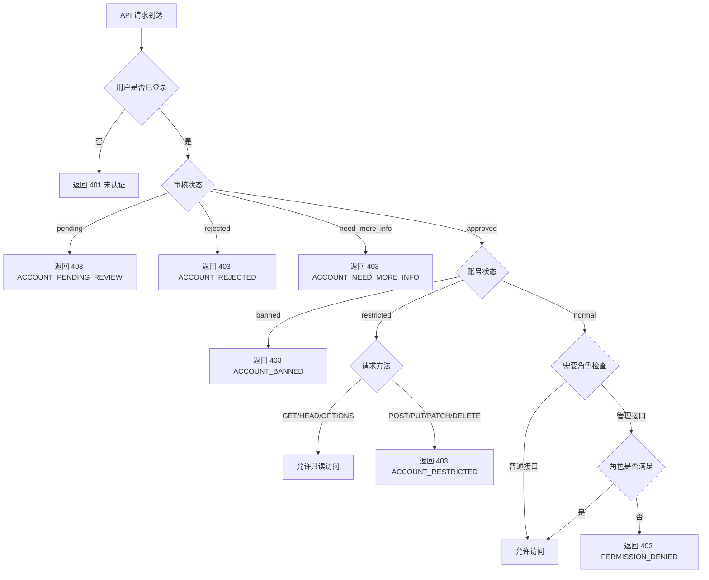
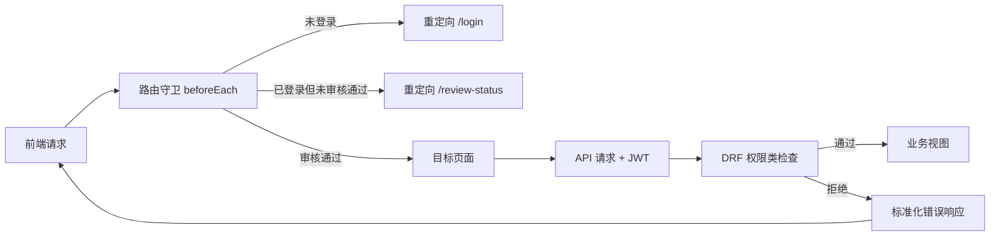
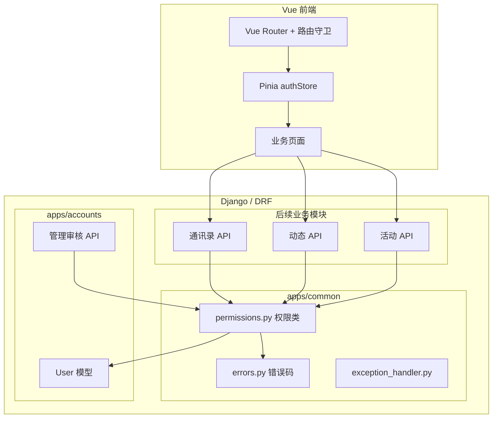
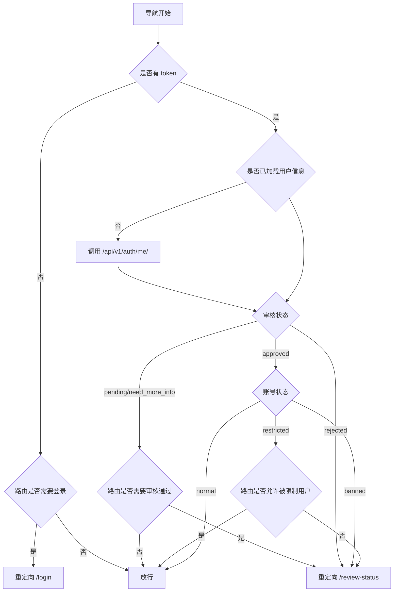

文章标题：M03 权限与角色技术方案

# 一、背景

## 项目背景

M02 已完成账号注册与身份审核模块，建立了自定义用户模型，包含角色字段（`classmate` / `moderator` / `super_admin`）、审核状态字段（`pending` / `approved` / `rejected` / `need_more_info`）和账号状态字段（`normal` / `restricted` / `banned`）。但当前除管理审核 API 使用了 `IsAdminUser` 外，尚未建立统一的权限判断基础设施。

M03 的目标是在不依赖具体业务模块的前提下，建立一套可复用的权限判断层，让后续 M04+ 的业务模块（通讯录、动态、活动等）可以直接使用，无需各自重复实现权限逻辑。

## 系统背景

- 后端已有 `apps/common/` 模块，目前仅包含健康检查接口和错误码常量。
- 前端已有 `authStore`，包含 `isAuthenticated` getter 和 `currentUser` 状态。
- 前端路由当前无守卫，所有页面均可直接访问。
- 管理审核 API 使用 DRF 内置 `IsAdminUser`，依赖 Django `is_staff` 字段。

# 二、需求描述

## 需求来源

| 来源 | 需求内容 |
| --- | --- |
| 白皮书 | 待审核用户登录后只能查看审核状态和补充资料页面，不能进入班级社区 |
| 白皮书 | 不同角色拥有不同权限：待审核用户、普通同学、管理会员、超级管理员、被限制用户、被封禁用户 |
| 白皮书 | 管理后台不向普通用户开放，管理会员只能看到与其职责相关的功能 |
| AGENTS.md | 权限判断必须放在后端，不能只依赖前端隐藏按钮 |
| AGENTS.md | 必须区分未登录用户、待审核用户、普通同学、管理会员、超级管理员、被限制用户、被封禁用户 |
| AGENTS.md | 管理接口必须独立命名和授权，例如 `/api/v1/admin/...` |
| 用户本轮确认 | 采用建议方案：统一权限类、被限制用户可浏览不可写、前端路由守卫 |

## 本阶段明确范围

M03 实现：

- DRF 统一权限类 `IsApprovedClassmate`：仅审核通过且账号正常的用户可访问内部业务 API。
- DRF 权限类 `IsModeratorOrAbove`：管理会员及以上可访问管理辅助接口。
- DRF 权限类 `IsSuperAdmin`：仅超级管理员可访问敏感管理接口。
- 统一异常处理：权限不足时返回标准化错误码（`ACCOUNT_PENDING_REVIEW`、`ACCOUNT_REJECTED`、`ACCOUNT_BANNED`、`ACCOUNT_RESTRICTED`、`ACCOUNT_NEED_MORE_INFO`、`PERMISSION_DENIED`）。
- 前端路由守卫：根据登录状态、审核状态、账号状态控制页面访问。
- 权限测试用例。

M03 不实现：

- 具体业务模块的 API（动态、活动、通讯录等），这些由后续 M04+ 各自实现。
- 完整管理后台页面，留到 M12。
- 对象级权限（如"只能编辑自己的动态"），这类权限由各业务模块自行实现。

# 三、技术方案

## 方案描述

M03 在 `apps/common/permissions.py` 中实现三个 DRF 权限类，作为后续所有业务 API 的权限基础。

`IsApprovedClassmate` 是内部业务 API 的默认权限类。它要求用户已登录、审核状态为 `approved`、账号状态为 `normal`。任一条件不满足时，返回对应的标准化错误码和 HTTP 403，并在响应体中给出可读的中文提示。被限制用户（`account_status=restricted`）在此权限类下被拒绝写操作，但允许 GET/HEAD/OPTIONS 等读操作——这一区分通过 `IsApprovedClassmateOrReadOnly` 变体实现。

`IsModeratorOrAbove` 要求用户角色为 `moderator` 或 `super_admin`，用于管理会员可访问的辅助管理接口（如举报处理、内容隐藏）。

`IsSuperAdmin` 要求用户角色为 `super_admin`，用于敏感管理操作（如用户角色分配、站点配置）。

前端路由守卫在 `router/index.ts` 中通过 `beforeEach` 全局守卫实现。守卫逻辑在路由的 `meta` 字段中声明页面所需的权限级别，未满足条件时自动重定向到对应页面。

## 业务流程图



## 数据流程图



## 技术架构拓扑图



## 关联模块具体方案描述

### 后端服务 / API

M03 在 `apps/common/` 中新增以下文件：

| 文件 | 说明 |
| --- | --- |
| `apps/common/permissions.py` | DRF 权限类 |
| `apps/common/exception_handler.py` | 统一异常处理，将权限拒绝转为标准化错误响应 |

权限类定义：

**`IsApprovedClassmate`**（内部业务 API 默认权限）：

| 条件 | 结果 |
| --- | --- |
| 未登录 | HTTP 401 |
| `review_status != approved` | HTTP 403，错误码按状态返回 |
| `account_status == banned` | HTTP 403，`ACCOUNT_BANNED` |
| `account_status == restricted` | HTTP 403，`ACCOUNT_RESTRICTED` |
| 全部通过 | 允许访问 |

**`IsApprovedClassmateOrReadOnly`**（被限制用户可读）：

| 条件 | 结果 |
| --- | --- |
| 安全方法 GET/HEAD/OPTIONS + `review_status == approved` + `account_status != banned` | 允许 |
| 非安全方法 + `account_status == restricted` | HTTP 403，`ACCOUNT_RESTRICTED` |
| 其他同 `IsApprovedClassmate` | |

**`IsModeratorOrAbove`**（管理会员辅助接口）：

| 条件 | 结果 |
| --- | --- |
| 已登录 + 审核通过 + 账号正常 + `role in (moderator, super_admin)` | 允许 |
| 不满足 | HTTP 403，`PERMISSION_DENIED` |

**`IsSuperAdmin`**（超级管理员专用）：

| 条件 | 结果 |
| --- | --- |
| 已登录 + 审核通过 + 账号正常 + `role == super_admin` | 允许 |
| 不满足 | HTTP 403，`PERMISSION_DENIED` |

统一异常处理：

在 `apps/common/exception_handler.py` 中自定义 DRF 异常处理函数，拦截 `PermissionDenied` 和 `NotAuthenticated` 异常，将 DRF 默认的 `detail` 字符串替换为包含 `code` 和 `message` 的结构化响应。

错误码补充：

在 `apps/common/errors.py` 中新增：

```python
ACCOUNT_RESTRICTED = "ACCOUNT_RESTRICTED"
ACCOUNT_NEED_MORE_INFO = "ACCOUNT_NEED_MORE_INFO"
```

### 前端 / 客户端

路由守卫在 `router/index.ts` 中通过 `beforeEach` 实现。

路由 `meta` 字段定义：

| meta 字段 | 类型 | 说明 |
| --- | --- | --- |
| `requiresAuth` | boolean | 是否需要登录 |
| `requiresApproved` | boolean | 是否需要审核通过 |
| `allowRestricted` | boolean | 是否允许被限制用户访问（默认 false） |

守卫逻辑：



路由配置更新：

| 路由 | requiresAuth | requiresApproved | allowRestricted |
| --- | --- | --- | --- |
| `/` 首页 | false | false | true |
| `/register` | false | false | true |
| `/login` | false | false | true |
| `/review-status` | true | false | true |

后续 M04+ 新增的内部页面（如 `/posts`、`/activities`）默认设置 `requiresAuth: true`、`requiresApproved: true`。

### 数据层 / 存储

M03 不新增数据库模型或字段。权限判断完全基于 M02 已有的 `review_status`、`account_status`、`role` 字段。

### 基础设施 / 第三方依赖

M03 不新增外部依赖。权限类基于 DRF 内置 `BasePermission`，异常处理基于 DRF 的 `EXCEPTION_HANDLER` 设置。

## 异常和边界场景

| 异常情况 | 结果 | 描述 |
| --- | --- | --- |
| 未登录用户访问内部 API | HTTP 401 | 返回标准 DRF 未认证响应 |
| 待审核用户访问内部 API | HTTP 403，`ACCOUNT_PENDING_REVIEW` | 审核通过前不能访问任何内部资源 |
| 审核拒绝用户访问内部 API | HTTP 403，`ACCOUNT_REJECTED` | 审核被拒后不能访问内部资源 |
| 需补充资料用户访问内部 API | HTTP 403，`ACCOUNT_NEED_MORE_INFO` | 需先补充资料 |
| 已封禁用户访问内部 API | HTTP 403，`ACCOUNT_BANNED` | 封禁账号不能访问内部资源 |
| 被限制用户 POST 内部 API | HTTP 403，`ACCOUNT_RESTRICTED` | 被限制用户不能执行写操作 |
| 被限制用户 GET 内部 API | 允许 | 被限制用户可以浏览内容 |
| 普通同学访问管理 API | HTTP 403，`PERMISSION_DENIED` | 角色不足 |
| 管理会员访问超级管理员 API | HTTP 403，`PERMISSION_DENIED` | 角色不足 |
| 前端未登录访问 `/review-status` | 重定向 `/login` | 路由守卫拦截 |
| 前端待审核访问内部页面 | 重定向 `/review-status` | 路由守卫拦截 |
| 前端已封禁访问内部页面 | 重定向 `/review-status` | 路由守卫拦截 |

## 方案劣势、风险和解决措施

| 风险 / 劣势 | 影响 | 解决措施 | 验证方式 |
| --- | --- | --- | --- |
| 权限类在每次请求时都查数据库 | 对性能有轻微影响 | User 对象在认证时已加载，权限检查只读内存中的字段，无额外查询 | 性能测试 |
| 被限制用户的读写区分较粗粒度 | 无法按限制原因做差异化处理 | M03 先做粗粒度区分；M12 管理后台完善时可扩展限制原因和细粒度控制 | 后续需求补充 |
| 前端路由守卫依赖 localStorage token | token 被清除后守卫失效 | 守卫在无 token 时统一重定向登录页；后续 M15 安全加固时评估更严格的方案 | 功能测试 |
| 权限错误码在响应体中而非 HTTP 头 | 前端需解析响应体 | 统一异常处理保证所有权限错误返回相同结构，前端可统一处理 | API 测试 |

# 四、实施步骤

## 后端实施步骤

1. 补充 `apps/common/errors.py` 错误码常量。
2. 实现 `apps/common/permissions.py` 四个权限类。
3. 实现 `apps/common/exception_handler.py` 统一异常处理。
4. 在 `settings/base.py` 配置自定义异常处理。
5. 将管理审核 API 的权限类从 `IsAdminUser` 迁移到 `IsSuperAdmin`。
6. 编写权限测试用例。

## 前端实施步骤

1. 在 `authStore` 中增加 `reviewStatus`、`accountStatus` 等 getter。
2. 实现路由守卫 `beforeEach`。
3. 为现有路由添加 `meta` 字段。
4. 验证各状态下的页面访问和重定向行为。

# 五、验收标准

M03 完成后应满足：

- 待审核、审核拒绝、需补充资料、已封禁用户访问内部 API 时返回对应错误码的 403。
- 被限制用户 GET 内部 API 允许，POST/PUT/DELETE 返回 `ACCOUNT_RESTRICTED`。
- 普通同学访问管理 API 返回 `PERMISSION_DENIED`。
- 前端未登录用户访问需登录页面时重定向到 `/login`。
- 前端待审核/审核拒绝/已封禁用户访问内部页面时重定向到 `/review-status`。
- `python manage.py check`、`makemigrations --check --dry-run`、后端测试、前端 typecheck、前端 build 通过。
