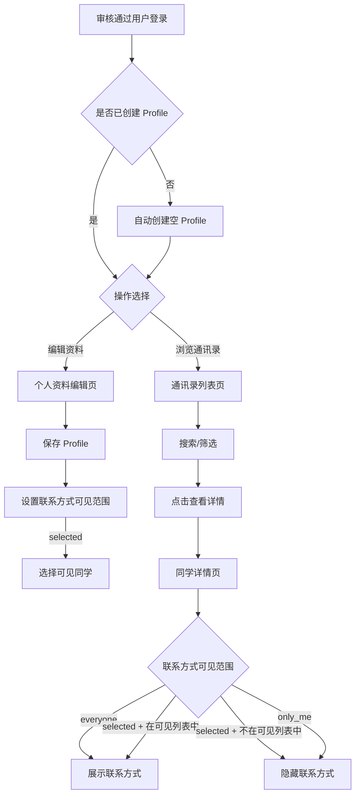
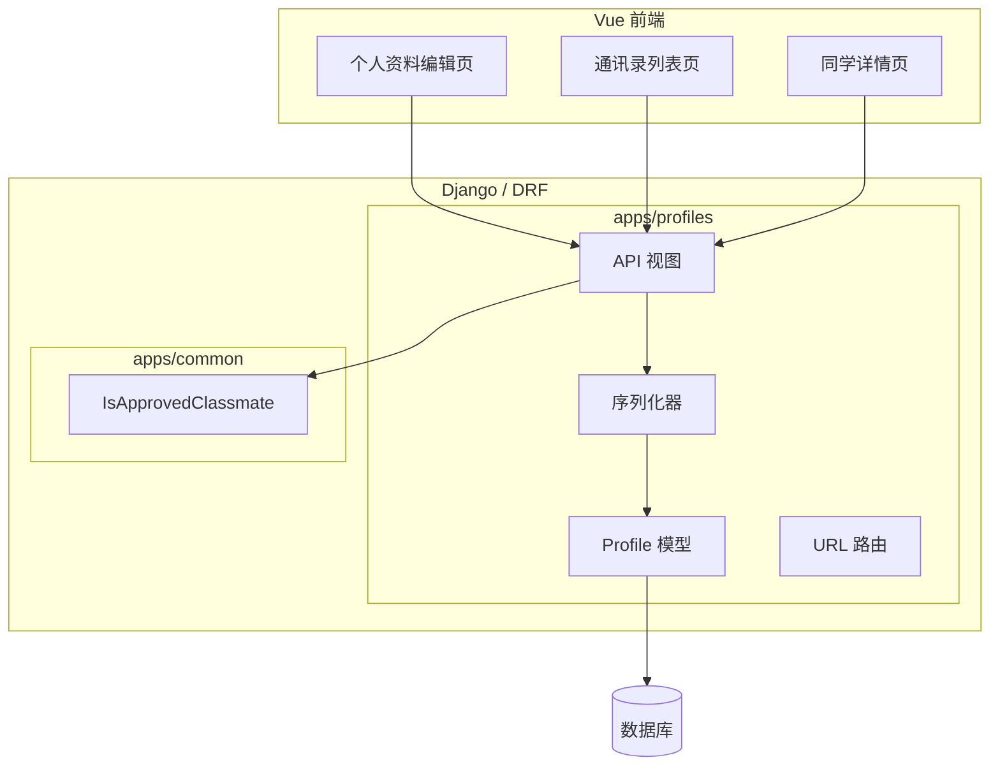

文章标题：M04 个人资料与通讯录技术方案

# 一、背景

## 项目背景

M02 完成了账号注册与身份审核，M03 建立了统一的权限基础设施。M04 是第一个面向审核通过用户的内部业务模块，实现个人资料管理和同学通讯录。

根据白皮书，通讯录用于帮助大家了解彼此近况，必须建立在自愿填写和可见范围控制之上。联系方式默认不公开，用户主动选择后才展示。通讯录支持搜索和筛选。

## 系统背景

- `accounts.User` 已有字段：`real_name`、`nickname`、`high_school`、`high_school_class`、`extra_info`（认证辅助信息）、`email`（登录凭证）。
- `apps/profiles/` 模块已建立边界，尚未实现业务模型。
- M03 已实现 `IsApprovedClassmate` 权限类，M04 的通讯录 API 直接使用。
- 前端已有路由守卫，审核通过用户可访问内部页面。

# 二、需求描述

## 需求来源

| 来源 | 需求内容 |
| --- | --- |
| 白皮书 | 通讯录支持头像、昵称、真实姓名、当前城市、职业或行业、个人简介、生日月份、联系方式（可选择公开或不公开）、高中时期补充信息 |
| 白皮书 | 通讯录支持搜索和筛选，例如按姓名、城市、行业查找同学 |
| 白皮书 | 联系方式默认不公开，用户主动选择后才展示 |
| 白皮书 | 生日月份仅用于展示"本月生日同学"，不展示年份和具体日期 |
| AGENTS.md | 公开任何联系方式前，必须检查用户的可见范围设置 |
| AGENTS.md | 生日字段只存储月份，取值范围 1-12 |
| 用户本轮确认 | 高中补充信息（座位、寝室等）仅作为认证信息，不出现在通讯录中 |
| 用户本轮确认 | 每个联系方式独立控制可见范围：所有人可见 / 指定人可见 / 仅自己可见 |
| 用户本轮确认 | 头像先做 URL 字段，文件上传留到后续模块 |

## 本阶段明确范围

M04 实现：

- `Profile` 模型，OneToOne 关联 User，承载个人资料和隐私设置。
- 个人资料字段：头像 URL、当前城市、职业/行业、个人简介、生日月份（1-12）。
- 联系方式字段：手机号、微信号，各自独立可见范围控制。
- 邮箱可见范围控制（邮箱本身在 User 模型上，可见范围在 Profile 上）。
- 可见范围三级：`everyone`（所有审核通过同学）、`selected`（指定同学可见）、`only_me`（仅自己）。
- 个人资料 API：查看和编辑自己的资料。
- 通讯录 API：分页列表（支持搜索和筛选）、单个同学详情（根据可见范围过滤字段）。
- 前端：个人资料编辑页、通讯录浏览页。

M04 不实现：

- 头像文件上传。
- 生日祝福板块（留到后续模块）。
- 高中补充信息（座位、寝室）的独立管理，这些保留在 User 的 `extra_info` 中作为认证辅助信息。

# 三、技术方案

## 方案描述

M04 在 `apps/profiles/` 中实现 `Profile` 模型，通过 OneToOne 关联 `accounts.User`。User 保留认证和审核相关字段，Profile 承载个人公开资料和隐私设置。

资料字段分为两类：公开资料（头像、城市、职业、简介、生日月份）和联系方式（手机号、微信号）。公开资料对所有审核通过同学可见。联系方式默认 `only_me`，用户可选择 `everyone` 或 `selected`。选择 `selected` 时，用户通过 `contact_visible_to` M2M 字段指定可见的同学。

邮箱的可见范围也通过 Profile 控制。邮箱值本身在 User 模型上，但通讯录 API 根据 Profile 的 `email_visibility` 决定是否返回。

通讯录列表 API 返回所有审核通过且账号正常的同学，支持按姓名、城市、行业搜索和筛选。列表不返回联系方式。详情 API 返回单个同学的完整资料，但联系方式仅在当前用户有权查看时才返回。

## 业务流程图



## 数据流程图

```mermaid
flowchart LR
    EditForm[资料编辑表单] --> ProfileAPI[PATCH /api/v1/me/profile/]
    ProfileAPI --> ProfileSerializer[Profile 序列化器]
    ProfileSerializer --> ProfileModel[(profiles_profile)]
    ProfileModel --> ClassmateListAPI[GET /api/v1/classmates/]
    ClassmateListAPI --> ListSerializer[通讯录列表序列化器]
    ListSerializer --> FilteredResponse[过滤后响应：不含联系方式]
    ProfileModel --> ClassmateDetailAPI[GET /api/v1/classmates/{account_id}/]
    ClassmateDetailAPI --> DetailSerializer[详情序列化器]
    DetailSerializer --> VisibilityFilter{可见范围检查}
    VisibilityFilter -->|有权查看| FullResponse[含联系方式的完整资料]
    VisibilityFilter -->|无权查看| PartialResponse[不含联系方式的资料]
```

## 技术架构拓扑图



## 关联模块具体方案描述

### 数据层 / 存储

`Profile` 模型字段：

| 字段 | 类型 | 必填 | 说明 |
| --- | --- | --- | --- |
| `user` | OneToOne(User) | 是 | 关联账号 |
| `avatar_url` | URLField blank | 否 | 头像链接 |
| `city` | CharField blank | 否 | 当前城市 |
| `occupation` | CharField blank | 否 | 职业或行业 |
| `bio` | TextField blank | 否 | 个人简介 |
| `birthday_month` | PositiveSmallIntegerField null | 否 | 生日月份 1-12 |
| `phone` | CharField blank | 否 | 手机号 |
| `phone_visibility` | CharField choices | 是 | `everyone` / `selected` / `only_me`，默认 `only_me` |
| `wechat` | CharField blank | 否 | 微信号 |
| `wechat_visibility` | CharField choices | 是 | 同上，默认 `only_me` |
| `email_visibility` | CharField choices | 是 | 同上，默认 `only_me` |
| `contact_visible_to` | M2M(User) blank | 否 | 当任一联系方式为 `selected` 时，指定可见的同学 |
| `created_at` | DateTime | 是 | 创建时间 |
| `updated_at` | DateTime | 是 | 更新时间 |

可见范围枚举：

```python
class ContactVisibility(models.TextChoices):
    EVERYONE = "everyone", "所有人可见"
    SELECTED = "selected", "指定同学可见"
    ONLY_ME = "only_me", "仅自己可见"
```

Profile 通过 Django signal 在 User 创建时自动创建空 Profile，确保每个用户都有 Profile 记录。

### 后端服务 / API

| 方法 | 路径 | 权限 | 说明 |
| --- | --- | --- | --- |
| `GET` | `/api/v1/me/profile/` | 登录用户 | 查看自己的完整资料 |
| `PATCH` | `/api/v1/me/profile/` | 登录用户 | 编辑自己的资料 |
| `GET` | `/api/v1/classmates/` | IsApprovedClassmate | 通讯录列表（分页、搜索、筛选） |
| `GET` | `/api/v1/classmates/{account_id}/` | IsApprovedClassmate | 单个同学详情 |

通讯录列表 API 支持的查询参数：

| 参数 | 类型 | 说明 |
| --- | --- | --- |
| `search` | string | 按姓名、城市、行业模糊搜索 |
| `city` | string | 按城市精确筛选 |
| `occupation` | string | 按行业模糊筛选 |
| `page` | int | 页码 |
| `page_size` | int | 每页条数 |

列表返回字段（不含联系方式）：

```json
{
  "account_id": "uuid",
  "real_name": "张三",
  "nickname": "三三",
  "avatar_url": "https://...",
  "city": "北京",
  "occupation": "软件工程师",
  "bio": "...",
  "birthday_month": 3
}
```

详情返回字段：列表字段 + 联系方式（根据可见范围决定是否返回）。

### 前端 / 客户端

新增路由：

| 路由 | 页面 | 权限 |
| --- | --- | --- |
| `/profile/edit` | 个人资料编辑页 | requiresAuth + requiresApproved |
| `/classmates` | 通讯录列表页 | requiresAuth + requiresApproved |
| `/classmates/:accountId` | 同学详情页 | requiresAuth + requiresApproved |

个人资料编辑页功能：
- 编辑头像 URL、城市、职业、简介、生日月份
- 编辑手机号、微信号
- 设置每个联系方式的可见范围
- 当选择"指定同学可见"时，从通讯录中选择同学

通讯录列表页功能：
- 分页展示同学列表
- 搜索框（按姓名、城市、行业）
- 城市和行业筛选
- 点击进入详情

同学详情页功能：
- 展示公开资料
- 根据可见范围展示或隐藏联系方式

### 基础设施 / 第三方依赖

M04 不新增外部依赖。生日月份校验在后端序列化器中实现（1-12 范围检查）。

## 异常和边界场景

| 异常情况 | 结果 | 描述 |
| --- | --- | --- |
| 未审核通过用户访问通讯录 | HTTP 403 | IsApprovedClassmate 拦截 |
| 用户未创建 Profile | 自动创建空 Profile | 通过 signal 在首次访问时自动创建 |
| 生日月份超出 1-12 | 返回 400 | 后端校验 |
| 设置 selected 可见范围但未选择同学 | 允许保存 | 等同于 only_me，直到选择了同学 |
| 查看自己的详情 | 返回完整资料 | 自己始终可以看到自己的所有字段 |
| 查看他人的联系方式（对方设为 only_me） | 不返回联系方式字段 | 详情 API 过滤 |
| 查看他人的联系方式（对方设为 selected，当前用户不在列表中） | 不返回联系方式字段 | 详情 API 过滤 |
| 通讯录搜索无结果 | 返回空列表 | 200 OK，空分页 |
| 非审核通过用户在通讯录中不可见 | 列表自动过滤 | 只返回 review_status=approved 且 account_status=normal 的用户 |

## 方案劣势、风险和解决措施

| 风险 / 劣势 | 影响 | 解决措施 | 验证方式 |
| --- | --- | --- | --- |
| 联系方式存在 Profile 表中 | 后续接入手机号登录时需要同步 | M02 已预留 account_id 作为稳定标识；后续手机号登录时增加认证凭证表，Profile 中的手机号作为展示用途 | 后续需求评审 |
| 头像仅支持 URL | 用户需自行上传到图床再填链接 | 后续文件上传模块统一处理头像上传，届时增加上传接口并自动填充 avatar_url | 后续需求补充 |
| selected 可见范围无人数限制 | 用户可能选择大量同学 | 初版不做限制；后续如发现滥用，可增加上限 | 使用观察 |
| 通讯录列表可能暴露用户存在性 | 被封禁/未审核用户不在列表中 | 这是预期行为，符合白皮书"未审核用户不可见"的要求 | 功能测试 |

# 四、实施步骤

## 后端实施步骤

1. 实现 `Profile` 模型和 `ContactVisibility` 枚举。
2. 实现 User post_save signal 自动创建 Profile。
3. 实现 Profile 序列化器（含可见范围过滤逻辑）。
4. 实现个人资料 API（GET/PATCH `/api/v1/me/profile/`）。
5. 实现通讯录列表 API（GET `/api/v1/classmates/`）。
6. 实现同学详情 API（GET `/api/v1/classmates/{account_id}/`）。
7. 配置 URL 路由并挂载到 `/api/v1/`。
8. 编写测试用例。
9. 生成并验证迁移。

## 前端实施步骤

1. 新增 Profile API 封装。
2. 新增个人资料编辑页 `/profile/edit`。
3. 新增通讯录列表页 `/classmates`。
4. 新增同学详情页 `/classmates/:accountId`。
5. 更新路由配置和导航。

# 五、验收标准

M04 完成后应满足：

- 每个审核通过用户自动拥有 Profile。
- 用户可以编辑自己的公开资料和联系方式。
- 每个联系方式可独立设置可见范围（everyone / selected / only_me）。
- 通讯录列表展示所有审核通过且账号正常的同学，不含联系方式。
- 通讯录支持按姓名、城市、行业搜索和筛选。
- 同学详情页根据可见范围决定是否展示联系方式。
- 用户始终可以看到自己的完整资料。
- 未审核通过用户无法访问通讯录 API。
- `python manage.py check`、`makemigrations --check --dry-run`、后端测试、OpenAPI 生成、前端 typecheck、前端 build 通过。
