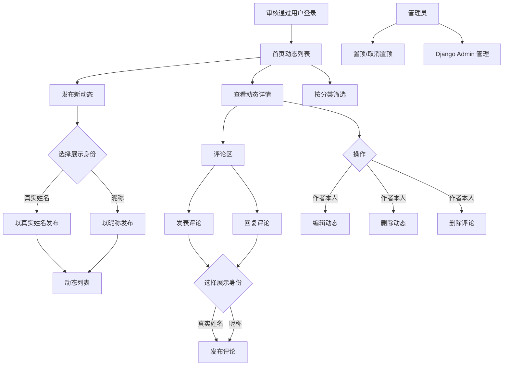
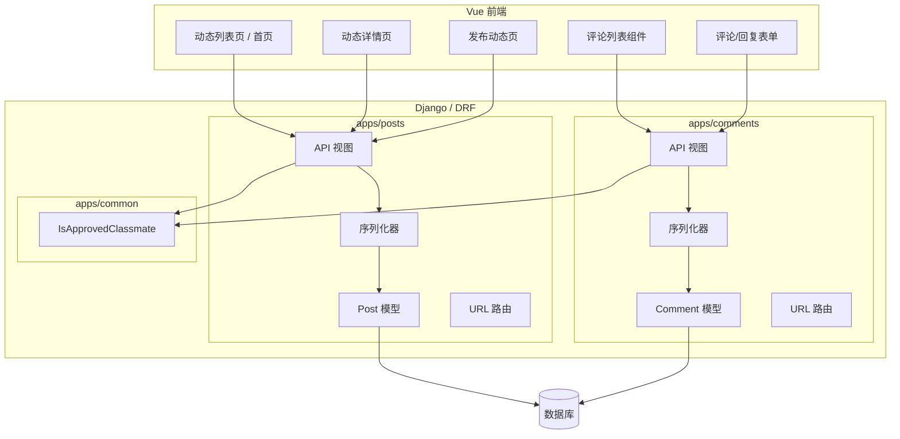

文章标题：M05 首页动态与评论技术方案

# 一、背景

## 项目背景

M02 完成了账号注册与身份审核，M03 建立了统一权限基础设施，M04 实现了个人资料与通讯录。M05 是第一个面向班级内部日常互动的内容模块，实现首页动态发布与评论回复。

根据白皮书，首页动态类似班级论坛或内部信息流，用于发布生活近况、图文分享、回忆故事等内容。动态支持文字发布、图片（URL）、分类标签、评论回复、置顶、用户删除自己的内容和管理员管理。

白皮书和 AGENTS.md 要求动态和评论支持展示身份选择。用户每次发布动态或评论时，可以选择以真实姓名或昵称展示。

## 系统背景

- `apps/posts/` 和 `apps/comments/` 模块已建立边界，尚未实现业务模型。
- M03 已实现 `IsApprovedClassmate` 权限类，M05 的动态和评论 API 直接使用。
- 前端已有路由守卫，审核通过用户可访问内部页面。
- 图片上传暂未实现，M05 使用图片 URL 方式。

# 二、需求描述

## 需求来源

| 来源 | 需求内容 |
| --- | --- |
| 白皮书 | 发布文字动态、上传图片、评论和回复、帖子置顶、按时间排序、按标签分类、用户删除自己的动态和评论、管理员删除不合适内容、举报入口 |
| 白皮书 | 动态分类：生活近况、老照片、同学聚会、老师相关、工作与城市、家庭与成长、求助与互助、闲聊 |
| 白皮书 | 用户发布动态和评论时，可以选择以真实姓名或昵称展示 |
| AGENTS.md | 数据库保存真实作者 author_id，前台根据 display_mode 决定展示真实姓名或昵称 |
| AGENTS.md | 管理员处理举报时可以看到真实作者 |
| 用户本轮确认 | 图片先做 URL 方式，文件上传留到后续 |
| 用户本轮确认 | 评论两级结构：评论 → 回复，回复不再嵌套 |
| 用户本轮确认 | 每次发动态/评论时选择真实姓名或昵称展示 |
| 用户本轮确认 | 举报先做前端 UI 入口，后端 API 留到 M13 |
| 用户本轮确认 | 动态状态先实现 published 和 deleted（软删除） |
| 用户本轮确认 | 实现管理员置顶功能 |

## 本阶段明确范围

M05 实现：

- Post 模型：文字内容、图片 URL 列表、分类标签、展示模式、置顶、软删除。
- Comment 模型：两级结构（顶级评论 + 回复），展示模式。
- 动态 API：发布、列表（分页+分类筛选+置顶优先）、详情、编辑、删除（软删除）。
- 评论 API：对动态发表评论、对评论发表回复、删除自己的评论。
- 管理员置顶/取消置顶 API。
- 前端：动态列表页（首页）、动态详情页、发布动态页、评论组件。
- 前端举报按钮 UI 入口（点击提示后续上线）。

M05 不实现：

- 图片文件上传。
- 匿名展示（只做真实姓名/昵称二选一）。
- 后端举报 API。
- 草稿、管理员隐藏、待审核等状态。
- 管理员删除他人动态/评论的前端管理界面（后端 API 可通过 Django Admin 操作）。

# 三、技术方案

## 方案描述

M05 在 `apps/posts/` 中实现 `Post` 模型，在 `apps/comments/` 中实现 `Comment` 模型。

Post 包含文字内容、图片 URL 列表（JSONField）、分类标签、展示模式（`real_name` / `nickname`）、置顶标记和软删除字段。用户发布动态时选择展示模式，系统保存真实作者 `author_id`，API 根据展示模式返回对应的展示名称。

Comment 采用两级结构。顶级评论直接关联 Post，回复关联父评论。评论同样支持展示模式选择。删除评论采用软删除。

动态列表按置顶优先、发布时间倒序排列。支持按分类标签筛选。用户只能编辑和删除自己的动态和评论。管理员可以通过 Django Admin 管理所有内容。

## 业务流程图



## 数据流程图

```mermaid
flowchart LR
    CreateForm[发布动态表单] --> PostAPI[POST /api/v1/posts/]
    PostAPI --> PostSerializer[Post 序列化器]
    PostSerializer --> PostModel[(posts_post)]
    PostModel --> ListAPI[GET /api/v1/posts/]
    ListAPI --> ListResponse[分页列表响应]
    PostModel --> DetailAPI[GET /api/v1/posts/{id}/]
    DetailAPI --> DetailResponse[详情 + 评论列表]
    CommentForm[评论表单] --> CommentAPI[POST /api/v1/posts/{id}/comments/]
    CommentAPI --> CommentSerializer[Comment 序列化器]
    CommentSerializer --> CommentModel[(comments_comment)]
    ReplyForm[回复表单] --> ReplyAPI[POST /api/v1/comments/{id}/replies/]
    ReplyAPI --> CommentModel
```

## 技术架构拓扑图



## 关联模块具体方案描述

### 数据层 / 存储

**Post 模型字段：**

| 字段 | 类型 | 必填 | 说明 |
| --- | --- | --- | --- |
| `author` | FK User | 是 | 真实作者 |
| `content` | TextField | 是 | 文字内容 |
| `images` | JSONField default=list | 否 | 图片 URL 列表 |
| `category` | CharField choices | 是 | 分类标签 |
| `display_mode` | CharField choices | 是 | `real_name` / `nickname` |
| `status` | CharField choices | 是 | `published` / `deleted`，默认 `published` |
| `is_pinned` | BooleanField | 是 | 是否置顶，默认 False |
| `pinned_at` | DateTime null | 否 | 置顶时间 |
| `pinned_by` | FK User null | 否 | 置顶操作人 |
| `deleted_at` | DateTime null | 否 | 删除时间 |
| `deleted_by` | FK User null | 否 | 删除操作人 |
| `created_at` | DateTime | 是 | 创建时间 |
| `updated_at` | DateTime | 是 | 更新时间 |

分类枚举：

```python
class PostCategory(models.TextChoices):
    LIFE = "life", "生活近况"
    OLD_PHOTOS = "old_photos", "老照片"
    REUNION = "reunion", "同学聚会"
    TEACHER = "teacher", "老师相关"
    WORK_CITY = "work_city", "工作与城市"
    FAMILY = "family", "家庭与成长"
    HELP = "help", "求助与互助"
    CHAT = "chat", "闲聊"
```

展示模式枚举：

```python
class DisplayMode(models.TextChoices):
    REAL_NAME = "real_name", "真实姓名"
    NICKNAME = "nickname", "昵称"
```

**Comment 模型字段：**

| 字段 | 类型 | 必填 | 说明 |
| --- | --- | --- | --- |
| `post` | FK Post | 是 | 所属动态 |
| `author` | FK User | 是 | 真实作者 |
| `parent` | FK self null | 否 | 父评论（回复时使用） |
| `content` | TextField | 是 | 评论内容 |
| `display_mode` | CharField choices | 是 | `real_name` / `nickname` |
| `status` | CharField choices | 是 | `published` / `deleted`，默认 `published` |
| `deleted_at` | DateTime null | 否 | 删除时间 |
| `created_at` | DateTime | 是 | 创建时间 |
| `updated_at` | DateTime | 是 | 更新时间 |

### 后端服务 / API

| 方法 | 路径 | 权限 | 说明 |
| --- | --- | --- | --- |
| `GET` | `/api/v1/posts/` | IsApprovedClassmate | 动态列表（分页、分类筛选、置顶优先） |
| `POST` | `/api/v1/posts/` | IsApprovedClassmate | 发布动态 |
| `GET` | `/api/v1/posts/{id}/` | IsApprovedClassmate | 动态详情（含评论列表） |
| `PATCH` | `/api/v1/posts/{id}/` | 作者本人 | 编辑动态 |
| `DELETE` | `/api/v1/posts/{id}/` | 作者本人 | 删除动态（软删除） |
| `POST` | `/api/v1/posts/{id}/pin/` | IsSuperAdmin | 置顶/取消置顶 |
| `GET` | `/api/v1/posts/{id}/comments/` | IsApprovedClassmate | 动态的评论列表 |
| `POST` | `/api/v1/posts/{id}/comments/` | IsApprovedClassmate | 发表评论 |
| `POST` | `/api/v1/comments/{id}/replies/` | IsApprovedClassmate | 回复评论 |
| `DELETE` | `/api/v1/comments/{id}/` | 作者本人 | 删除评论（软删除） |

动态列表 API 支持的查询参数：

| 参数 | 类型 | 说明 |
| --- | --- | --- |
| `category` | string | 按分类筛选 |
| `page` | int | 页码 |
| `page_size` | int | 每页条数 |

列表排序规则：`is_pinned` 降序 → `pinned_at` 降序 → `created_at` 降序。

展示名称逻辑：
- `display_mode == real_name` → 返回 `author.real_name`
- `display_mode == nickname` → 返回 `author.nickname`（如无昵称则回退到 `real_name`）
- 管理员查看时额外返回 `author_id` 和 `author_real_name` 用于追溯

### 前端 / 客户端

新增路由：

| 路由 | 页面 | 权限 |
| --- | --- | --- |
| `/` | 动态列表页（首页） | requiresAuth + requiresApproved |
| `/posts/create` | 发布动态页 | requiresAuth + requiresApproved |
| `/posts/:id` | 动态详情页 | requiresAuth + requiresApproved |

动态列表页功能：
- 分页展示动态，置顶帖在最前面
- 分类标签筛选
- 每条动态显示：展示名称、发布时间、分类、内容摘要、图片缩略图、评论数
- 点击进入详情

发布动态页功能：
- 文字内容输入
- 图片 URL 添加（可添加多张）
- 分类选择
- 展示身份选择（真实姓名 / 昵称）

动态详情页功能：
- 完整内容展示
- 图片展示
- 评论区（评论列表 + 发表评论 + 回复评论）
- 作者本人可编辑/删除
- 举报按钮（点击提示后续上线）

### 基础设施 / 第三方依赖

M05 不新增外部依赖。

## 异常和边界场景

| 异常情况 | 结果 | 描述 |
| --- | --- | --- |
| 未审核通过用户访问动态 API | HTTP 403 | IsApprovedClassmate 拦截 |
| 发布动态时内容为空 | 返回 400 | 后端校验 content 必填 |
| 发布动态时分类无效 | 返回 400 | 后端校验 choices |
| 编辑他人动态 | HTTP 403 | 仅作者本人可编辑 |
| 删除他人动态 | HTTP 403 | 仅作者本人可删除 |
| 删除已删除的动态 | HTTP 404 | 软删除后不再返回 |
| 评论不存在的动态 | HTTP 404 | 动态不存在或已删除 |
| 回复不存在的评论 | HTTP 404 | 父评论不存在或已删除 |
| 回复顶级评论时再回复 | HTTP 400 | 只支持两级，parent 为顶级评论时不能再设 parent |
| 置顶已删除的动态 | HTTP 404 | 已删除动态不可置顶 |
| 昵称模式但用户无昵称 | 回退到真实姓名 | API 返回时处理 |

## 方案劣势、风险和解决措施

| 风险 / 劣势 | 影响 | 解决措施 | 验证方式 |
| --- | --- | --- | --- |
| 图片仅支持 URL | 用户需自行上传图片到外部图床 | 后续文件上传模块统一处理后，增加上传接口并自动填充 images | 后续需求补充 |
| 评论两级限制 | 无法在回复下继续讨论 | 初版够用；后续如需更深层级，可扩展 parent 为自引用树 | 使用观察 |
| 无内容审核流程 | 不当内容发布后立即可见 | 依赖举报机制和事后管理；后续可增加内容审核开关 | 管理后台观察 |
| 展示名称仅二选一 | 不支持完全匿名 | 用户本轮确认不需要匿名；后续如需匿名，扩展 display_mode 即可 | 功能测试 |
| 前端举报无后端 | 用户点击举报无实际效果 | 前端明确提示"后续上线"；M13 实现后端举报 API 后接入 | 功能测试 |

# 四、实施步骤

## 后端实施步骤

1. 实现 Post 模型和分类/展示模式枚举。
2. 实现 Comment 模型（两级结构）。
3. 实现 Post 序列化器（含展示名称逻辑）。
4. 实现 Comment 序列化器。
5. 实现动态 CRUD API 和置顶 API。
6. 实现评论和回复 API。
7. 配置 URL 路由并挂载。
8. 编写测试用例。
9. 生成并验证迁移。

## 前端实施步骤

1. 新增 Post 和 Comment API 封装。
2. 改造首页为动态列表页。
3. 新增发布动态页。
4. 新增动态详情页。
5. 实现评论列表和评论/回复表单组件。
6. 更新路由配置和导航。

# 五、验收标准

M05 完成后应满足：

- 审核通过用户可以发布动态，选择分类和展示身份。
- 动态列表按置顶优先、时间倒序排列，支持分类筛选。
- 用户可以编辑和删除自己的动态。
- 用户可以发表评论和回复评论，每次选择展示身份。
- 评论为两级结构，回复不能再被回复。
- 管理员可以置顶和取消置顶动态。
- 前端举报按钮可见，点击提示后续上线。
- 软删除的动态和评论不在 API 中返回。
- `python manage.py check`、`makemigrations --check --dry-run`、后端测试、OpenAPI 生成、前端 typecheck、前端 build 通过。
