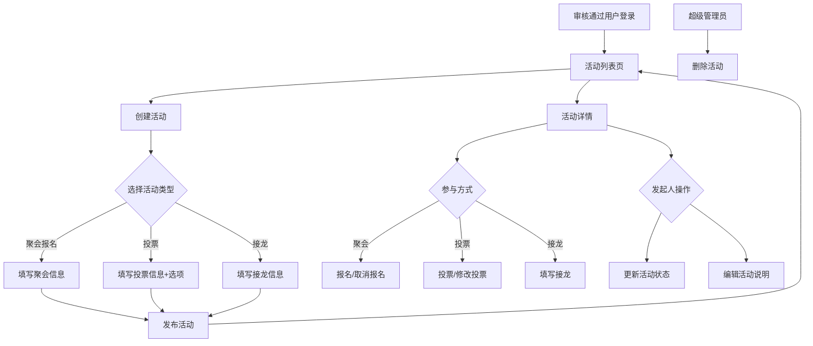
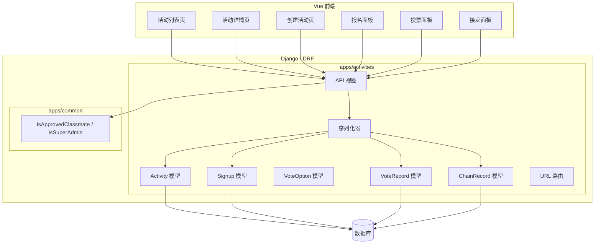

文章标题：M07 活动模块技术方案

# 一、背景

## 项目背景

M02-M06 已完成账号审核、权限基础、个人资料、内容公共能力和首页动态。M07 是阶段 4 的核心业务模块，实现班级活动组织能力：聚会报名、投票和接龙。

根据白皮书，活动模块不同于普通动态，采用结构化表单。参与活动、报名、接龙、费用确认等行为必须使用真实姓名，不提供匿名参与。活动发起人不能自行删除已发布活动，删除活动由管理员处理。

模块规划要求实现实名快照机制，保存发起人、报名人、投票人、接龙人的 `real_name_snapshot`，避免用户后续修改真实姓名导致历史活动记录混乱。

## 系统背景

- `apps/activities/` 模块已建立边界，尚未实现业务模型。
- M03 已实现 `IsApprovedClassmate` 和 `IsSuperAdmin` 权限类。
- M05 已实现 `ContentStatus` 公共枚举和 `SoftDeletableModel` 基类。
- M04 已实现个人资料和通讯录，为活动实名提供数据来源。
- 前端已有路由守卫和导航框架。

# 二、需求描述

## 需求来源

| 来源 | 需求内容 |
| --- | --- |
| 白皮书 | 三类活动：聚会报名、投票、接龙 |
| 白皮书 | 活动字段：标题、时间、地点、发起人、说明、报名截止时间、预计费用、是否可带家属、联系人、报名名单、活动状态 |
| 白皮书 | 投票字段：主题、说明、选项列表、单选/多选、结果展示方式、截止时间、是否实时公开、是否允许修改 |
| 白皮书 | 接龙支持表格式字段，示例：姓名、是否参加、人数、是否开车、备注 |
| 白皮书 | 活动参与必须使用真实姓名，不支持匿名 |
| 白皮书 | 活动发起人不能自行删除活动，删除由管理员处理 |
| 白皮书 | 活动状态：筹备中、报名中、已截止、已结束、已取消 |
| 模块规划 | 实名快照机制：保存 real_name_snapshot |
| 用户本轮确认 | 三种活动都实现；投票两种结果展示都支持；接龙固定模板；严格执行删除规则；报名截止前可取消；前端活动列表/详情/创建页 |

## 本阶段明确范围

M07 实现：

- 活动主体模型 `Activity`：标题、时间、地点、发起人（含实名快照）、说明、活动类型、状态、截止时间等。
- 聚会报名：报名记录模型，含实名快照、人数、是否带家属、备注。
- 投票：投票选项模型、投票记录模型，支持单选/多选、两种结果展示方式。
- 接龙：接龙记录模型，固定字段模板（是否参加、人数、备注）。
- 活动 API：创建、列表（按状态筛选）、详情、编辑（发起人）、状态变更（发起人）、删除（管理员）。
- 报名 API：报名、取消报名、查看报名名单。
- 投票 API：投票、修改投票（如允许）、查看结果。
- 接龙 API：填写接龙、查看接龙列表。
- 前端：活动列表页、活动详情页（含报名/投票/接龙交互）、创建活动页。

M07 不实现：

- 活动费用公示和财务管理。
- 管理端活动管理页面（留到 M12）。
- 活动关联相册（留到 M09）。

# 三、技术方案

## 方案描述

M07 在 `apps/activities/` 中实现活动主体模型和三种参与记录模型。

`Activity` 是活动主体，通过 `activity_type` 区分类型（`gathering` / `voting` / `chain`）。公共字段包括标题、时间、地点、发起人、说明、状态、截止时间等。发起人保存 `real_name_snapshot`。

`Signup`（聚会报名）关联 Activity，保存报名人、人数、是否带家属、备注，以及报名人的 `real_name_snapshot`。

`VoteOption`（投票选项）关联 Activity，保存选项文本。`VoteRecord`（投票记录）关联 VoteOption 和投票人，保存 `real_name_snapshot`。

`ChainRecord`（接龙记录）关联 Activity，保存填写人、是否参加、人数、备注，以及 `real_name_snapshot`。

所有参与记录在创建时从 `request.user.real_name` 复制到 `real_name_snapshot`，后续用户修改真实姓名不影响历史记录。

## 业务流程图



## 数据流程图

```mermaid
flowchart LR
    CreateForm[创建活动表单] --> ActivityAPI[POST /api/v1/activities/]
    ActivityAPI --> ActivityModel[(activities_activity)]
    ActivityModel --> ListAPI[GET /api/v1/activities/]
    ListAPI --> ListResponse[分页列表 + 状态筛选]
    ActivityModel --> DetailAPI[GET /api/v1/activities/{id}/]
    DetailAPI --> DetailResponse[详情 + 参与数据]

    SignupForm[报名表单] --> SignupAPI[POST /api/v1/activities/{id}/signup/]
    SignupAPI --> SignupModel[(activities_signup)]
    VoteForm[投票表单] --> VoteAPI[POST /api/v1/activities/{id}/vote/]
    VoteAPI --> VoteRecordModel[(activities_voterecord)]
    ChainForm[接龙表单] --> ChainAPI[POST /api/v1/activities/{id}/chain/]
    ChainAPI --> ChainRecordModel[(activities_chainrecord)]
```

## 技术架构拓扑图



## 关联模块具体方案描述

### 数据层 / 存储

**Activity 模型：**

| 字段 | 类型 | 必填 | 说明 |
| --- | --- | --- | --- |
| `title` | CharField | 是 | 活动标题 |
| `activity_type` | CharField choices | 是 | `gathering` / `voting` / `chain` |
| `initiator` | FK User | 是 | 发起人 |
| `initiator_name_snapshot` | CharField | 是 | 发起人真实姓名快照 |
| `description` | TextField | 是 | 活动说明 |
| `location` | CharField blank | 否 | 活动地点（聚会用） |
| `start_time` | DateTime null | 否 | 活动开始时间（聚会用） |
| `deadline` | DateTime null | 否 | 报名/投票/接龙截止时间 |
| `max_participants` | PositiveIntegerField null | 否 | 人数上限（聚会用） |
| `allow_guests` | BooleanField | 是 | 是否可带家属（聚会用），默认 False |
| `contact_info` | CharField blank | 否 | 联系人信息 |
| `status` | CharField choices | 是 | 活动状态 |
| `is_multi_choice` | BooleanField | 是 | 是否多选（投票用），默认 False |
| `show_voter_names` | BooleanField | 是 | 是否展示投票参与人（投票用），默认 False |
| `allow_vote_change` | BooleanField | 是 | 是否允许修改投票（投票用），默认 True |
| `created_at` | DateTime | 是 | 创建时间 |
| `updated_at` | DateTime | 是 | 更新时间 |

活动状态枚举：

```python
class ActivityStatus(models.TextChoices):
    PREPARING = "preparing", "筹备中"
    OPEN = "open", "报名中"
    CLOSED = "closed", "已截止"
    FINISHED = "finished", "已结束"
    CANCELLED = "cancelled", "已取消"
```

**Signup 模型（聚会报名）：**

| 字段 | 类型 | 必填 | 说明 |
| --- | --- | --- | --- |
| `activity` | FK Activity | 是 | 关联活动 |
| `user` | FK User | 是 | 报名人 |
| `real_name_snapshot` | CharField | 是 | 报名人真实姓名快照 |
| `participant_count` | PositiveSmallIntegerField | 是 | 参加人数，默认 1 |
| `bring_guests` | BooleanField | 是 | 是否带家属，默认 False |
| `note` | CharField blank | 否 | 备注 |
| `created_at` | DateTime | 是 | 报名时间 |

**VoteOption 模型（投票选项）：**

| 字段 | 类型 | 必填 | 说明 |
| --- | --- | --- | --- |
| `activity` | FK Activity | 是 | 关联活动 |
| `text` | CharField | 是 | 选项文本 |
| `order` | PositiveSmallIntegerField | 是 | 排序 |

**VoteRecord 模型（投票记录）：**

| 字段 | 类型 | 必填 | 说明 |
| --- | --- | --- | --- |
| `option` | FK VoteOption | 是 | 投票选项 |
| `user` | FK User | 是 | 投票人 |
| `real_name_snapshot` | CharField | 是 | 投票人真实姓名快照 |
| `created_at` | DateTime | 是 | 投票时间 |

**ChainRecord 模型（接龙记录）：**

| 字段 | 类型 | 必填 | 说明 |
| --- | --- | --- | --- |
| `activity` | FK Activity | 是 | 关联活动 |
| `user` | FK User | 是 | 填写人 |
| `real_name_snapshot` | CharField | 是 | 填写人真实姓名快照 |
| `will_attend` | BooleanField | 是 | 是否参加 |
| `participant_count` | PositiveSmallIntegerField | 是 | 人数，默认 1 |
| `note` | CharField blank | 否 | 备注 |
| `created_at` | DateTime | 是 | 填写时间 |

### 后端服务 / API

| 方法 | 路径 | 权限 | 说明 |
| --- | --- | --- | --- |
| `GET` | `/api/v1/activities/` | IsApprovedClassmate | 活动列表（分页、状态筛选） |
| `POST` | `/api/v1/activities/` | IsApprovedClassmate | 创建活动 |
| `GET` | `/api/v1/activities/{id}/` | IsApprovedClassmate | 活动详情（含参与数据） |
| `PATCH` | `/api/v1/activities/{id}/` | 发起人 | 编辑活动说明 |
| `POST` | `/api/v1/activities/{id}/update-status/` | 发起人 | 更新活动状态 |
| `DELETE` | `/api/v1/activities/{id}/` | IsSuperAdmin | 删除活动 |
| `POST` | `/api/v1/activities/{id}/signup/` | IsApprovedClassmate | 报名 |
| `DELETE` | `/api/v1/activities/{id}/signup/` | 报名人 | 取消报名 |
| `POST` | `/api/v1/activities/{id}/vote/` | IsApprovedClassmate | 投票 |
| `GET` | `/api/v1/activities/{id}/vote-results/` | IsApprovedClassmate | 查看投票结果 |
| `POST` | `/api/v1/activities/{id}/chain/` | IsApprovedClassmate | 填写接龙 |

### 前端 / 客户端

新增路由：

| 路由 | 页面 | 权限 |
| --- | --- | --- |
| `/activities` | 活动列表页 | requiresAuth + requiresApproved |
| `/activities/create` | 创建活动页 | requiresAuth + requiresApproved |
| `/activities/:id` | 活动详情页 | requiresAuth + requiresApproved |

### 基础设施 / 第三方依赖

M07 不新增外部依赖。

## 异常和边界场景

| 异常情况 | 结果 | 描述 |
| --- | --- | --- |
| 未审核通过用户访问 | HTTP 403 | IsApprovedClassmate 拦截 |
| 创建活动时类型无效 | 返回 400 | 后端校验 choices |
| 报名已截止的活动 | 返回 400 | 截止后不可报名 |
| 取消报名（已截止） | 返回 400 | 截止后不可取消 |
| 重复报名 | 返回 400 | 同一用户对同一活动只能报名一次 |
| 编辑他人活动 | HTTP 403 | 仅发起人可编辑 |
| 删除活动（非管理员） | HTTP 403 | 仅超级管理员可删除 |
| 投票已截止 | 返回 400 | 截止后不可投票 |
| 修改投票（不允许） | 返回 400 | allow_vote_change=False 时不可修改 |
| 单选投票选多个 | 返回 400 | is_multi_choice=False 时只能选一个 |
| 接龙重复填写 | 返回 400 | 同一用户对同一接龙只能填写一次 |

## 方案劣势、风险和解决措施

| 风险 / 劣势 | 影响 | 解决措施 | 验证方式 |
| --- | --- | --- | --- |
| 接龙字段固定模板 | 无法满足复杂接龙场景 | 初版够用；后续如需自定义字段，可扩展为 JSON 模板 | 使用观察 |
| 无费用管理 | 涉及费用的活动需线下处理 | 后续 M12 或独立模块可增加费用公示 | 后续需求补充 |
| 活动删除仅管理员 | 发起人无法自行清理测试活动 | 符合白皮书规则；测试数据通过 Django Admin 清理 | 功能测试 |

# 四、实施步骤

## 后端实施步骤

1. 实现 Activity、Signup、VoteOption、VoteRecord、ChainRecord 模型。
2. 实现序列化器。
3. 实现活动 CRUD、状态变更、删除 API。
4. 实现报名、投票、接龙 API。
5. 配置 URL 路由。
6. 编写测试用例。
7. 生成并验证迁移。

## 前端实施步骤

1. 新增 Activity API 封装。
2. 新增活动列表页。
3. 新增创建活动页（按类型展示不同表单）。
4. 新增活动详情页（含报名/投票/接龙交互）。
5. 更新路由和导航。

# 五、验收标准

- 用户可以创建三种类型的活动。
- 活动列表支持按状态筛选。
- 用户可以报名、取消报名（截止前）。
- 用户可以投票（单选/多选），查看投票结果。
- 用户可以填写接龙。
- 所有参与记录保存 real_name_snapshot。
- 发起人可编辑活动说明和更新状态。
- 发起人不能删除活动，管理员可以。
- `python manage.py check`、`makemigrations --check --dry-run`、后端测试、OpenAPI 生成、前端 typecheck、前端 build 通过。
