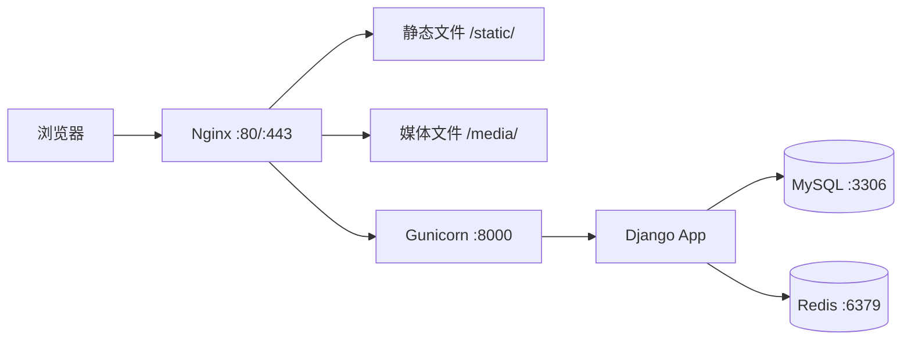

文章标题：M15 部署、备份与上线验收技术方案

# 一、背景

M15 是第一版最后一个模块，目标是将此前完成的 M01-M14 所有业务能力，整理为可部署、可备份、可恢复、可验收的上线条件。

根据模块规划，M15 包含以下任务：

- 生产 Docker Compose
- Nginx 与 HTTPS
- 数据库迁移验证
- 媒体文件备份
- 数据库备份恢复
- 安全配置检查
- 上线验收

# 二、当前基础设施状态

## 已有

| 资源 | 状态 |
| --- | --- |
| 开发 Docker Compose | 已有 MySQL 8.4 + Redis 7.4 |
| 配置分层 | 已有 base / development / test / production |
| 后端依赖 | Django + DRF + JWT + OpenAPI + django-filter + Pillow + PyMySQL |
| 前端工程 | Vue 3 + TypeScript + Vite + Element Plus |
| 测试 | 90 个测试全部通过 |
| OpenAPI | 已生成，无错误无警告 |

## 缺失

| 资源 | 说明 |
| --- | --- |
| 生产 Docker Compose | 需要 Nginx + Django/Gunicorn + MySQL + Redis |
| Nginx 配置 | 反向代理、静态资源、安全响应头、上传大小限制 |
| Gunicorn 配置 | 多 worker、日志、超时 |
| 备份脚本 | 数据库备份、媒体文件备份 |
| 恢复脚本 | 数据库恢复、媒体文件恢复 |
| .env.prod 模板 | 生产环境变量模板 |
| 安全加固 | DEBUG=False、ALLOWED_HOSTS、CORS、CSRF、密钥管理 |

# 三、部署架构



## 服务清单

| 服务 | 镜像/工具 | 端口 | 说明 |
| --- | --- | --- | --- |
| Nginx | nginx:1.28-alpine | 80, 443 | 反向代理、静态资源、安全响应头 |
| Django | python:3.14-slim + Gunicorn | 8000（内部） | 应用服务 |
| MySQL | mysql:8.4 | 3306（内部） | 数据库 |
| Redis | redis:7.4-alpine | 6379（内部） | 缓存/会话 |

# 四、生产 Docker Compose

## 文件

```text
deploy/docker-compose.prod.yml
deploy/nginx/nginx.conf
deploy/nginx/conf.d/tavern.conf
```

## 关键设计决策

1. Gunicorn 使用 4 个 worker，绑定 0.0.0.0:8000
2. Nginx 处理静态文件 /static/ 和媒体文件 /media/，其余代理到 Gunicorn
3. MySQL 和 Redis 不暴露端口到宿主机，仅内部网络通信
4. 使用 Docker 命名卷持久化 MySQL 数据和媒体文件
5. 环境变量通过 .env.prod 注入，不写入镜像

# 五、备份策略

## 数据库备份

```text
deploy/scripts/backup-db.sh
```

- 使用 mysqldump 导出全库
- 备份文件命名：tavern_db_YYYYMMDD_HHMMSS.sql.gz
- 保留最近 7 天备份
- 通过 cron 定时执行

## 媒体文件备份

```text
deploy/scripts/backup-media.sh
```

- 使用 tar 打包 media/ 目录
- 备份文件命名：tavern_media_YYYYMMDD_HHMMSS.tar.gz
- 保留最近 7 天备份

## 恢复脚本

```text
deploy/scripts/restore-db.sh
deploy/scripts/restore-media.sh
```

# 六、安全配置

## .env.prod 模板

```text
deploy/.env.prod.example
```

包含以下配置项（不含真实值）：

- DJANGO_SECRET_KEY
- DJANGO_ALLOWED_HOSTS
- CORS_ALLOWED_ORIGINS
- CSRF_TRUSTED_ORIGINS
- MYSQL_DATABASE / MYSQL_USER / MYSQL_PASSWORD / MYSQL_ROOT_PASSWORD
- REDIS_URL
- JWT_ACCESS_TOKEN_MINUTES / JWT_REFRESH_TOKEN_DAYS

## 生产 Django 配置

```text
tavern/settings/production.py
```

已有 production.py，需要确认：

- DEBUG=False
- ALLOWED_HOSTS 从环境变量读取
- CORS_ALLOWED_ORIGINS 从环境变量读取
- CSRF_TRUSTED_ORIGINS 从环境变量读取
- SECURE_SSL_REDIRECT=True
- SESSION_COOKIE_SECURE=True
- CSRF_COOKIE_SECURE=True

## Nginx 安全响应头

- X-Content-Type-Options: nosniff
- X-Frame-Options: DENY
- X-XSS-Protection: 1; mode=block
- Referrer-Policy: strict-origin-when-cross-origin
- 上传大小限制：client_max_body_size 10m

# 七、上线验收清单

| 验收项 | 验证方式 |
| --- | --- |
| Docker Compose 配置有效 | docker compose config |
| 后端检查通过 | python manage.py check --deploy |
| 迁移可执行 | python manage.py migrate --noinput |
| 测试通过 | python manage.py test |
| OpenAPI 可生成 | python manage.py spectacular --validate |
| 前端可构建 | npm run build |
| 备份脚本可执行 | bash backup-db.sh / backup-media.sh |
| 恢复脚本可执行 | bash restore-db.sh / restore-media.sh |

# 八、边界决策

1. HTTPS 证书：第一版使用自签名证书或 Let's Encrypt，不强制要求商业 CA 证书。Nginx 配置预留 443 端口和 SSL 配置块，实际证书路径通过环境变量注入。
2. 对象存储：第一版使用本地 media/ 目录，不做 S3/OSS 迁移。备份脚本覆盖本地文件即可。
3. Celery：第一版不启用 Celery，通知在请求内同步创建。后续需要异步任务时再引入。
4. 监控和日志：第一版使用 Docker 日志驱动和 Django 日志，不引入 Prometheus/Grafana/ELK。
5. CI/CD：第一版不做 CI/CD 流水线，手动执行部署和验证命令。
