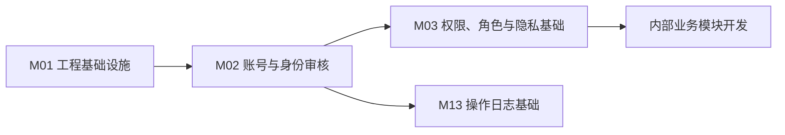
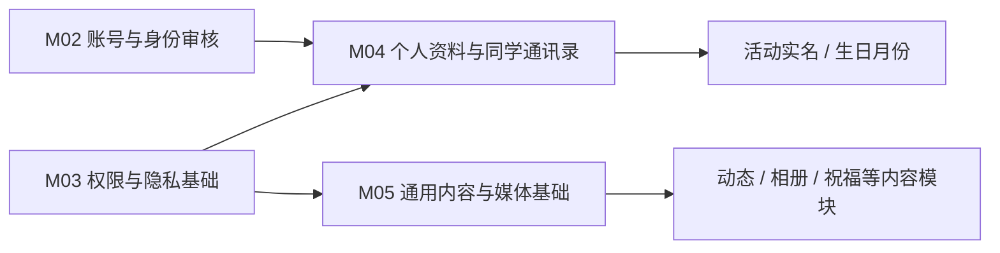
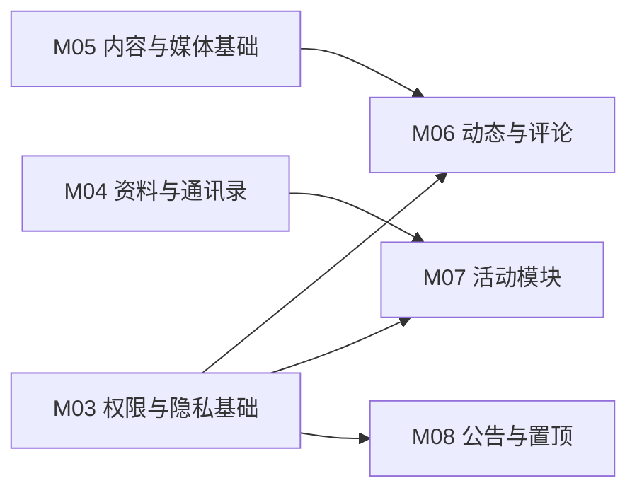
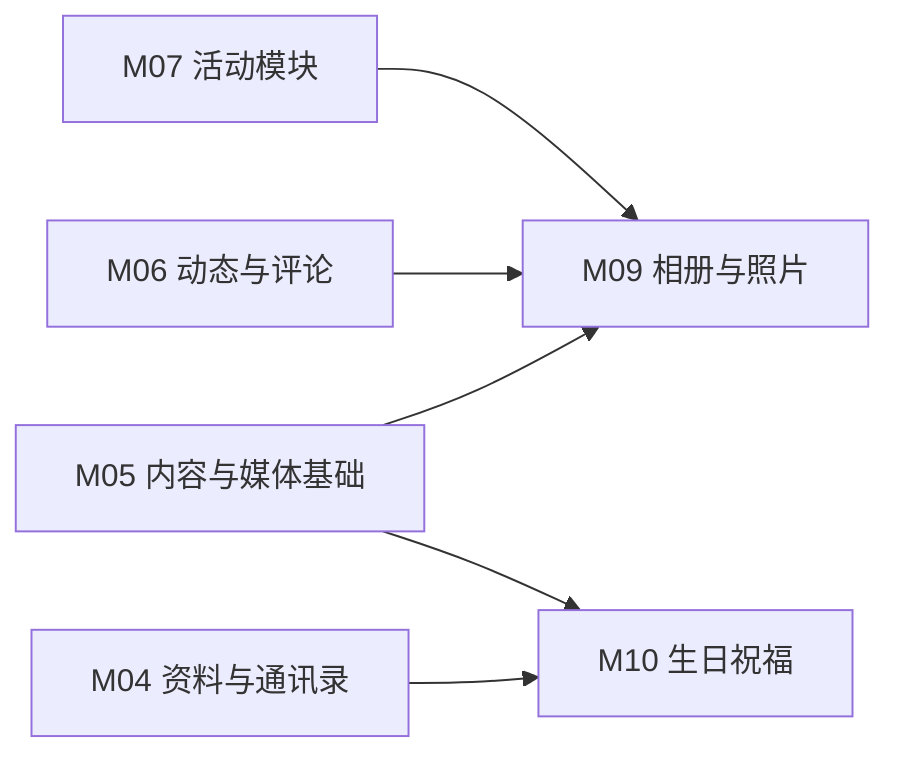
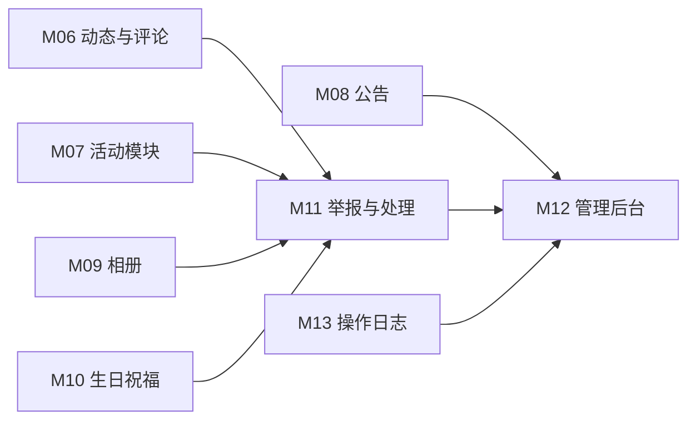
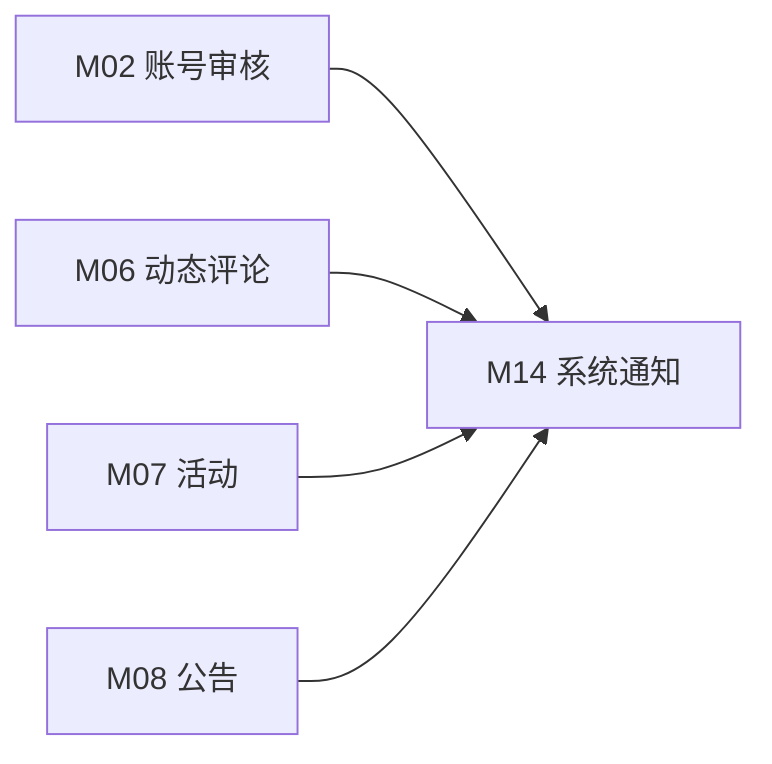
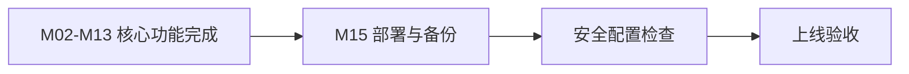
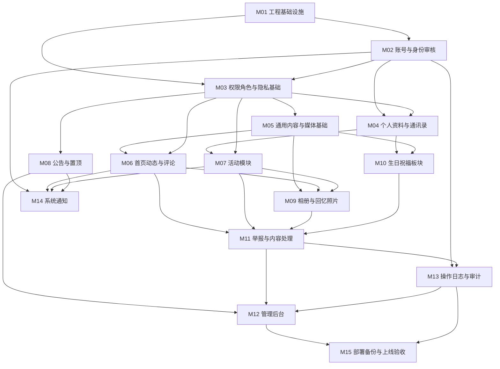

文章标题：高中同班同学社区网站项目开发模块规划说明文档

# 一、文档目的

本文档用于指导“高中同班同学社区网站”第一版后续开发计划，基于以下资料整理：

- `classmate-community-whitepaper.md`：项目产品与治理总纲。
- `AGENTS.md`：项目技术栈、工程结构、安全、隐私、测试和部署约束。
- `docs/classmate-community-hld.md`：项目概要设计文档。

本文档只做粗颗粒度开发模块划分和阶段顺序规划，不估算具体人天，不绑定具体自然日期。后续进入具体 Sprint、Issue 或 PR 拆分时，可以再把本文档中的模块继续拆成更细任务。

# 二、当前进展

截至当前代码状态，M01-M15 第一版模块均已落地，并在后续迭代中补齐了以下体验和安全能力：

- 注册页接入“社区公约”勾选门控，社区公约为注册前公开可访问页面。
- 动态评论和照片评论统一为“两级展示 + 任意评论可继续回复”的扁平回复模型。
- 系统通知已从“预留”升级为可用通知中心，并接入审核、公告、评论回复和活动状态。
- 新增 SSE 实时事件推送与 `/events/since/` 补拉，用于动态、评论、公告、相册、通知等页面刷新。
- 完成 P0 安全加固：生产关闭公开 API 文档、接口限流、SSE 连接保护、媒体短期签名访问。
- 完成移动端适配、举报弹框优化、头像上传和通用头像兜底展示。

后续开发应以“缺陷修复、体验打磨、安全回归和上线验收”为主，不再按 M01-M15 从零推进。

# 三、规划原则

## 开发顺序原则

项目第一版应先打基础，再做业务模块，最后做治理、部署和验收。核心顺序如下：

1. 先完成工程基础设施和开发环境。
2. 先完成账号、身份审核、权限和隐私基础能力。
3. 再开发依赖账号体系的业务模块，例如通讯录、动态、活动、相册、生日祝福。
4. 举报、治理、操作日志需要贯穿业务模块，但完整管理闭环应在核心业务对象稳定后集中完善。
5. 前端页面可以跟随后端 API 并行推进，但不能早于关键接口契约和权限规则。
6. 部署、备份、安全加固和上线验收放在后期，但开发期需要提前预留配置和目录结构。

## 粗颗粒度原则

本文档中的任务项是“开发模块级”任务，不是具体编码任务。每个模块通常包含：

- 后端模型、接口、权限、序列化、基础测试。
- 前端页面、路由、状态管理、表单、列表和基础交互。
- 必要的管理后台能力。
- 与其他模块的接口联调。

后续落地时，建议再把每个模块拆成后端、前端、测试、文档、联调等更小 Issue。

## 隐私与治理优先原则

本项目不是公开社区，而是面向同班同学的私密社区。因此开发时应优先保证：

- 未登录和未审核用户不能访问内部内容。
- 普通用户不能看到审核材料、举报记录、管理日志等敏感信息。
- 联系方式默认不公开。
- 展示身份用于前台选择真实姓名或昵称；所有内容后台均保留真实作者。
- 活动报名、投票、接龙必须实名。
- 生日只展示月份，不保存出生年份和具体日期。
- 不实现站内私信、小群、群聊、临时讨论组等不可控沟通能力。

# 四、模块拆分总览

| 模块编号 | 模块名称 | 模块定位 | 主要交付物 | 依赖关系 | 推荐阶段 |
| --- | --- | --- | --- | --- | --- |
| M01 | 工程基础设施 | 搭建项目可持续开发的基础骨架 | 后端工程结构、前端工程、基础配置、API 文档、开发环境 | 无 | 阶段 1 |
| M02 | 账号与身份审核 | 建立用户准入机制 | 注册、登录、JWT、真实姓名、邀请码、审核状态、管理员审核 | M01 | 阶段 2 |
| M03 | 权限、角色与隐私基础 | 所有内部模块的安全底座 | 角色、账号状态、权限类、隐私字段过滤、统一错误码 | M01、M02 | 阶段 2 |
| M04 | 个人资料与同学通讯录 | 用户资料和班级联系基础 | 资料维护、通讯录、搜索筛选、联系方式可见范围、生日月份设置 | M02、M03 | 阶段 3 |
| M05 | 通用内容与媒体基础 | 动态、相册等内容模块的公共能力 | 上传校验、媒体元数据、内容状态、软删除、身份展示工具 | M02、M03 | 阶段 3 |
| M06 | 首页动态与评论 | 站内日常分享和互动基础 | 动态、图片、标签、置顶、评论、回复、删除、身份展示 | M03、M05 | 阶段 4 |
| M07 | 活动模块 | 班级活动组织能力 | 聚会报名、投票、接龙、活动状态、实名快照 | M03、M04 | 阶段 4 |
| M08 | 公告与置顶 | 班级重要信息发布能力 | 公告发布、置顶、有效期、已读确认 | M02、M03 | 阶段 4，可与 M06/M07 并行 |
| M09 | 相册与回忆照片 | 班级照片沉淀能力 | 相册、照片上传、照片说明、照片评论、活动关联 | M05、M06、M07 | 阶段 5 |
| M10 | 生日祝福板块 | 轻量情感连接能力 | 本月生日同学、生日祝福、生日展示开关、祝福管理 | M04、M05 | 阶段 5，可与 M09 并行 |
| M11 | 举报与内容处理 | 内容治理入口和处理流程 | 举报入口、举报列表、处理动作、状态流转 | M06、M07、M08、M09、M10 | 阶段 6 |
| M12 | 管理后台 | 管理员日常治理工作台 | 用户审核、用户管理、内容管理、活动管理、举报处理、公告管理 | M02-M11 | 阶段 6，部分能力可随模块增量建设 |
| M13 | 操作日志与审计 | 治理追溯能力 | 审核、删除、封禁、角色变更、举报处理等日志 | M02、M03，贯穿 M06-M12 | 阶段 2 起预埋，阶段 6 完善 |
| M14 | 系统通知 | 系统提醒能力，不包含私信 | 审核结果、公告、评论回复、活动状态等系统通知 | M02、M06、M07、M08 | 阶段 7，可按需裁剪 |
| M15 | 部署、备份与上线验收 | 第一版上线保障 | Docker Compose、Nginx、MySQL、Redis、备份恢复、安全配置、验收测试 | M01-M13 | 阶段 8 |

# 五、任务项规划说明

## 工程基础设施

该模块是所有后续开发的基础，应最先完成。

主要任务项：

| 任务项 | 说明 | 前置依赖 | 可并行性 |
| --- | --- | --- | --- |
| 后端工程结构整理 | 按 `apps/accounts`、`apps/profiles`、`apps/posts` 等领域模块建立目录结构 | 无 | 可与前端工程初始化并行 |
| 后端依赖补齐 | 引入 DRF、JWT、OpenAPI、CORS、django-filter、Pillow、MySQL 驱动等 | 无 | 可与目录结构并行 |
| 配置分层 | 区分开发、测试、生产配置，使用环境变量管理敏感配置 | 后端基础结构 | 可与 Docker 开发环境并行 |
| 前端工程初始化 | 建立 Vue 3 + TypeScript + Vite 工程，配置路由、状态管理和 UI 组件库 | 无 | 可与后端基础并行 |
| OpenAPI 基础接入 | 建立 API 文档生成能力，作为前后端联调契约 | DRF 基础依赖 | 依赖后端 API 框架 |
| Docker 开发环境 | 建立 MySQL、Redis 的开发期 Docker Compose | 无 | 可与后端基础并行 |

阶段目标：项目可以启动，后端具备 API 开发基础，前端具备页面开发基础，MySQL/Redis 开发环境可用。

## 账号与身份审核

账号模块是所有内部业务模块的前置依赖。没有账号审核，其他模块即使完成也不能安全开放。

主要任务项：

| 任务项 | 说明 | 前置依赖 | 可并行性 |
| --- | --- | --- | --- |
| 自定义用户模型 | 支持真实姓名、角色、审核状态、账号状态等字段 | 工程基础设施 | 必须优先 |
| 注册与登录 | 支持注册、登录、退出、JWT 刷新 | 自定义用户模型 | 可与审核资料模型并行 |
| 审核资料提交 | 支持真实姓名、班级信息、身份说明、邀请码等资料 | 自定义用户模型 | 可与注册登录并行 |
| 管理员审核 | 支持通过、拒绝、需补充资料、限制、封禁等状态流转 | 注册与审核资料 | 依赖前面任务 |
| 待审核状态页 | 前端展示审核状态和补充资料入口 | 注册与审核接口 | 可与管理员审核页面并行 |
| 管理端审核页面 | 管理员查看待审核用户并处理 | 管理员审核接口 | 可与待审核状态页并行 |

阶段目标：用户可以注册并等待审核，管理员可以处理审核，只有审核通过用户可以进入内部社区。

## 权限、角色与隐私基础

该模块是所有内部 API 的共同安全底座，应与账号模块同步推进，并在业务模块开发前形成稳定规则。

主要任务项：

| 任务项 | 说明 | 前置依赖 | 可并行性 |
| --- | --- | --- | --- |
| 角色权限模型 | 区分普通同学、管理会员、超级管理员、被限制用户 | 自定义用户模型 | 可与账号接口并行 |
| 账号状态访问矩阵 | 明确未登录、待审核、拒绝、限制、封禁等访问规则 | 账号状态模型 | 必须先于内部模块 |
| DRF 权限类 | 实现内部资源、管理接口、对象级权限基础类 | 角色和状态规则 | 依赖权限模型 |
| 隐私可见范围枚举 | 定义仅自己、仅管理员、已审核同学、活动参与者等范围 | 资料模块设计 | 可提前设计 |
| 字段级过滤机制 | 普通接口按可见范围返回最小必要字段 | 隐私枚举 | 依赖隐私规则 |
| 统一错误码 | 定义账号待审核、封禁、无权限、内容删除等错误码 | 权限规则 | 可与权限类并行 |

阶段目标：所有后续模块可以复用统一权限和隐私过滤能力，不需要各自重复实现安全规则。

## 个人资料与同学通讯录

资料和通讯录是用户进入社区后的基础能力，也为活动实名、生日祝福和同学搜索提供数据来源。

主要任务项：

| 任务项 | 说明 | 前置依赖 | 可并行性 |
| --- | --- | --- | --- |
| 资料模型 | 头像、昵称、城市、行业、简介、高中信息、生日月份等 | 账号与权限 | 必须先做 |
| 隐私设置模型 | 手机号、微信号、邮箱等联系方式默认不公开 | 资料模型、隐私基础 | 可与资料接口并行 |
| 个人资料维护 API | 用户查看和编辑自己的资料 | 资料模型 | 可与前端资料页并行 |
| 通讯录列表 API | 已审核同学查看通讯录列表 | 权限和隐私过滤 | 依赖字段过滤 |
| 搜索和筛选 | 按姓名、城市、行业等白名单字段筛选 | 通讯录 API | 依赖列表接口 |
| 前端资料与通讯录页面 | 资料编辑、隐私设置、通讯录列表、同学详情 | 对应 API | 可按接口契约并行开发 |

阶段目标：已审核同学可以维护自己的资料，并在隐私规则下查看同学通讯录。

## 通用内容与媒体基础

动态、相册和照片都依赖媒体上传、内容状态、软删除和身份展示能力，因此建议在具体内容模块之前先抽象公共能力。

主要任务项：

| 任务项 | 说明 | 前置依赖 | 可并行性 |
| --- | --- | --- | --- |
| 媒体元数据模型 | 保存上传人、文件路径、类型、大小、宽高、关联对象等 | 账号与权限 | 必须先做 |
| 上传安全校验 | 限制文件大小、类型、数量，服务端校验图片 | 媒体模型 | 可与媒体访问设计并行 |
| 媒体受控访问 | 图片和附件不提供永久公开敏感直链 | 权限基础 | 依赖权限规则 |
| 内容状态枚举 | draft、published、hidden、deleted、pending_review 等 | 权限基础 | 可并行 |
| 软删除基础字段 | deleted_at、deleted_by、delete_reason | 内容状态枚举 | 可并行 |
| 身份展示工具 | 根据 display_mode 和当前用户角色返回展示身份 | 权限与账号 | 必须先于动态、评论、生日祝福 |

阶段目标：业务内容模块可以复用统一的上传、内容状态、软删除和身份展示能力。

## 首页动态与评论

动态和评论是社区日常互动的核心模块，应在账号、权限、资料和媒体基础具备后开发。

主要任务项：

| 任务项 | 说明 | 前置依赖 | 可并行性 |
| --- | --- | --- | --- |
| 动态模型与 API | 发布文字动态、图片、标签、列表、详情 | 通用内容与媒体基础 | 后端优先 |
| 评论与回复模型 | 支持动态评论、回复、删除和状态管理 | 动态模型、身份展示 | 可与动态接口并行设计 |
| 身份展示接入 | 动态、评论按普通用户和管理员视角返回不同作者信息 | 身份展示工具 | 依赖公共能力 |
| 置顶和标签 | 支持常用分类、按时间排序、置顶展示 | 动态基础 API | 可后置 |
| 用户删除 | 用户删除自己的普通动态和评论 | 动态和评论模型 | 依赖状态规则 |
| 前端动态页面 | 动态列表、发布框、详情、评论区、图片展示 | 动态和评论 API | 可按接口契约并行开发 |

阶段目标：已审核同学可以在班级内部发布动态、评论互动，并遵守身份展示和内容可管规则。

## 活动模块

活动模块用于聚会报名、投票和接龙。由于活动参与必须实名，依赖账号真实姓名和资料能力。

主要任务项：

| 任务项 | 说明 | 前置依赖 | 可并行性 |
| --- | --- | --- | --- |
| 活动主体模型 | 标题、时间、地点、说明、发起人、状态、截止时间 | 账号、权限、资料 | 必须先做 |
| 实名快照机制 | 保存发起人、报名人、投票人、接龙人的 real_name_snapshot | 活动主体、账号真实姓名 | 必须先于参与记录 |
| 聚会报名 | 报名名单、人数、可带家属、备注、截止时间 | 活动主体、实名快照 | 可与投票/接龙并行 |
| 投票 | 选项、单选/多选、结果展示规则、截止时间 | 活动主体、实名快照 | 可与报名/接龙并行 |
| 接龙 | 表格式字段定义、填写记录、实名填写 | 活动主体、实名快照 | 可与报名/投票并行 |
| 活动状态管理 | 筹备中、报名中、已截止、已结束、已取消 | 活动主体 | 可后置完善 |
| 前端活动页面 | 活动列表、详情、报名、投票、接龙填写 | 对应 API | 可与后端子能力并行开发 |

阶段目标：同学可以实名参与活动，管理员后续可以治理活动内容和删除异常活动。

## 公告与置顶

公告模块相对独立，可以在账号、权限和管理角色具备后，与动态、活动模块并行开发。

主要任务项：

| 任务项 | 说明 | 前置依赖 | 可并行性 |
| --- | --- | --- | --- |
| 公告模型 | 标题、内容、发布人、置顶、有效期、状态 | 账号与权限 | 可独立开发 |
| 公告列表与详情 | 已审核同学查看公告 | 公告模型 | 可与管理发布并行 |
| 公告发布管理 | 管理员或授权管理会员发布、编辑、删除公告 | 管理角色 | 可与普通公告 API 并行 |
| 已读确认 | 重要公告支持用户确认已读 | 公告基础 API | 可后置 |
| 前端公告页面 | 公告列表、详情、已读确认、首页置顶展示 | 对应 API | 可并行 |

阶段目标：管理员可以发布班级重要事项，已审核同学可以查看并确认重要公告。

## 相册与回忆照片

相册依赖媒体上传能力，也会复用评论和举报能力。建议在动态评论和活动基础稳定后开发。

主要任务项：

| 任务项 | 说明 | 前置依赖 | 可并行性 |
| --- | --- | --- | --- |
| 相册模型 | 标题、分类、说明、创建人、状态、活动关联 | 媒体基础、活动基础 | 必须先做 |
| 照片上传 | 上传照片、图片说明、照片状态 | 媒体上传 | 依赖媒体基础 |
| 照片评论 | 对照片进行评论，复用评论能力 | 评论基础 | 依赖评论模块 |
| 活动照片关联 | 相册或照片关联到活动 | 活动基础 | 可后置 |
| 相册管理 | 管理员审核、删除或隐藏照片 | 管理权限、内容状态 | 可与举报模块联动 |
| 前端相册页面 | 相册列表、照片墙、照片详情、评论 | 对应 API | 可并行 |

阶段目标：班级照片可以结构化沉淀，照片上传和展示符合隐私与内容治理要求。

## 生日祝福板块

生日模块依赖资料中的生日月份和内容身份展示能力。该模块功能轻量，可以与相册并行。

主要任务项：

| 任务项 | 说明 | 前置依赖 | 可并行性 |
| --- | --- | --- | --- |
| 生日月份设置 | 用户自愿填写生日月份并可关闭展示 | 资料模块 | 已包含在资料模块，可复用 |
| 本月生日同学 API | 只返回当前月份开启展示的同学 | 资料和隐私规则 | 必须确保不返回具体日期 |
| 生日祝福 | 发布祝福留言，支持真实姓名 / 昵称展示 | 身份展示工具 | 可与本月生日 API 并行 |
| 祝福内容管理 | 管理员隐藏不合适祝福 | 管理权限、内容状态 | 可与举报治理联动 |
| 前端生日页面 | 本月生日列表、祝福列表、发布祝福 | 对应 API | 可并行 |

阶段目标：生日板块只展示生日月份和本月生日同学，不暴露年份和具体日期。

## 举报、治理与操作日志

举报和治理能力需要覆盖多个业务对象。可以先在动态中预埋举报入口，等主要内容对象稳定后集中完善通用处理流程。

主要任务项：

| 任务项 | 说明 | 前置依赖 | 可并行性 |
| --- | --- | --- | --- |
| 操作日志基础 | 审核、角色、删除、封禁、举报处理等关键动作写日志 | 账号与权限 | 应尽早预埋 |
| 举报模型 | 举报人、对象类型、对象 ID、原因、说明、状态 | 主要内容对象稳定 | 必须先做 |
| 举报入口 | 动态、评论、照片、活动说明、生日祝福均可举报 | 对应业务模块 | 随业务模块接入 |
| 举报处理 | 忽略、隐藏、删除、要求修改、警告、限制、封禁 | 举报模型、治理动作 | 集中开发 |
| 内容治理动作 | 更新内容状态或用户状态，并记录日志 | 内容状态、账号状态 | 依赖操作日志 |
| 管理端举报列表 | 管理员查看、筛选和处理举报 | 举报处理 API | 可与后端处理并行 |

阶段目标：站内主要内容都可举报，管理员可以处理并留下可追溯记录。

## 管理后台

管理后台贯穿多个模块。建议采用“随模块增量建设 + 后期统一整合”的方式，而不是等所有业务模块完成后一次性开发。

主要任务项：

| 任务项 | 说明 | 前置依赖 | 可并行性 |
| --- | --- | --- | --- |
| 管理后台框架 | 后台路由、布局、权限守卫、菜单控制 | 前端基础、管理角色 | 可早期搭建 |
| 用户审核管理 | 审核列表、审核处理、补充资料、拒绝原因 | 账号审核 API | 阶段 2 必须完成 |
| 用户与角色管理 | 用户列表、角色分配、限制、封禁 | 权限与账号状态 | 可阶段 6 完善 |
| 内容管理 | 动态、评论、相册、生日祝福等内容隐藏和删除 | 对应业务模块 | 随模块接入 |
| 活动管理 | 活动状态、活动删除、异常处理 | 活动模块 | 依赖活动基础 |
| 公告管理 | 公告发布、编辑、置顶、有效期 | 公告模块 | 可与公告并行 |
| 举报处理 | 举报列表和处理动作 | 举报治理模块 | 依赖举报处理 |
| 操作日志查看 | 查询关键操作日志 | 操作日志基础 | 后期完善 |

阶段目标：管理人员可以完成用户审核和日常治理，超级管理员具备完整治理能力。

## 系统通知

通知中心是未来拓展方向之一。第一版可以根据资源决定是否实现完整页面，但后端设计应避免把通知做成私信。

主要任务项：

| 任务项 | 说明 | 前置依赖 | 可并行性 |
| --- | --- | --- | --- |
| 通知模型 | 接收人、类型、标题、内容、状态 | 账号模块 | 可后置 |
| 审核结果通知 | 审核通过、拒绝、需补充资料提醒 | 账号审核 | 可选实现 |
| 公告通知 | 重要公告发布提醒 | 公告模块 | 可选实现 |
| 评论回复通知 | 评论或回复提醒 | 动态评论模块 | 可选实现 |
| 活动状态通知 | 报名成功、活动状态变化提醒 | 活动模块 | 可选实现 |
| 通知中心页面 | 系统通知列表和已读状态 | 通知 API | 可后置 |

阶段目标：实现系统通知能力，但明确不提供私信、小群或聊天能力。

## 部署、备份与上线验收

部署与上线模块应在主要业务能力完成后集中完善，但环境变量、媒体路径、数据库配置等应从早期就按上线要求设计。

主要任务项：

| 任务项 | 说明 | 前置依赖 | 可并行性 |
| --- | --- | --- | --- |
| 开发 Docker Compose | MySQL、Redis 开发环境 | 工程基础设施 | 早期完成 |
| 生产 Docker Compose | Nginx、Django/Gunicorn、MySQL、Redis | 主要服务稳定 | 后期完成 |
| Nginx 与 HTTPS | 反向代理、静态资源、安全响应头、上传大小限制 | 生产部署 | 后期完成 |
| 数据库迁移验证 | 在 MySQL 上运行迁移和测试 | 后端模型稳定 | 每阶段都应执行，后期集中验收 |
| 媒体文件备份 | 上传文件备份和恢复策略 | 媒体模块 | 后期完成 |
| 数据库备份恢复 | 定期备份、恢复演练 | MySQL 环境 | 后期完成 |
| 安全配置检查 | DEBUG、ALLOWED_HOSTS、CORS、密钥、日志脱敏 | 部署配置 | 上线前完成 |
| 上线验收 | 核心流程、权限矩阵、隐私规则、治理流程验证 | 全部核心模块 | 最后完成 |

阶段目标：系统具备可部署、可备份、可恢复、可验收的第一版上线条件。

# 六、阶段时间轴规划

本文档用“阶段”表达顺序，不绑定具体日期。被依赖任务必须排在前面；没有直接依赖的任务可以并行推进。

## 阶段 1：工程基础阶段

目标：让项目具备持续开发能力。

必须先做：

- M01 工程基础设施。
- 后端依赖、工程结构、配置分层、OpenAPI 基础能力。
- 前端工程初始化。
- MySQL / Redis 开发环境。

可并行：

- 后端工程结构与前端工程初始化可以并行。
- Docker 开发环境与后端依赖补齐可以并行。
- OpenAPI 接入可在 DRF 基础就绪后推进。

阶段完成标志：后端和前端都能本地启动，开发数据库和缓存可用，后端具备 REST API 开发基础。

## 阶段 2：账号准入与安全底座阶段

目标：先建立“谁能进站、能看什么、能做什么”的基础规则。

必须先做：

- M02 账号与身份审核。
- M03 权限、角色与隐私基础。
- M13 操作日志基础预埋。

依赖关系：

可并行：

- 注册登录与审核资料模型可以并行。
- 管理员审核页面与待审核状态页可以并行。
- 角色权限模型、统一错误码、操作日志基础可以与审核流程并行推进。

阶段完成标志：用户可以注册、登录、等待审核；管理员可以审核；未审核用户不能访问内部内容；后续业务模块有统一权限基座可复用。

## 阶段 3：资料、通讯录与内容公共能力阶段

目标：补齐业务模块共享的数据基础和内容基础。

必须先做：

- M04 个人资料与同学通讯录。
- M05 通用内容与媒体基础。

依赖关系：

可并行：

- 资料与通讯录可以和媒体基础并行。
- 资料编辑页面可以和通讯录页面并行。
- 媒体上传安全、内容状态、身份展示工具可以并行推进。

阶段完成标志：用户资料、隐私设置、通讯录、生日月份基础可用；媒体上传和身份展示等公共能力可被动态、相册、生日祝福复用。

## 阶段 4：核心互动模块阶段

目标：完成社区第一版最核心的互动能力。

建议开发：

- M06 首页动态与评论。
- M07 活动模块。
- M08 公告与置顶。

依赖关系：

可并行：

- 动态与评论、活动、公告之间没有强互相依赖，可以并行开发。
- 活动内部的聚会报名、投票、接龙在活动主体和实名快照完成后可以并行开发。
- 公告模块相对独立，可以由另一条工作流并行推进。

阶段完成标志：已审核同学可以看公告、发动态、评论互动、发起和参与活动。

## 阶段 5：沉淀与轻量情感模块阶段

目标：完成相册和生日祝福，让社区具备记忆沉淀和轻量情感连接。

建议开发：

- M09 相册与回忆照片。
- M10 生日祝福板块。

依赖关系：

可并行：

- 相册与生日祝福可以并行开发。
- 相册中的活动照片关联可以晚于相册基础上传能力。
- 生日祝福管理已接入举报治理模块，后续只需按运营反馈微调。

阶段完成标志：相册、照片、照片评论、本月生日同学和生日祝福可用，并符合上传安全、身份展示和生日最小展示规则。

## 阶段 6：治理闭环与管理后台整合阶段

目标：把前面各业务模块纳入统一举报、治理、管理后台和操作日志闭环。

建议开发：

- M11 举报与内容处理。
- M12 管理后台整合。
- M13 操作日志与审计完善。

依赖关系：

可并行：

- 用户管理、公告管理可以早于完整举报处理上线。
- 动态管理、活动管理、相册管理、生日祝福管理可以随业务模块分批接入后台。
- 操作日志查看可以和举报处理页面并行开发。

阶段完成标志：管理员可以审核用户、管理内容、处理举报、限制或封禁账号，并查看关键操作记录。

## 阶段 7：系统通知与体验补齐阶段

目标：在不引入私信和聊天能力的前提下，补齐必要系统提醒和体验细节。

建议开发：

- M14 系统通知或轻量实现。
- 前端移动端适配完善，包含手机端导航抽屉、弹窗和表格适配。
- 空状态、错误提示、权限提示、隐私提示完善。
- OpenAPI 文档、接口说明和实时刷新方案整理。

依赖关系：

可并行：

- 系统通知、实时刷新、移动端适配、错误提示和文档整理可以并行。
- 通知中心已经提供列表、未读数、单条已读和全部已读能力。

阶段完成标志：关键用户路径体验顺畅，系统通知和实时事件不突破“禁止私信和小群”的产品边界。

## 阶段 8：部署、备份、安全与上线验收阶段

目标：让第一版具备稳定上线条件。

建议开发：

- M15 部署、备份与上线验收。
- MySQL 迁移和测试。
- Docker Compose 生产配置。
- Nginx、HTTPS、静态资源、媒体文件访问。
- 数据库和媒体备份恢复演练。
- 权限、隐私、身份展示、活动实名、生日月份规则回归测试。

依赖关系：

可并行：

- 部署配置、安全检查、测试用例整理可以并行。
- 数据库备份和媒体文件备份可以并行设计，但上线前必须一起验证恢复。

阶段完成标志：系统通过核心流程验收、权限隐私验收、MySQL 验证、部署配置验证和备份恢复检查。

# 七、总体依赖关系图

这张图表达整体依赖方向：越靠上的模块越应先开发；同一层且没有直接依赖的模块可以并行。

# 八、推荐并行开发视图

如果后续多人协作，可以按以下工作流并行推进。这里不指定人数，只表达可并行方向。

| 工作流 | 主要负责模块 | 可开始条件 | 说明 |
| --- | --- | --- | --- |
| 后端基础工作流 | M01、M02、M03、M05、M13 | 项目启动即可 | 先打账号、权限、媒体、日志底座 |
| 前端基础工作流 | M01、登录注册、审核状态页、后台框架 | API 契约初步确定 | 与后端并行，但以 OpenAPI 契约为准 |
| 资料与通讯录工作流 | M04 | M02、M03 基本可用 | 可独立形成一个早期可用闭环 |
| 内容互动工作流 | M06、M09、M10 | M03、M05 可用 | 动态先于相册，生日可与相册并行 |
| 活动工作流 | M07 | M03、M04 可用 | 报名、投票、接龙可在活动主体后并行 |
| 公告与管理工作流 | M08、M12 | M02、M03 可用 | 公告相对独立，管理后台随模块逐步接入 |
| 治理与审计工作流 | M11、M13 | 主要内容对象稳定 | 先预埋日志，再集中完善举报处理 |
| 部署与验收工作流 | M15 | 核心模块基本完成 | 部署准备可提前，最终验收放后期 |

# 九、粗颗粒度需求矩阵

| 一级功能 | 二级功能 | 三级功能 | 需求功能描述 | 前置依赖条件 | 开发工作量（人天） | 开始时间 | 完成时间 | 负责人 | 适用端/平台 | 风险 | 状态 |
| --- | --- | --- | --- | --- | --- | --- | --- | --- | --- | --- | --- |
| 基础架构 | 工程基础设施 | 后端/前端/环境 | 建立 Django + DRF 后端基础、Vue 3 前端基础、MySQL/Redis 开发环境、OpenAPI 能力 | 无 | 不在本文档估算 | 阶段 1 | 阶段 1 | 待分配 | Backend / Web / DevOps | 工程结构如果频繁变更会影响后续模块 | 已完成 |
| 账号体系 | 注册登录与审核 | 身份可信准入 | 实现注册、登录、JWT、真实姓名、邀请码、审核状态和管理员审核 | 基础架构 | 不在本文档估算 | 阶段 2 | 阶段 2 | 待分配 | Backend / Web | 自定义用户模型若设计不当，后续迁移成本高 | 已完成 |
| 权限隐私 | 角色与访问控制 | 安全底座 | 实现角色、账号状态、管理接口权限、对象级权限、隐私字段过滤和统一错误码 | 账号体系 | 不在本文档估算 | 阶段 2 | 阶段 2 | 待分配 | Backend / Web | 权限遗漏会导致敏感数据泄露 | 已完成 |
| 用户资料 | 资料与通讯录 | 同学资料维护 | 实现个人资料、通讯录、联系方式可见范围、生日月份设置 | 账号体系、权限隐私 | 不在本文档估算 | 阶段 3 | 阶段 3 | 待分配 | Backend / Web | 联系方式默认不公开规则必须严格落实 | 已完成 |
| 内容基础 | 媒体与身份展示 | 公共内容能力 | 实现上传校验、媒体元数据、内容状态、软删除、身份展示工具 | 权限隐私 | 不在本文档估算 | 阶段 3 | 阶段 3 | 待分配 | Backend / Web | 展示身份和真实作者追溯规则需保持一致 | 已完成 |
| 社区互动 | 动态与评论 | 首页内容流 | 实现动态、图片、标签、置顶、评论、回复、删除和身份展示 | 内容基础、权限隐私 | 不在本文档估算 | 阶段 4 | 阶段 4 | 待分配 | Backend / Web | 普通接口不应返回超出当前展示身份所需的作者字段 | 已完成 |
| 活动组织 | 聚会/投票/接龙 | 活动实名参与 | 实现活动主体、报名、投票、接龙、状态管理、实名快照 | 资料与通讯录、权限隐私 | 不在本文档估算 | 阶段 4 | 阶段 4 | 待分配 | Backend / Web | 活动参与必须实名，不能出现匿名参与入口 | 已完成 |
| 公告 | 公告与置顶 | 班级重要信息 | 实现公告发布、置顶、有效期和已读确认 | 账号体系、权限隐私 | 不在本文档估算 | 阶段 4 | 阶段 4 | 待分配 | Backend / Web | 重要公告已读需要幂等处理 | 已完成 |
| 内容沉淀 | 相册与照片 | 班级照片沉淀 | 实现相册、照片上传、照片说明、照片评论、活动关联 | 内容基础、动态评论、活动模块 | 不在本文档估算 | 阶段 5 | 阶段 5 | 待分配 | Backend / Web | 图片权限、上传安全、存储成本需控制 | 已完成 |
| 情感连接 | 生日祝福 | 本月生日同学 | 实现本月生日同学、生日祝福、展示开关和祝福管理 | 资料与通讯录、内容基础 | 不在本文档估算 | 阶段 5 | 阶段 5 | 待分配 | Backend / Web | 禁止保存或展示出生年份和具体日期 | 已完成 |
| 内容治理 | 举报与处理 | 治理闭环 | 实现举报入口、举报列表、处理动作、内容隐藏/删除、用户限制/封禁 | 主要内容模块、操作日志基础 | 不在本文档估算 | 阶段 6 | 阶段 6 | 待分配 | Backend / Web | 被举报对象多类型处理复杂 | 已完成 |
| 管理后台 | 后台治理 | 管理工作台 | 整合用户审核、用户管理、内容管理、活动管理、举报处理、公告管理、日志查看 | 账号、业务模块、举报治理 | 不在本文档估算 | 阶段 2 起增量，阶段 6 完整 | 阶段 6 | 待分配 | Web / Backend | 管理权限必须严格隔离 | 已完成 |
| 审计日志 | 操作日志 | 可追溯治理 | 记录审核、删除、封禁、角色变更、举报处理、活动状态修改等关键动作 | 账号体系、权限隐私 | 不在本文档估算 | 阶段 2 起预埋 | 阶段 6 完整 | 待分配 | Backend | 日志不能记录敏感明文信息 | 已完成 |
| 系统通知 | 通知中心与实时事件 | 系统提醒 | 实现审核结果、公告、评论回复、活动状态等系统通知，不提供私信 | 账号、公告、动态、活动 | 不在本文档估算 | 阶段 7 | 阶段 7 | 待分配 | Backend / Web | 容易被误做成私信能力，需要严格边界 | 已完成 |
| 部署上线 | 部署与备份 | 上线保障 | 完成 Docker Compose、Nginx、MySQL、Redis、备份恢复、安全配置和上线验收 | 核心模块完成 | 不在本文档估算 | 阶段 8 | 阶段 8 | 待分配 | DevOps / Backend | 备份恢复若未演练，上线风险高 | 已完成 |
| 多语言/国际化 | 中文优先 | 多语言影响评估 | 第一版默认中文，数据库使用 utf8mb4；多语言不作为第一版目标 | 基础架构 | 不在本文档估算 | 阶段 1 起关注 | 阶段 8 验收 | 待分配 | 通用 | 中文、emoji、时区格式需正确处理 | 已完成 |
| 可访问性 | 基础可用性 | 移动端和语义 | 页面应考虑移动端显示、表单可用性、焦点和基础语义 | 前端工程 | 不在本文档估算 | 阶段 3 起关注 | 阶段 8 验收 | 待分配 | Web | 后期补可访问性成本较高 | 已完成 |
| 主题/暗黑模式 | 主题能力 | 主题预留 | 第一版不强制暗黑模式，但前端样式应避免硬编码过多颜色，便于后续扩展 | 前端工程 | 不在本文档估算 | 阶段 1 起关注 | 阶段 8 验收 | 待分配 | Web | UI 组件库选择会影响主题扩展 | 非第一版目标 |
| 埋点/日志 | 工程日志 | 日志与审计 | 应用错误日志、权限拒绝日志、上传失败日志、操作日志需要脱敏 | 基础架构、操作日志 | 不在本文档估算 | 阶段 2 起预埋 | 阶段 8 验收 | 待分配 | 通用 | 日志泄露手机号、邮箱、token 等敏感信息 | 已完成 |
| 监控/告警 | 运行监控 | 基础可观测性 | 监控应用存活、错误率、数据库连接、磁盘容量、备份结果等 | 部署环境 | 不在本文档估算 | 阶段 8 | 阶段 8 | 待分配 | DevOps | 初版容易忽略备份失败和磁盘容量 | 脚本级预留 |
| 安全/隐私 | 安全验收 | 权限与隐私回归 | 上线前验证未登录、待审核、封禁、身份展示、活动实名、生日月份、联系方式隐私等规则 | 所有核心模块 | 不在本文档估算 | 阶段 8 | 阶段 8 | 待分配 | 通用 | 是本项目上线前最高优先级验收项 | 已完成 |

# 十、第一版验收主线

第一版开发完成后，建议按以下主线验收，而不是只按页面是否能打开验收。

## 准入主线

- 用户可以注册并填写真实姓名和身份资料。
- 待审核用户只能查看审核状态和补充资料入口。
- 管理员可以审核通过、拒绝或要求补充资料。
- 只有审核通过用户可以访问内部内容。

## 隐私主线

- 联系方式默认不公开。
- 普通用户不能看到审核备注、举报记录、后台日志、封禁详情、登录 IP、设备信息。
- 通讯录和个人资料按可见范围返回字段。
- 生日只展示月份和本月生日同学，不出现年份和具体日期。

## 内容互动主线

- 已审核用户可以发布动态、评论、上传图片。
- 动态和评论可以选择真实姓名或昵称展示，后台始终保留真实作者。
- 用户可以删除自己的普通动态和评论。
- 管理员可以隐藏或删除不合适内容。

## 活动主线

- 活动可以支持聚会报名、投票和接龙。
- 活动参与记录保存真实姓名快照。
- 活动发起人不能直接删除已发布活动。
- 管理员删除活动需要记录原因和操作日志。

## 治理主线

- 动态、评论、照片、活动说明、生日祝福均可举报。
- 管理员可以处理举报，并执行忽略、隐藏、删除、警告、限制、封禁等动作。
- 关键管理动作进入操作日志。
- 普通用户不能查看举报后台信息和管理日志。

## 部署主线

- 生产环境 `DEBUG=False`。
- `ALLOWED_HOSTS`、CORS、JWT、Secret Key、数据库密码等配置不写入公开仓库。
- MySQL 迁移和测试通过。
- 数据库和媒体文件具备备份与恢复方案。
- 上传文件目录不可执行，媒体访问受权限控制。

# 十一、后续拆分建议

本文档适合用作第一版开发路线图。进入实际开发时，建议按以下方式继续拆分：

1. 每个模块拆成后端 Issue、前端 Issue、测试 Issue 和文档 Issue。
2. 后端 Issue 优先按“模型 → 权限 → API → 测试 → OpenAPI”拆分。
3. 前端 Issue 优先按“路由 → 页面 → 表单 → 列表 → 状态管理 → 错误提示”拆分。
4. 每个模块完成时都要补充最小验证命令或验收用例。
5. 权限、隐私、身份展示、活动实名、生日月份、举报治理这几类规则应持续回归，不应只在最后一次性测试。

如果后续需要更细的 Sprint 计划，可以基于本文档再生成 Issue 级任务矩阵，并补充开发人数、开始日期、负责人和每个任务的工作量估算。
